# Problems in Current Frameworks
[User interfaces as reactive systems - Technuflections Blog](https://brucou.github.io/posts/user-interfaces-as-reactive-systems/)

## Halogen
[Reading TEA leaves](https://github.com/benkolera/ylj-reading-the-tea-leaves)
[Slides](http://lambdajam.yowconference.com.au/slides/yowlambdajam2017/Kolera-ReadingTEALeaves.pdf)

> Elm/TEA makes a very deliberate design choice to avoid thinking of building UIs in terms of components.
> It places the focus on building separate, reusable functions/types for each of the model, view and update (event processing) parts rather than thinking in the traditional OO component style.
> However, the design doesn't really bake in an idea of separating the public and private events/state of a UI element and it can get a little messy.

> Halogen, on the other hand is a similar Model-View-Intent framework but works in terms of composable components each with their own internal state and clearly defined input and output events.
> This is more complicated at first, but allows composition of UI elements in a much more modular way since the lines between internal state/actions and public API are not as blurred.
> Even better, it makes the state/events/any effects obvious in the component type, so you can reason about the component based on type.

[`architecture > purescript-halogen`](architecture/purescript-halogen/purescript-halogen.md)

## PUX
TODO

[PUX - Build type-safe web applications with PureScript](http://purescript-pux.org/)

[purescript/panda - Elm TEA without VDOM](https://github.com/i-am-tom/purescript-panda)

[grmble/purescript-bonsai - Elm TEA with VDOM](https://github.com/grmble/purescript-bonsai)

> A Pux application consists of two types and two functions:
> 1. A type for the app's **State**.
>
> A type for the application's state. For example, the state of a simple counter that can be incremented or decremented may be an integer:
> ```purescript
> type State = Int
> ```
>
> 2. A type for **Event**s such as the user clicking a button.
>
> Pux listens for DOM events and reifies them using the application's event type. For example, a simple counter needs events for incrementing and decrementing in response to clicking buttons:
> ```purescript
> data Event = Increment | Decrement
> ```
>
> 3. A function which produces a new state from events, **foldp**.
>
> Whenever an event occurs a new state is produced by folding it with the current state using foldp. Continuing the counter example, the previous count is combined with the current event to produce a new count:
> ```purescript
> foldp :: ∀ fx. Event -> State -> EffModel State Event fx
> foldp Increment n = { state: n + 1, effects: [] }
> foldp Decrement n = { state: n - 1, effects: [] }
> ```
>
> 4. A function which produces HTML from the current state, **view**.
>
> The view function takes state and returns the corresponding HTML.
> ```purescript
> view :: State -> HTML Event
> view count =
>   div do
>     button #! onClick (const Increment) $ text "Increment"
>     span $ text (show count)
>     button #! onClick (const Decrement) $ text "Decrement"
> ```

## CycleJS

1. CycleJS claims that the Main Function is *Pure*, but not really.
  Still need mocking for testing.
  - event listener attach/removal is side effect which is not abstracted away from Main.
  - RxJS Observable has many stateful operators which are declarative (named)  but encapsulate/hide state.
    - MemoryStream / operators with buffers
    - time-related operators

2. Cyclic dependency is painful to handle which destroys scalability.

Why cyclic?

Parent component cannot interpret External Events from Event Listeners attached by its child components which is a reasonable design choice.
To pass interpreted events as messages back to parent component, part of child's sink has to be part of parent's source while part of parent's source is already part of child's source. Thus, parent and child depend on each other.
e.g. TodoMVC, delete button is attached to child components (TodoItem) while the lifecycles of child components are managed by parent component (TodoList). Parent need DELETE event from child to perform the state transition.

- [Handling lists in Cycle.js](https://github.com/cyclejs/cyclejs/issues/312)
- [Solve memory leak with circular dependencies of streams](https://github.com/cyclejs/cyclejs/issues/257)
- [Exploring composition in CycleJS - circular dependencies](http://blog.krawaller.se/posts/exploring-composition-in-cyclejs/)

## ELM

1. ~~state transition function without validation of state~~

  - Precise construction of state space by Union type and Product type, which encapsulate the state validation logic.
  - Further refinement of state space relies on conditionals (a set of source states) in State Transition Function.

2. state transition functions are directly attached to event handlers, which strongly couples model and view 

3. child-parent message passing need child to expose state getter/lense function to its parent to grant parent access to its state (give it ability to interpret)
  (in OOP, Translator Pattern)

4. node-to-node communication is even worse.
  Need to find a common ancestor and all the ancestor/parent along the way to be aware of the communication.

5. first-order FRP and static signal graph. Separation between Container and Child Component in state management (which is essential for creating General Container Widget) while maintaining the ability to add/remove child components dynamically in runtime is not possible.

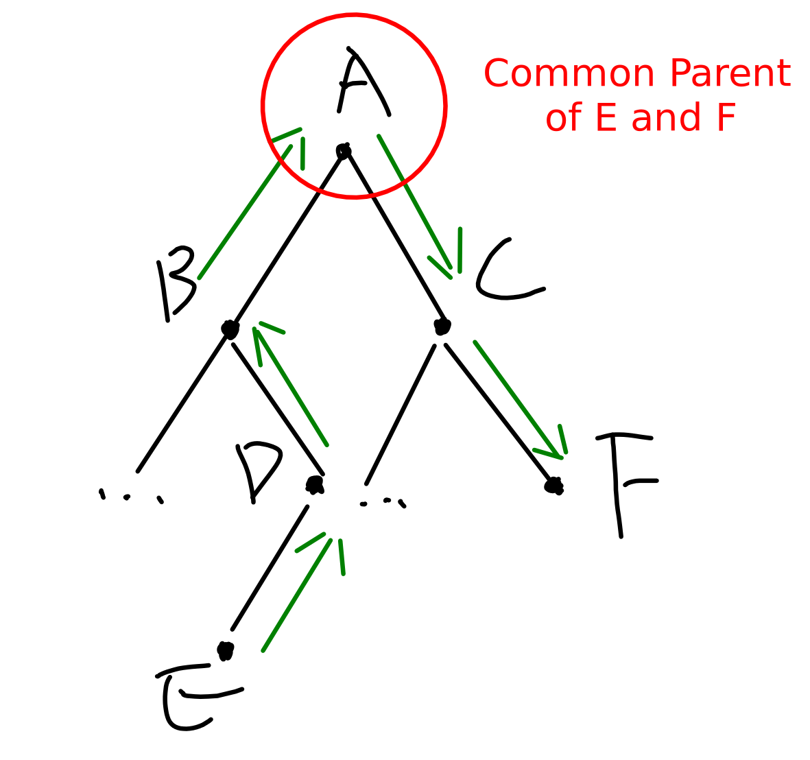

6. Missing Type Classes

`speechCollection > Programming > 3 Code Reuse in PS`

[Elm Is Wrong](http://reasonablypolymorphic.com/blog/elm-is-wrong/)

### Potential Fix

Elm support synchronous and asynchronous recursive Update on Model.
- Sync: directly call the `Update` function with the `Msg` (sequential)
- Async: pack the `Msg` in `Cmd` (branching is possible, but ordering not guaranteed)

Able to implement `Regulator` and `PostCensor`

## SAM

V = State( vm( Model.present( Action( data))), nap(Model))

Moore Machine(?)

1. If nap(next-action predicate, push machine out of intermediate state) is rejected by Model.present, then the entire system gets stuck in an invalid state.
  This means nap() function has to be consistent with Model.present but this type of coordination is error-prone if managed manually.

2. nap() function has to guarantee global validness which is not planned to be componentized. Scalability issue.

3. Modulization pattern in this framework is not clearly stated or ever designed.

## React + Redux

State transition function and Output function are separated into Reducer and Middleware.

1. Middlewares don't compose. Functional specification needed.

2. Reducer can be modulized based on DOM tree's hierarchical structure but then suffer from the same communication problem as ELM. 
If reducer tree is flattened into a single layer hash map (all components directly subscribing dimensions of interest from the store by react-redux `connect`), then global constraints are easy to implement but cyclic dependency are still not properly handled (some parent components know too much).

### React VDOM

Functionality
- inject content
- inject event handlers
- inject view functions
- different view/visualization based on state

`React.Component` can be parametrized by data, event handlers, and view/render functions (officially called Render Props).

If the Component is parametrized by view functions, then it focuses on **view state** handling logic.

Component without any view state handling logic is pure template.


## Angular2 / Vue

TODO

## Some Progress in the Community
### 1. [scalable-frontend-with-elm-or-redux](https://github.com/slorber/scalable-frontend-with-elm-or-redux)
### 2. [The Rise Of The State Machines](https://www.smashingmagazine.com/2018/01/rise-state-machines/) - [Stent | FSM in JS](https://github.com/krasimir/stent)
Still, Scalability Issues:
- How to divide the state space to reduce the complexity to a certain level in which an average programmer is able to reason about?
- How to compose individual state machines? Communication with network/graph?


# Comparison between Finite State Machine, Actor, FRP, Arrowized FRP, and OOP with Mutation

## Actor

Each actor/coroutine is actually an individual finite state machine (with/without feedback loop).
(Fact: the implementation of goroutine in Clojure is just syntax sugar of a state machine written in Clojure Macro.)

Actors communicating with each other through channels is basically saying that interconnections in the network are explicit by function calls (OOP, yet can be implemented in FP, push/pull functions (setter) have side effects and its state is not explicit nor accessible at any moment but managed by a scheduler) which is more optimal than a total graph in performance.

But the network itself is not part of the program as a monolithic state machine, which means either the network is static, or the evolution of the network can not be traced by the state history.

Post-censor is expressible but too hard to implement in this model because of the implicit state in all the channels with a buffer. 

The benefit of channels is that the wiring between senders and receivers has less manual coordination and thus less error-prone.

Maybe refrained from stateful channels thus only using stateless channels to build up a communication network between state machines is a way to go.
Basically, abstract out the state machine out of each buffer so that the state transformation is explicit and can be traced by the global state history.

[What is the purpose of the state monad?](https://stackoverflow.com/questions/28224270/what-is-the-purpose-of-the-state-monad)

> From what you're describing it seems to me like you're looking for something more along the lines of the **actor model of concurrency**, where state is managed in an actor and the rest of the code interfaces with it through that, retrieving (a non-mutable version of) it or telling it to be modified via messages. In immutable languages (like Erlang), actors block waiting for a message, then process one when it comes in, then loop via (tail) recursion; they pass any modified state to the recursive call, and this is how the state gets "modified".

# Tech & Design Choices

## State Graph Model

### i. Extended Finite State Machines
Like any other user interface, 3D modeling systems are typical event-driven systems which can be precisely described by Finite State Machines (FSM).
States and State Transitions are denoted by unique symbols in an algebraic/formal system.
Then we end up with a directed total graph of state space where vertices are states and directed edges between each pair of distinct vertices are state transitions.

As the complexity of the system increases the number of discrete states grows exponentially so we need Extended Finite State Machines (EFSM) which allow parametrization as an effective state space compression technique.
By parametrization, a set of states can be described by one or many variables.
An unique combination of specific values in all variables is a unique symbol itself and can be mapped back to each unique state in the original finite state machine.
This way we no longer need to deal with a large number of plain discrete states but a number of discrete or continuous variables which can be further abstracted by types.

> Two primitive types are Integer and String, both of which can be mapped to natural number set.
> Two famous constructs of natural number set are Von Neumann Ordinals and Church Numerals.
> Then with Boolean Algebra, we can represent a finite subset of the natural number set using combinational logic circuits.

> With higher-order abstraction, Dependent Type, from type theory, each type can be precisely crafted by ruling out a set of values using logical constraints so that a set of invalid states are irrepresentable by the combinations of these types.

At this point, we can update our state space representation using a vector to denote each state with a set of variables.

### ii. Event-driven System Design
With the formal system / EFSM defined, programmers or domain experts add semantics to the system by mapping each state or state Transition to a scenario or a signal/action respectively in the real system which usually described also by a formal system.
Because of the limitation in human's working memory, programmers and users can only deal with a small set of objects at a time.
Therefore, before or during the process of indexing states and state transitions by comprehensible names, usually large state space needs to be preprocessed by state space partition/classification, basically indexing/naming states or state transitions with human-readable Strings.

### iii. State Space Partition Techniques

#### 1. Horizontal Split
Horizontal Split of state space means grouping all the variables in the state vector into disjoint sets.
Each subspace after the horizontal split is still a total graph with the same number of vertices as the original but with lower dimensionality.
Then the state transition functions in each subspace can deal with lower number of variables.

For a UI system, the horizontal split usually means dividing the monolith system into independent widgets/subsystems (for analytic purpose, which is likely the opposite way to construct a UI system in practice).
Each widget embeds an extended finite state machine whose state vector only has a small number of variables.

#### 2. Vertical Split
Vertical Split of state space means grouping all the state vectors into disjoint sets based on rules each of which involves an arbitrary number of dimensions.
The subspace left untouched by the rule set can be automatically named "Otherwise"/"Rest".
Each subspace after the vertical split is still a total graph with the same dimensionality as the original but with lower number of vertices.

In each subspace, some information may no longer be needed and can be thrown away based on some sequential ordering.
In our formal representation, this means that the edges between two subspaces after a vertical split is directed only from one to the other, not the other way around.
Thus, after a vertical split, each subspace can have its own state vector representation instead of using the global state vector.

For example, in a transition system, after confirmation of credit card info and generation of an order number, the card info related variables (e.g. card number, address, etc.) are no longer useful.
However, if the system requires certain degree of fault tolerance, the card info then should not be thrown right after the confirmation because the transition may fail and the card info need to be presented and modified by the user for another try.

#### 3. Hierarchical Composition

##### Hierarchical Finite State Machine (HFSM)
HFSM requires a horizontal split on the state space and construct state transition functions in each subspace.
When constructing the HFSM, a vertical split is conducted first and some of the state transition functions from the horizontal split can be reused directly or with slight modification (usually parametrized) across these vertically partitioned subspaces, which will reduce a fair amount of boilerplate in code base. 

##### Behavior Tree (BT)
State space is hierarchically classified into subspaces using vertical splits.


## Message-Passing / Component-Wiring Style

### Actor

- Interactive

Sender-> Receiver (**[ pic ]**)

- Reactive

Sender ->Receiver (**[ pic ]**)

### CSP

Sender ->Mediator(Channel)-> Receiver (**[ pic ]**)

**Benefit**: abstract out dependency/wiring/edge and leave components autonomic and independent from others

## Combinational Logic (acyclic composition)

data flow/dependency/causality

composition by logic gate/operator

**[ pic ]**

## Feedback Loop (cyclic composition)
1. Feedback loop merges the internal dependency/wiring/network into one stream.

2. Able to express cyclic dependency

(unachievable by combinational logic / acyclic composition)
**[ pic ]**

*[cyclic dependency]: can be unfolded into an infinite/varying length acyclic dependency sequence. The infinite length case can be handled by Banach fixed-point theorem which is out of the scope of this project.

3. Unified cyclic/acyclic dependencies

child state machines are in a map

## Top-down thinking of a event-driven system
### General Model of event-driven programming

Approach 1 and approach 2 actually commute.
**[ pic ]**

#### Approach 1
1 Define State Space & State Graph

Define the unified state vector to represent the entire state space of the system.
We start with a total graph in which each node is connected to the other nodes.

1 -> 2 Reshape the State Graph

2 A single connected graph, or multiple isolated/unconnected subgraphs

2 -> 3 Index all the edges with names of the events

All the outgoing edges from a single node in the graph should be indexed/named
differently, otherwise the state machine is non-deterministic.

(optional) add terminal state to the system and all the state may have an edge to the terminal state. These edges to terminal state may have different indices.

3 Event graph

#### Approach 2
1 State Space Definition

1 -> 2 Classify/index all the edges in the graph by names of the events.
Map each index/name to a state transformation function.

2 Annotated Graph

2 -> 3 Reshape the annotated graph by adding guards to state transformation functions to limit the state space each state transformation function dealing with (equivalent to remove edges from the state graph).

3 Event Graph

### Practical Workflow
1. Given a collection of information to be presented in GUI.
2. Build / Have a collection of widgets.
3. Classify / Pack information as payloads to be injected into suitable widgets.
Each widgets are disjoint state machine functioning independently.
Refined the behavior of each widget by adding guards to fulfill local constraints
4. Refine the behavior of groups of widgets by adding guards to fulfill global constraints
5. project manager / UI designer modifies the design
  - some information is packed differently (into different widgets than before)
  - extra information (dispatch to widgets already existed or add new widgets)
  - modify the appearance of some widgets (not a big deal)
  - modify the behavior of some widgets
  - replace some widgets entirely by other implementations
  - extra behaviors on a group of widgets (may get packed into a new container)
  
### Indexing / Classification Strategy

#### Staged Computation / action decomposition (Hierarchical State Machines)
Categorized by one variable/dimension

#### Parametrization
Index a set of edges (from a set of states to a set of states) by the same event name.


## State Refinement

**Guard can be factored out of state transition**

Used to incrementally refine the state following some global constraints.

1. Pre Censor

**Remove indexed edges from the state graph**

Listening to (External) Messages

Filtered out Messages/Inputs for components based on Global Constraints

2. Regulator

i) pull back <=> pre-censor (so don't use it this way)

ii) push forward <=> **move the index on a outgoing edge of a given node to a different outgoing edge**

Listening to (Internal) Messages which indicate State Update in any component.

Push forward / Roll back the component's state to next/last intermediate state based on Global Constraints

3. Post Censor

**Remove nodes and associated edges from the state graph**

After the state transition in this tick/step is done ( no more Internal Messages received), Post Censor checks if the system is in a valid state.
If not, roll back to previous valid state.

*All intermediate states are invalid states and should not be observed by external observers.

4. Guard
Guard are constraints on local states.

### Case Study
#### 1. push forward
#### 2. pull back

## Guard

Higher-order combinational logic with variables

### AND/OR Table

**[ pic ]**


## Separation of Internal Representation and External Representation

> multi-layered processing?
> Internal (singleton) + Externals
> Each may have multiple layers, and dynamic & static information
> dynamics (represented by state vector, e.g. payloads in React)
> statics (commonly encoded in view/render function, e.g. React, but not necessary)

This framework is ought to be general for both Frontend and Backend application.

1. Model

Minimal amount of information that will be presented in different formats and sent to External World through corresponding Drivers.

Compensate Models
  - View Model ( DOM )

  Strictly view-related only. Parametrize the View(template) Function.

  e.g. Color, Opacity, Font, Coordinates, Layer etc.

  Targeting different platforms.

  e.g. Console (Terminal App), Mobile (IOS, Android), Hybrid(React Native, Cordova)

  Will be shipped with (pure) View Function in View Container/Component library.
  - Network Model ( HTTP(S)/WebSocket )

  Client-related states are stored in Model but protocol-related information like Server-Client Message Schema, Communication Encryption Method, etc. should be presented in HTTP Model.

2. View

A function that transforms internal representation (Model) to external representation (DOM, HTTP, Mobile, etc.).

For example, DOM View maps the hash map of Model into a tree.

general view container/component library
general model testing/prototyping purpose view function

### Case

## Extended Finite State Machine

### time constraints

## Self-adaptive

[Multiple Levels in Self-adaptive Complex Systems: A State-Based Approach](https://arxiv.org/abs/1209.1628)

[An Approach to Self-Adaptive Software based on Supervisory Control](http://www.isis.vanderbilt.edu/sites/default/files/Karsai_G_5_0_2001_An_Approac.pdf)

In order to sustain the clear separation between Parent and Child components (state machines) where Parent manages the lifecycles of its children including their behaviors (State Transition Function is swappable dynamically during the runtime), the dependency network is no longer static which needs a second-order state machine.

## State Machine Composition
1. Cascade Composition / Sequencing ( 2 sequential dependent tasks)

signal passing

**[ pic ]**

2. Synchronous Parallel/Side-by-side Composition / Intersection ( n independent tasks, n >= 2)

signal broadcasting

**[ pic ]**

3. Feedback Loop / Repetition

4. Switch / Choice ( Hierarchical State Machine, add guards before each State Machine)

These composition logic will be implemented by Writer Monad, Monoid, ChainRec Monad, Fixed-point Monad.

### Reader Monad
### Writer Monad
### Monoid
### ChainRec

### F-Algebra, Fixed-point data type (Fix), recursive function

[Understanding F-Algebras](https://www.schoolofhaskell.com/user/bartosz/understanding-algebras)

[Haskell/Fix and recursion](https://en.wikibooks.org/wiki/Haskell/Fix_and_recursion)
The Fix data type cannot model all forms of recursion.

[purescript-fixed-points](https://pursuit.purescript.org/packages/purescript-fixed-points/4.0.0)

## UI control design

### state space representation
The design process of UI control starts with a state space representation (basically a state graph with states parametrized as a state vector and connectivity between states parametrized as state transition functions).

### input mapping
In order to turn this purely symbolic and seemingly useless system into an event-driven system, the designer then needs to add context and semantics to the system by mapping input events to state transitions and indexing the states with meaningful and unambiguous names.

### classification of input components/devices
The sources of input events generally can be classified into two categories:
- state update of stateful input components
- pre-defined actions of stateless input components being triggered

where input components can be either physical or virtual since we always need a virtual representation of the physical devices in any artificial system.

In 2d UI, three typical stateful input components are text entry box (InputField in Unity), check box and slider.
Furthermore, customized draggable components with position (`x` and `y` coordinates) tracked can also be utilized as input devices.
For stateless components, we have button and any components with event handlers attached (e.g. mouse hovering event handler).

Users commonly manipulate these virtual input components by a cursor on screen, a virtual representation of physical mouse (stateful input device) on a flat surface with scaled input mapping between the movement of mouse and the movement of the cursor, and a keyboard (stateless input device to send pre-defined events, i.e. key pressing).

In 3d UI, things are similar but with an extra dimension available and more advanced tracking devices (e.g. 6DOF hand-held controllers) than mouse and touchpad (2DOF).

### Available input devices and DOF in this contest
The following input devices are accessible to attendants:
1. one 6DOF head-worn display
2. two 6DOF hand-held controllers with a trigger button and a grip button

The maximum number of DOF provided by this setting is 6 + 2 * (6 + 2) = 22, or 18 Real numbers and 4 Booleans to be specific.

Attendants may introduce their customized input devices to bypass this limitation.

### input component/device DOF allocation
The designer needs to figure out the number of DOF available in the virtual input components and physical input devices.
For isomorphic control, the number of DOF should exactly match the dimensionality of all the control parameters in the state space.

If the gap between the number of DOF given by the input devices and the required number for control parameters is too large, we need to reduce the required DOF for user input.
One common technique is to introduce the derivative (difference per frame) of a continuously varying variable to the state vector and to map the value of 1DOF in controllers' state to that derivative to indirectly modify the state of the system.
The system will maintain the two-way constraints between the variables and their derivatives. 
Thus, we can switch between different derivatives and change their values by only investing 1DOF in controllers' state.
To stop changing a variable, simply assign the derivative of that variable to 0.

## Hot-Swappable Input (Device) Mapping Profile

Mapping between 
- pre-defined events in virtual input components / physical input devices
- events in the event-driven system

### 1.[A Morphological Analysis of the Design Space of Input Devices](https://dl.acm.org/citation.cfm?id=128726)

## Group Constraint

Conditionals on multiple variables.

Hard to define manually in FRP / causal relationships.

None of these variables are prioritized over the others.

All of them are interconnected by causal connections, which forms a total graph.

See also the `References > Bayesian Network & Causality > The Book of Why`.

# Overall Architecture

Mealy Machine + Synchronous Composition + Feedback + Explicit Side Effects

## Driver
Represent side effects by data, push them out of the main logic, and let the drivers to interpret the Effs.
Like a Domain Specific Language (DSL).
Can be naturally implemented by Free Monad.

1. DOM Driver
2. HTTP Driver (WebSocket Driver)
3. Time Driver
4. Database Driver
  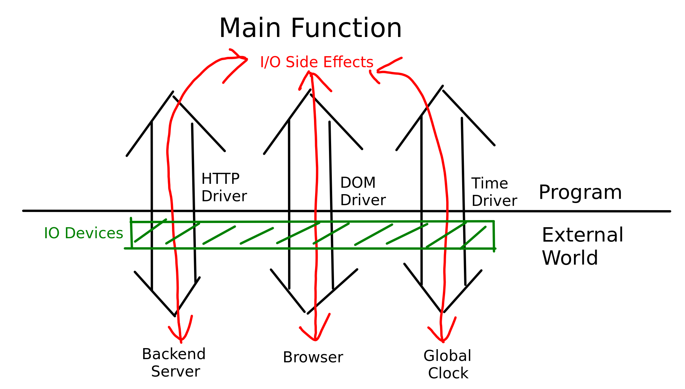

### Time Driver
1 Global Clock / n Local Clocks

I guess Global Clock is better for animation.

### Free / CoFree
#### 1.[Free from Tree & Halogen VDOM](https://www.youtube.com/watch?v=eKkxmVFcd74)

Core primitives to model any recursive types, which means you can build Mu/Nu (fixed-point data type) out of Free/CoFree. 
Mathematically equivalent but may not be optimal for performance because of the structural overhead (e.g. extra wrapping which takes more memory and of course extra unwrapping).
It's like trading performance for generality so that you can get all the operators for free.

Two different types of Trees.

Substitute a Functor into Free/CoFree, you can derive a Monad/CoMonad.

Used to build AST and Interpreter.

**One usage is to turn Effects into data/AST.**
Which is exactly what I need.
- time travel: state + effects
- hot reload (S-[B]) with security

#### 2.[Free for DSLs, cofree for interpreters](http://dlaing.org/cofun/posts/free_and_cofree.html)

#### 3.[DrBoolean/freeky](https://github.com/DrBoolean/freeky)

#### 4. Free play
[Free play - part 1](http://therning.org/magnus/posts/2016-01-13-000-free-play--part-one.html)

[Free, take 2](http://therning.org/magnus/posts/2016-06-18-free--take-2.html)

#### 5.[A Modern Architecture for FP](http://degoes.net/articles/modern-fp)

#### 6.[The Free Monad Interpreter Pattern](https://blog.otastech.com/2016/01/the-free-monad-interpreter-pattern/)

#### 7.[Why free monads matter](http://www.haskellforall.com/2012/06/you-could-have-invented-free-monads.html?m=1)

### Existing Examples in JS
#### 1.[Elm-Effects](https://guide.elm-lang.org/architecture/effects/) / [Type Reference](http://package.elm-lang.org/packages/evancz/elm-effects/2.0.1/Effects)

#### 2.[Cyclejs Drivers](https://cycle.js.org/drivers.html)

#### 3.[Redux-Saga](https://github.com/redux-saga/redux-saga)

[Closed Issue: redux-saga is a lot like an IO monad](https://github.com/redux-saga/redux-saga/issues/505)

#### 4.[Redux-Loop](https://github.com/redux-loop/redux-loop)

#### 5.[Redux-Cycles](https://github.com/cyclejs-community/redux-cycles)

### Potential Issues of Drivers/FreeMonads

1. no helpful information from stack traces

#### 1.[Practical Principled FRP](https://github.com/beerendlauwers/haskell-papers-ereader/blob/master/papers/Practical%20Principled%20FRP%20-%20Forget%20the%20past,%20change%20the%20future,%20FRPNow!.pdf)

I/O in FRP The second problem with Fran is that interaction with the outside world is limited to a few built-in primitives: there is no general way to interact with the outside world. Arrowized FRP does allow general interaction with the outside world, by organizing the FRP program as a function of type `Behavior Input → Behavior Output`, where Input is a type containing all input values the program is interested in and Output is a type containing all I/O requests the program can do. This function is then passed to a wrapper program, which actually does the I/O , processing requests and feeding input to this function. This way of doing I/O is reminiscent of the stream based I/O that was used in early versions and precursors to Haskell, before monadic I/O was introduced. It has a number of problems (the first two are taken from Peyton Jones [10] discussing stream based I/O ):

- It is hard to extend: new input and output facilities can only be added by changing the Input and Output types, and then changing the wrapper program.

- There is no close connection between a request and its corresponding response. For example, an FRP program may open multiple files simultaneously. To associate the result of opening a file to its the request, we have to resort to using unique identifiers.

- All I/O must flow through the top-level function, meaning the programmer must manually route each input to the place in the program where it is needed, and route each output from the place where the request is done.

Other FRP formulations partially remedy this situation[1, 21], but none overcome all of the above issues. We present a solution that is effectively the FRP counterpart of monadic I/O . We employ a monad, called the Now monad, that allows us to (1) sample behaviors at the current time, and (2) plan to execute Now computations in the future and (3) start I/O actions with the function:

```haskell
async :: IO a → Now (Event a)
```

which starts the IO action and immediately returns the event associated with the completion of the I/O action. The key idea is that all actions inside the Now monad are synchronous 2 , i.e. they return immediately, conceptually taking zero time, making it easier to reason about the sampling of behaviors in this monad. Since starting an I/O action takes zero time, its effects do not occur now, and hence async does not change the present, but “changes the future”. Like the I/O monad, the Now monad is used to deal with input as well as output, both via async. This approach does not have the problems associated with stream-based IO, and is as flexible and modular as regular monadic I/O.

#### 2.[Free monad considered harmful](https://markkarpov.com/post/free-monad-considered-harmful.html)

1. Inspection
2. Efficiency
3. Composability

A better solution - type classes in Haskell

So we want to be able to interpret a monadic action in different ways, inspect/transform it, etc. Well, Haskell already has a mechanism for giving different concrete meanings to the same abstract (read polymorphic) thing. It’s called type classes. It’s simple, efficient, familiar, composable, and if you really want to build data structures representing your actions to do whatever you want with them, guess what… you can do that too.

[The ReaderT Design Pattern - Avoid WriterT, StateT, ExceptT](https://www.fpcomplete.com/blog/2017/06/readert-design-pattern)

#### 3.[Typed final (tagless-final) style](http://okmij.org/ftp/tagless-final/index.html)
[Typed Tagless Final Interpreters](http://okmij.org/ftp/tagless-final/course/lecture.pdf)

#### 4.[Monad transformers, free monads, mtl, laws and a new approach](https://ocharles.org.uk/blog/posts/2016-01-26-transformers-free-monads-mtl-laws.html)

#### 5.[3 approaches to monadic api design in haskell](https://making.pusher.com/3-approaches-to-monadic-api-design-in-haskell/)

- Concrete monads
- Monad typeclasses

Issues with typeclasses

The types become more complicated.
compiler errors can be much harder to understand.
Potentially performance issue (may already be solved by inlining).

- Free/operational monads

This is nice because it **decouples** the **logic** from the means of performing the **effects**. Another advantage is that it allows different interpreters to be written for different purposes; this would be particular useful when writing **tests**.

However this approach comes with similar problems as mtl. It also has the disadvantage of being less widely used/understood at the moment.

Furthermore it means that the caller of the library will likely need to write more code because they have to implement the interpreter. For more complex libraries, this may be worth it, but for simple things like writing a client library for a web API, it is most likely overkill.

#### 6.[mtl is Not a Monad Transformer Library](https://blog.jle.im/entry/mtl-is-not-a-monad-transformer-library.html)

# DOM Component Library

Framework-independent & composable

## Container

1. spring grid system (draggable)
2. waterfall
3. notification/modal
4. scroll lazy load
5. Router / Page with Navigator

## Component

1. table
2. tree (collapse)
3. graph
4. (video/soundtrack) media player
5. (geo) map
6. time
7. image viewer
8. text editor (container? DOM tree inside)
9. text area with annotation (hidden, collapse)

## Alternatives?
### 1.[Pux App Architecture](http://purescript-pux.org/docs/components/)

> If you have React or Elm experience, you're taught to think of your application as self-contained, inter-locking components that encapsulate business logic and presentation. But that object-oriented perspective is unnecessary when working with a purely functional language like PureScript. Components are just one of the many ways you could organize your Pux application, because an application is really a single foldp and view function. They can be split into smaller functions however best fit your needs.
> Instead of components, split up the foldp function into modules that are separate from your views and organized around business logic. You may have a module that handles user events like logging in and out, another for todo list events, etc. along with your top-level foldp. Views can live separately and import the events from those other foldp modules as needed. It's easier to reorganize business logic and views with this architecture. Those with Redux experience will see the similarity to actions and reducers.

### 2.[purescript-ui - DSL for cross-platform 2d UI](https://github.com/joneshf/purescript-ui/tree/master/docs)

# Examples

## Cyclic-dependent Buttons
## Autocomplete Input Box
## TodoList
## Container with different types of Draggable Components
## Drag-and-drop among multiple Containers

# TODO (unsettled design choices)

## State Vector Type Construct


## Input/Event Space Partition
1. Event Type definition
2. Organization of Event Indices/Names


### Deprecate Event Handler Model
State Transition Function: State x Event/Input -> State x Output 

DOM has its primitive event dispatching system for event handling which is the event handler mechanism.
Event handlers are supposed to be part of the state transition functions that matches pre-defined events by its name in the function call.
But this enforces the programmer to partition the event space **first** then the state space, which doesn't match our native thinking of a state graph.
We usually organize the state space in hierarchical manner because states are easier to understand (by visualization or direct observation of the system).
Given a specific state of the system, then we talk about the outgoing edges (state transitions) associated with that state, which presumably is a small set that human developers are able to deal with.

So the first thing to do is to inverse the order of pattern matching. 
All the event handlers registered in DOM call our singleton giant state transition function. 

Event handlers are still useful but we only need the following information to be past to our state transition function:
- where the event is created in the DOM tree/hierarchy
- payload of the event (primitive events are usually parametrized)

### Multiple instances of the same component
Componentized UI systems ship independent parts (disjoint dimensions in the state vector) of the system as components, each of which has its own state transition function therefore comes with a set of pre-defined events.

Most components are designed to have multiple instances instantiated at the runtime, for example, general containers like image viewer, or components managing a list of child components like TODOitems in a TODOlist.

If we match event by its exact name, then name collision is inevitable.
We need a way to distinguish events of the same name from different instances of the same component.

The most straight forward way is to attach each instance with a unique ID and pass the ID along with the event in its payload.

```elm
type alias Payload ::
  { id :: String
  , ...
  }

type alias Event ::
  { name :: String
  , payload :: Payload
  , domPayload :: DOMpayload
  }
```

Then how we construct the unique IDs.

A conventional way to namespace a hierarchical finite structure is to stack the names of a instance's ancestors in a sequential order and separate them by `.` or `/`.
e.g. `rootNode.ContainerA.Item1`

In ELM, we assume the signal graph is static where the state transition function can be organized in a hierarchical way, then this solution is enough.

If we assume the signal graph is not static, then this solution suffers handling the dynamics in the organization of instances in the DOM tree.
If the structure of the DOM changes, for example, a instance is moved by drag-and-drop from one container to another, the ID of that instance is supposed to be updated along with the event handling logic associated with that instance in the state transition function, since the belonging of that instance shifts to a different container.
e.g. `rootNode.ContainerA.Item1 -> rootNode.ContainerB.Item1`

A better way invariant to the organization of instances in the DOM tree is to use unique identifier generators like UUID or GUID.

In CycleJS,
> If a channel's value is null, then that channel's sources and sinks won't be
> isolated. If the wildcard is null and some channels are unspecified, those
> channels won't be isolated. If you don't have a wildcard and some channels
> are unspecified, then `isolate` will generate a random scope.


### 1.[An  Industrial  Study  of  Applying  Input  Space Partitioning to Test Financial Calculation Engines](https://cs.gmu.edu/~offutt/rsrch/papers/calcengine.pdf)

> This paper presents result from an industrial study that applied input space partitioning and semi-automated requirements modeling to large-scale industrial software, specifically financial calculation engines.

## Model Checking (Rule-based System / Logic Programming)

### 1.[Architecture for logic programing with arrangements of finite-state machines](http://ieeexplore.ieee.org/document/7588297/)

> Logic-Labeled Finite-State Machines (LLFSMs)
> LLFSMs are composed of states and transitions between states.
> transitions are not labeled by events.
> transitions are labeled by logic expressions (in a sense analogy to the guard conditions in UML's labels for transitions).
> State activity occurs in sections named OnEntry, OnExit, and Internal.
> If none of them evaluate to true (that is, none of them fires), then the Internal activity is executed.
> Only when a transition evaluates to true and the target state T is a different state from the current state, the OnExit section of the current state is executed and, in the next ringlet, the OnEntry of the target state is executed.

### 2.[Verification of Conflicition and Unreachability in Rule-based Expert System with Model Checking](https://arxiv.org/pdf/1404.2768.pdf)

> 3.2 UPPAAL
> UPPAAL can verify systems that can be modeled as networks of timed automata (TA) expanded with structured data types, integer variables, and channel synchronization.
> A finite state machine expended by clock variables is a TA.

> UPPAAL expands the definition of TA with extra characteristics:
> - Templates
> - Global Variables
> - Expressions
> - Edges
>   - Select
>   - Guard
>   - Synchronization
>   - Update

### 3.[Rule-based Machine Learning - Wikipedia](https://en.wikipedia.org/wiki/Rule-based_machine_learning)

[Where machine learning meets rule-based systems - Hacker News](https://news.ycombinator.com/item?id=14717692)

### 4.[Alloy - SAT-based Software Model Checking](http://alloytools.org/)

[Software Abstractions - Daniel Jackson](http://softwareabstractions.org/)

### 5.[Entity-Based State Management for Complex Event Processing Applications](https://link.springer.com/chapter/10.1007/978-3-642-22546-8_13)

### 6.[Software Foundations series](https://softwarefoundations.cis.upenn.edu/current/index.html)

[Volume1: Logical Foundations](https://softwarefoundations.cis.upenn.edu/current/lf-current/index.html)
> covers functional programming, basic concepts of logic, computer-assisted theorem proving,and Coq.

[Programming Language Foundations](https://softwarefoundations.cis.upenn.edu/current/plf-current/index.html)
> surveys the theory of programming languages, including operational semantics, Hoare logic, and static type systems.


[Verified Functional Algorithms](https://softwarefoundations.cis.upenn.edu/current/vfa-current/index.html)
> shows how a variety of fundamental data structures can be mechanically verified.


## Stateful HTML Elements handling for performance

1. Text Entry Box
2. Slider
3. Selector

may represented by continuous-time model?
(e.g. [@funkia/turbine](https://github.com/funkia/turbine)
[@funkia/hareactive](https://github.com/funkia/hareactive))

## State Store as Database

1.[Using the Redux Store Like a Database](https://hackernoon.com/shape-your-redux-store-like-your-database-98faa4754fd5)

2.[gist - Most efficient way to store domain state in Redux (Indexed Key-Value Store)](https://gist.github.com/sikanhe/9b940ce866d78354bba3)

## acceptable Events for a given State <-> Input Components in View Function

Synchronization problem:
- Events used in current View Function
- All the Events available in the Event/Input space/subspaces

Given a state diagram, all the outgoing edges from a given state are properly indexed with distinct symbols.
There needs to be enough physical input devices / virtual input components in the view ( and enough DOFs which takes an interpreter/translator) to be able to cover all these events associated with this state.

> interpreter/translator: mapping from Primitive Events in Input Devices/Component to Internal Events in the system's Internal Representation

1. When the user interaction designer are figuring out the specification of the system behaviors for a given state in Statecharts, presenting all the events used in current view function along with all the events available are useful. The designer is able to check if some events are not properly handled.

2. When the user interface programmers are creating View Function based off the Statecharts specification, programmers are able to check if there are enough input components laying out in the view and their behaviors are properly defined to cover all the acceptable events after each interpreter/translator.

### 1. [Emerging Patterns in JavaScript Event Handling](https://www.sitepoint.com/emerging-patterns-javascript-event-handling/)

## Serialization of Functions

1. [JavaScript's eval() and Function() constructor](http://dfkaye.github.io/2014/03/14/javascript-eval-and-function-constructor/)

## State Transitions as Events

A more general description of event?

For example, keyboard without considering Cpas Lock is a stateless input device because the state of each key is out of the scope of OS, the way to sample the states of the keys are pre-defined by the device designer or manufacturer, i.e. sampling rate, respond time.

Fundamentally, we constantly sample the continuous states of the keys and turn the discrete state transitions into pre-defined discrete events.

## API Complexity
### 1.[The MNP Problem of Distributed Computing](https://www.ebpml.org/blog2/index.php/2014/12/27/the-mnp-problem-of-distributed)

MNPT Problem:
An architecture with M **clients**, invoking N **remote operations**/actions which can each have P **versions** and involves data fetching from T **systems of records** / micro-services, ends up with MNPT **communication paths**.

I would personally support any approach where:
- operations are explicit (machine readable contracts, generated clients)
- an interface can change while remaining compatible (when possible) with existing consumers which are not immediately interested in consuming that change (that should limit the number of versions in production to 3 or less)
- an architecture where operations are not hard wired to the systems of record since you want to be in the position to 
  - control how changes from the systems of record propagate to the operation's contract
  - add new systems of record in the future without asking your clients to change anything

There are 3 approaches to distributed computing which are not interchangeable and solve different kinds of problems:
- Consumer-System of Record (a.k.a Point-to-Point)
- Event-Driven (this pattern is more often used in system-to-system communication than consumer-to-system of record)
- Service Oriented

All I know is that the worst way to deal with that problem is to use a point-to-point approach.
Each time a consumer communicates directly with a system of record, you are using a "point-to-point" integration pattern, wiring consumers to the integration points of the system of record.
That is the root of all problems in distributed computing where the number of components is greater than two.
That is why RPC fails, that is why CORBA or EJB were too "brittle" because any change in the system impacted too many communication paths.
And to minimize impact, you respond to change by creating more integration points (or microservices if you like that term better), hence more communication paths.
That is the definition of a runaway system.

Personally, I prefer a "Service-Oriented" approach where the consistency responsibility is given to a 3rd party component exposing an intentional and versionable interface because that logic does not belong to the consumer or the system of record.


## Debugging Complexity

### 1.[Debugging Go Routine leaks](https://blog.minio.io/debugging-go-routine-leaks-a1220142d32c)

Daily code optimization using benchmarks and profiling in Golang - Gophercon India 2016 talk - 
[article](https://medium.com/@hackintoshrao/daily-code-optimization-using-benchmarks-and-profiling-in-golang-gophercon-india-2016-talk-874c8b4dc3c5)
/ [youtube](https://www.youtube.com/watch?v=-KDRdz4S81U)

### 2.[Debugging data flows in reactive programs](https://blog.acolyer.org/2018/06/29/debugging-data-flows-in-reactive-programs/)

## Continuous-time/Hybrid Model Representation

### Hybrid Automaton

#### 1.[Wikipedia - Hybrid automaton](https://en.wikipedia.org/wiki/Hybrid_automaton)

#### 2.[Foundations of Total Functional Data-Flow Programming](https://arxiv.org/abs/1406.2063)

> A hybrid automaton is a finite state machine with a finite set of continuous variables whose values are described by a set of ordinary differential equations.
> This combined specification of discrete and continuous behaviors enables dynamic systems that comprise both digital and analog components to be modeled and analyzed.

1st-order (continuous variables dependency graph): ODE / Dataflow
2st-order (discrete dependency graph transition): FSM (a finite set of control mode)

#### 3.[Enclosing the behavior of a hybrid automaton up to and beyond a Zeno point](https://www.sciencedirect.com/science/article/pii/S1751570X15000606)

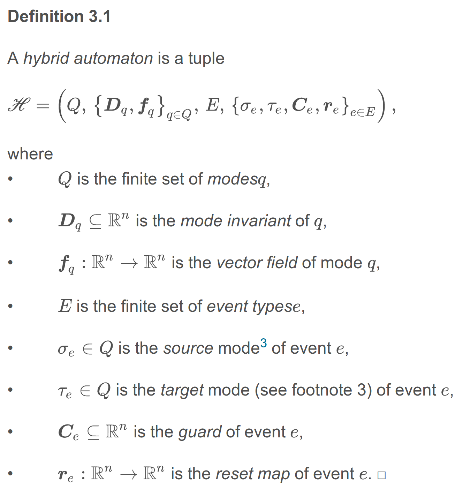

#### 4.[An Introduction to Hybrid Automata](http://www.cmi.ac.in/~madhavan/courses/acts2010/Raskin_Intro_Hybrid_Automata.pdf)

### Ordinary Differential Equation (ODE)

#### 1.[State-space representation - Wikipedia](https://en.wikipedia.org/wiki/State-space_representation)

control engineering

a mathematical model of a physical system as a set of input, output and state variables related by **first-order differential equations** or difference equations.

State variables are variables whose values **evolve through time** in a way that depends on the values they have at any given time and also depends on the externally imposed values of input variables.

Output variables’ values depend on the values of the state variables.
(Moore Machine?)

#### 2.[Complex ODE Based Models - Stan, a Bayesian inference framework](https://github.com/stan-dev/stan/wiki/Complex-ODE-Based-Models)

#### 3.[Analog computation with continuous ODEs](https://ieeexplore.ieee.org/document/363672/)

### Algorithmic/Automatic Derivatives

### 1.[Youtube - The simple essence of automatic differentiation - Conal Elliott](https://www.youtube.com/watch?v=Shl3MtWGu18&t=1083s)

### 2.[Youtube - You Should Be Using Automatic Differentiation - Ryan Adams (Twitter & Harvard)](https://www.youtube.com/watch?v=sq2gPzlrM0g&t=1314s)


> **System Model**: A model that describes the evolution of a system over time.
>
> **Event**: Either the observation of a certain quantity or a change in the state of the system:
>
> - Observation Event: usually specifies the time and the quantity of interest at which we want to simulate data
> - State Changer: An (exterior) intervention that alters the state of the system
>
> **Evolution Operator**: Takes in the state of a system at time t0 and returns the state of that system at time t0 + t, provided that:
>
> - knowing the state at time t0 fully defines the state at finite times
> - between t0 and t0 + t, the system is isolated, i.e. there is no exterior intervention that alters the state of the system
>
> **Event Handler**: Takes in a schedule of events and returns the quantities of interest at each event.

# Reference

## Automata
- [Turing Machine](https://en.wikipedia.org/wiki/Turing_machine)
- [Pushdown Automata (PDA)](https://en.wikipedia.org/wiki/Pushdown_automaton)

FSM with Buffer/History

- [Sequential Logic](https://en.wikipedia.org/wiki/Sequential_logic)
/ [Finite State Machine](https://en.wikipedia.org/wiki/Finite-state_machine)
- [Combinational Logic](https://en.wikipedia.org/wiki/Combinational_logic)

### 1.[EECS149 - Chapter 5: Composition of State Machines](https://chess.eecs.berkeley.edu/eecs149/lectures/CompositionOfStateMachines.pdf)

### 2.[Building Finite State Machines](http://www.dcs.ed.ac.uk/home/mic/FiniteStateMachines2-slides.pdf)

### 4.[Introduction to Hierarchical State Machines (HSMs)](https://barrgroup.com/Embedded-Systems/How-To/Introduction-Hierarchical-State-Machines)

### 5.[Transition system](https://en.m.wikipedia.org/wiki/Transition_system)
A labelled transition system is a tuple `(S, Λ, →)` where `S` is a set of states, `Λ` is a set of labels and `→` is a set of labelled transitions (i.e., a subset of `S × Λ × S`).

a labeled transition system is equivalent to an abstract rewriting system with the indices being the labels

[Uniform Labeled Transition Systems for Nondeterministic, Probabilistic, and Stochastic Process Calculi](https://arxiv.org/abs/1108.1865)

### 6.[Abstract rewriting system](https://en.m.wikipedia.org/wiki/Abstract_rewriting_system)

### 7.[Microsoft: The Abstract State Machines Method for High-Level System Design and Analysis](http://pages.di.unipi.it/boerger/Papers/Methodology/BcsFacs07.pdf)

Design
- Ground model constuction
- Model refinement
- Model change

Analysis
- Mathemetical verification
- Experimental validation

### 8.[State Space Representations of Linear Physical Systems](http://lpsa.swarthmore.edu/Representations/SysRepSS.html)

## Event-driven system as Automata
### 1.[User interfaces as reactive systems - Technuflections Blog](https://brucou.github.io/posts/user-interfaces-as-reactive-systems/)

### 2.[State Machines for Event-Driven Systems](https://barrgroup.com/Embedded-Systems/How-To/State-Machines-Event-Driven-Systems)

### 3.[Pure UI Control - prototyping with Statecharts](https://medium.com/@asolove/pure-ui-control-ac8d1be97a8d)

### 4.[Constructing the User Interface With Statecharts - Ian Horrocks](https://dl.acm.org/citation.cfm?id=520870)

## Behavior Tree

### 1.[Behavior Trees in Robotics and AI: An Introduction](https://arxiv.org/abs/1709.00084)

### 2.[How Behavior Trees Modularize Hybrid Control Systems and Generalize Sequential Behavior Compositions, the Subsumption Architecture and Decision Trees](http://michelecolledanchise.com/tro16colledanchise.pdf)

### 3.[Algorithmic State Machine (ASM) - Wikipedia](https://en.wikipedia.org/wiki/Algorithmic_state_machine)

### 4.[DRAKON charts - Wikipedia](https://en.wikipedia.org/wiki/DRAKON)

## General Web Component/Container

### 1.[How to Build the Ultimate Reusable Web Chat Component](https://medium.com/outsystems-engineering/how-to-build-the-ultimate-reusable-web-chat-component-c9acf3dc5f2b)

### 2.[This SVG always shows today's date](https://shkspr.mobi/blog/2018/02/this-svg-always-shows-todays-date/)

## CSS

### 1.[Modern CSS Explained For Dinosaurs](https://medium.com/actualize-network/modern-css-explained-for-dinosaurs-5226febe3525)

### 2.[JSS - An authoring tool for CSS which uses JavaScript as a host language.](https://github.com/cssinjs/jss)

[Styled-JSS - a styled-primitives interface on top of JSS.](https://github.com/cssinjs/styled-jss/)

### 3.[CSSreference - A free visual guide to CSS](https://cssreference.io/)
all common markups explained by examples

### 4.[MaintainableCSS](https://maintainablecss.com/)

### 5.[A Complete Guide to Grid | CSS-Tricks.com](https://css-tricks.com/snippets/css/complete-guide-grid/)

### 6.[rscss - Reasonable System for CSS Stylesheet Structure](http://rscss.io/)

### 7.[CSS Diner – Interactive gamified tutorial for learning selection with CSS](https://flukeout.github.io/)
- Type Selector: `A`
- ID Selector: `#id`
- Descendant Selector: `A B`
- Combine the Descendant & ID Selectors: `#id A`
- Class Selector: `.className`
- Combine the Class Selector: `A.className`
- Comma Combinator: 'A, B'
- The Universal Selector: `*`
- Combine the Universal Selector: `A *`
- Adjacent Sibling Selector: `A + B`, Select an element that directly follows another element
- General Sibling Selector: `A ~ B`, Select elements that follows another element
- Child Selector: `A > B`, Select direct children of an element
- First Child Pseudo-selector: `:first-child`, Select a first child element inside of another element
- Only Child Pseudo-selector: `:only-child`, Select an element that are the only element inside of another one.
- Last Child Pseudo-selector: `:last-child`, Select the last element inside of another element
- Nth Child Pseudo-selector: `:nth-child(A)`, Select an element by its order in another element
- Nth Last Child Selector: `:nth-last-child(A)`, Select an element by its order in another element, counting from the back
- First of Type: `:first-of-type`, Selector Select the first element of a specific type
- Nth of Type Selector: `:nth-of-type(A)`, Selects a specific element based on its type and **order** in another element - or `even` or `odd` instances of that element.
- Nth-of-type Selector with Formula: `:nth-of-type(An+B)`, The nth-of-type formula selects every nth element, starting the count at a specific instance of that element.
- Only of Type Selector: `:only-of-type`, Select elements that are the only ones of their type within of their parent element
- Last of Type Selector: `:last-of-type`, Select the last element of a specific type
- Empty Selector: `:empty`, Select elements that don't have children
- Negation Pseudo-class: `:not(X)`, Select all elements that don't match the negation selector
- Attribute Selector: `[attribute]`, Select all elements that have a specific attribute
- Attribute Selector: `A[attribute]`, Select all elements that have a specific attribute
- Attribute Value Selector: `[attribute="value"]`, Select all elements that have a specific attribute value
- Attribute Starts With Selector: `[attribute^="value"]`, Select all elements with an attribute value that starts with specific characters
- Attribute Ends With Selector: `[attribute$="value"]`, Select all elements with an attribute value that ends with specific characters
- Attribute Wildcard Selector: `[attribute*="value"]`, Select all elements with an attribute value that contains specific characters anywhere

1. `plate` 
2. `bento`
3. `#fancy`
4. `plate apple`
5. `#fancy pickle`
6. `.small`
7. `orange.small`
8. `bento orange.small`
9. `plate, bento`
10. `*`
11. `plate *`
12. `plate + apple`
13. `bento ~ pickle`
14. `plate > apple`
15. `plate orange:first-child`
16. `plate *:only-child`
17. `.small:last-child`
18. `plate:nth-child(3)`
19. `bento:nth-last-child(3)`
20. `apple:first-of-type`
21. `plate:nth-of-type(even)`
22. `plate:nth-of-type(2n+3)`
23. `plate apple:only-of-type`
24. `.small:last-of-type`
25. `bento:empty`
26. `apple:not(.small)`
27. `[for]`
28. `plate[for]`
29. `[for="Vitaly"]`
30. `[for^="S"]`
31. `[for$="o"]`
32. `[for*="bb"]`

### 8. [CSS World](https://www.amazon.cn/dp/B079GNPR6V/)
Boundary knowledge

### 9. [CSS Modules - Glen Maddern](https://glenmaddern.com/articles/css-modules)
Changing the style by changing `className` so all state management can be done in JS.
Object composition.

### 10. [Scalable and Modular Architecture for CSS (SMACSS)](https://smacss.com/)

### 11. [An Introduction to Style Elements for Elm](https://mdgriffith.gitbooks.io/style-elements/content/)

> HTML and CSS make this difficult because there's **no central place that represents your layout**.

> **Separating Layout and Style**
> The Style Elements library makes layout a first class idea, which makes working with style and layout a breeze.
> It also makes refactoring your style feel similarly invincible as refactoring in Elm! 
> The main idea is that layout should live in your view, and your stylesheet should deal with all properties except those relating to layout, position, sizing, and spacing. 
> The `Element` module contains all the components that go in your view. 
> The `Style` module is the base for creating your stylesheet.


## Dependent Type

May use dependent type to further restrict the state space so that invalid states are not representable.

Able to modify the type rules in runtime which aligns well with hot reloading / behavior adapting.

- Idris
- Agda
- ATS (with Linear Type)
- F*(fstar)

### 1. [Implementing State-aware Systems in Idris](http://docs.idris-lang.org/en/latest/st/introduction.html)

### 2. [State Machines All The Way Down: An Architecture for Dependent Typed Applications](https://www.idris-lang.org/drafts/sms.pdf)

### 3. [Learn you an Agda](http://learnyouanagda.liamoc.net/pages/introduction.html)

### 4. [Functional Typelevel Programming in Scala](https://github.com/dotty-staging/dotty/blob/add-transparent/docs/docs/typelevel.md)

### 5. Dependable Types - Tom Harding

#### 1.[Full-STλC Development](http://www.tomharding.me/2018/01/09/dependable-types/)

> The Untyped Lambda Calculus
> The lambda calculus is a Turing-complete language made up of only 3 constructs:
> variable: `x`
> abstraction: `λx. M`
> application: `M N`
> De Bruijn Indices
> `λf.λg.λx.λy.f(gx)(gy)`
`λλ2(λ21)(λ21)`

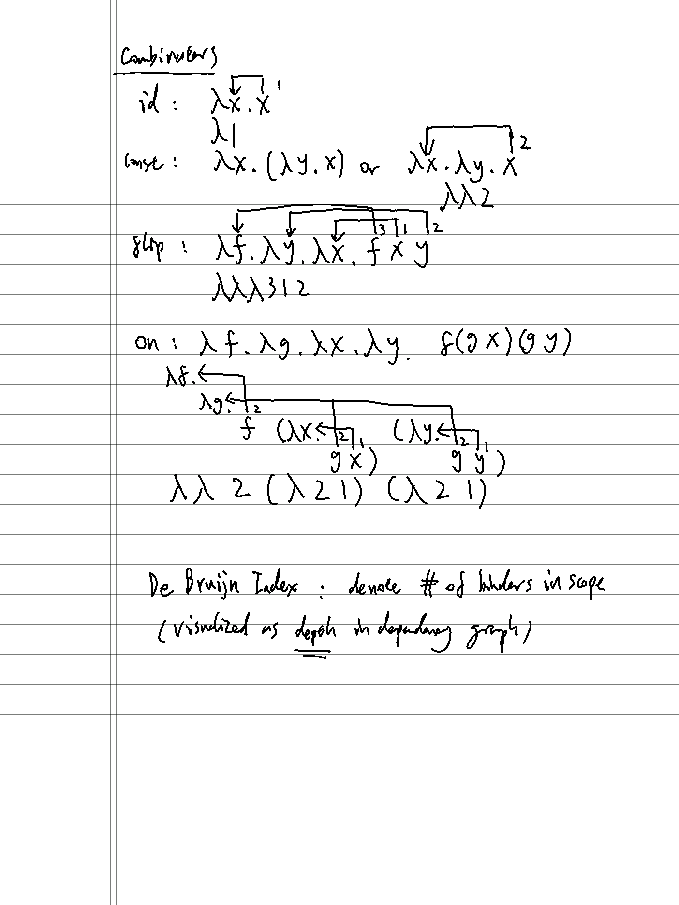

#### 2.[Correctness by Construction](http://www.tomharding.me/2018/01/27/dependable-types-2/)

> GADT (Generalised ADTs)
> A small digression: `Elem`
Bound variable: construct a finite set of values as a type (?)


## Concurrent Models of Computation

### 1.[Introduction to Embedded Systems: a Cyber-Physical Systems Approach](http://leeseshia.org/releases/LeeSeshia_DigitalV1_08.pdf)

#### Event Sequence

Only care about the sequence of ticks while the physical time at which the ticks occur is irrelevant.

1. Synchronously Reactive Model

The reaction of all actors are simultaneous and instantaneous at each of a sequence of ticks of a global clock.

2. Synchronous Dataflow Model (SDF)

SDF actors are constrained to produce the same number of output tokens on each firing.
  - need scheduling polices that deliver bounded buffers
  - need Delay actor (produce an initial output token without having any input token available) to prevent deadlock (insufficient tokens to satisfy any of the firing rules of the actors in a directed loop)

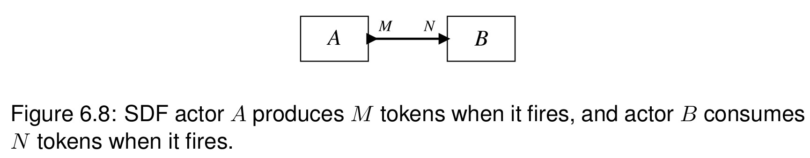
All tokens that A produces are consumed by B if and only if the following balance equation is satisfied:
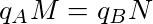

3. Dynamic Dataflow Model (DDF)

DDF actors support conditional firing.
  - Select Actor
  - Switch Actor

Select and Switch Actor are dataflow analogs of **goto** statement in imperative programming.

Bounded buffers and deadlock are undecidable for DDF models.(Buck 1993)

4. Structured Dataflow (constrained DDF)

A higher-order actor called Conditional is introduced, which has one or more models as parameters.

When Conditional fires, it consumes one token from each input port and produces one token on its output port, so it is an SDF actor.

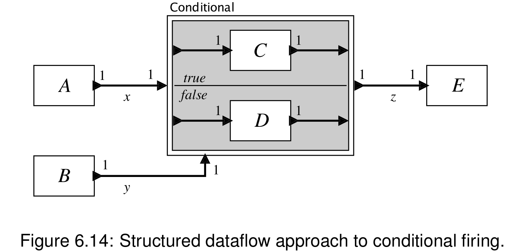
The action of Conditional depends on the value of the token that arrives from B: if that value is true, then actor C fires, otherwise actor D fires.

5. Process Network (PN)

Processes in a PN are called **Coroutines**.

Blocking reads and nonblocking writes. Such interaction between processes is called **Rendezvous**. 

Boundness of buffers and deadlock are also undecidable.

6. Communication Sequential Process (CSP)

A variant of PN.

Reads and writes are both blocking.

e.g. Go Lang, Clojure (core.async), Javascript (JS-CSP)

goroutine <= Coroutine

Go Channel: All operations on unbuffered channels block the execution until both sender and receiver are ready to communicate.

#### Timed Model of Computation

1. Time-triggered Model

Computations are coordinated by a global clock as in SR MoC but computations take time instead of simultaneous and instantaneous.

Each computation in time-triggered MoCs is associated with a logical execution time.

The inputs to the computation are provided at each tick of the global clock, but the outputs are not visible to other computations until the next tick of the global clock.
  - no race condition

  Between ticks, no interaction between computations.

  - no difficulties with feedback loop

  Computations are not instantanous in each tick but can take multiple ticks.

The computations are tied closely to a periodic clock (whose frequency is decided by global execution time) which makes the model awkward when actions are not periodic.

2. Discrete-Event (DE) System

Events are endowed with a **time stamp**. Distinct time stamps must be comparable.

DE system is a network of actors where each actor reacts to input events in time-stamp order and produces output events in time-stamp order.

To execute a DE model, we can use an **event queue**, which is a list of events sorted by time stamp.

e.g. Event Loop in Javascript

[Basics of parallel programming with Swift](https://medium.com/flawless-app-stories/basics-of-parallel-programming-with-swift-93fee8425287)

[The Android Event Loop](http://mattias.niklewski.com/2012/09/android_event_loop.html)

3. Continuous-Time System

Time continuum can only be approximated on digital computers but the continuous-time model preserves the exact dynamics which is similar to the purpose of Scalable Vector Graphics so that you can adjust the precision to match your need.

The approximate execution of a continuous-time model is accomplished by a solver with static/variable step size (may take into account the slope of the curve). e.g. Forward Euler, ODE45

A continuous-time model can be viewed as an **SR model** with a time step between global reaction determined by a solver.
Specifically, a continuous-time model is a network of actors, each of which is **a cascade composition of a simple memoryless computation actor and a state machine**, and actor reactions are **simultaneous and instantaneous**.
Thus, the mechanisms required to achieve a continuous-time model of computation are not much different from those required to achieve SR and DE.

### 2.[LuaCSP Reference Manual](http://htmlpreview.github.io/?https://github.com/loyso/LuaCSP/blob/master/doc/html/LuaCSP.html)

### 3.[Concurrent Programming for Scalable Web Architectures - Diploma Thesis by Benjamin Erb](http://berb.github.io/diploma-thesis/community/index.html)

### 4.[libaco - Proof of Correctness](https://github.com/hnes/libaco#proof-of-correctness)

> registers' constraints in the Function Calling Convention of Intel386 Sys V ABI

### 5.[Locks, Actors, And Stm In Pictures](http://adit.io/posts/2013-05-15-Locks,-Actors,-And-STM-In-Pictures.html)

the actor solution in the article makes an ad-hoc partition on the global state vector, which might not be practical.

### 6.[Beautiful Concurrency - an introduction to STM in Haskell](https://www.schoolofhaskell.com/school/advanced-haskell/beautiful-concurrency)


## Arrowized FRP

### 1. Euterpea: From signals to symphonies
  [Youtube](https://www.youtube.com/watch?v=xtmo6Bmfahc)

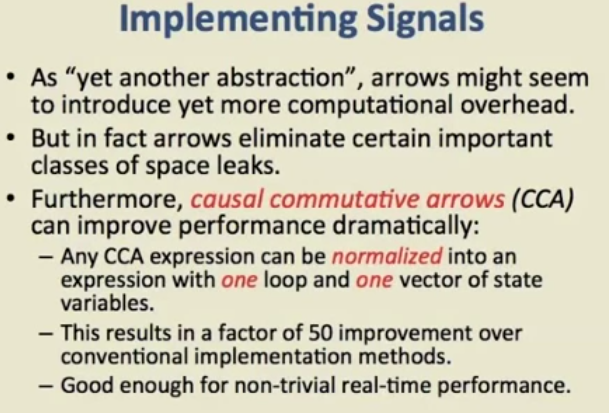

### 2. Causal Commutative Arrows and Their Optimization
[Paper](http://haskell.cs.yale.edu/wp-content/uploads/2012/06/FromJFP.pdf) 
[Youtube](https://vimeo.com/6652662)

Causal Commutative Normal Form(CCNF):
- A pure arrow, or a single loop containing one pure arrow and one initial state
- Transition only based on abstract laws without committing to any particular implementation.

### 3. Causal Commutative Arrows Revisited
[Paper](https://www.cl.cam.ac.uk/~jdy22/papers/causal-commutative-arrows-revisited.pdf) 
[Youtube](https://www.youtube.com/watch?v=bnFHYsL4QNc) 
[Github](https://github.com/yallop/causal-commutative-arrows-revisited)

### 4. [Yampa](https://wiki.haskell.org/Yampa#Primitive_signal_functions)

### 5. [Henrik Nilsson - ITU FRP2010 Lecture](http://www.cs.nott.ac.uk/~psznhn/ITU-FRP2010/)

#### Lecture 01
FRP Variants
- Classic FRP
  First class signal generators.
- Extended Classic FRP
  First class signal generators and signals
- Yampa
  First class signal functions, signals and secondary notion
- Elerea
  First class signals and signal generators

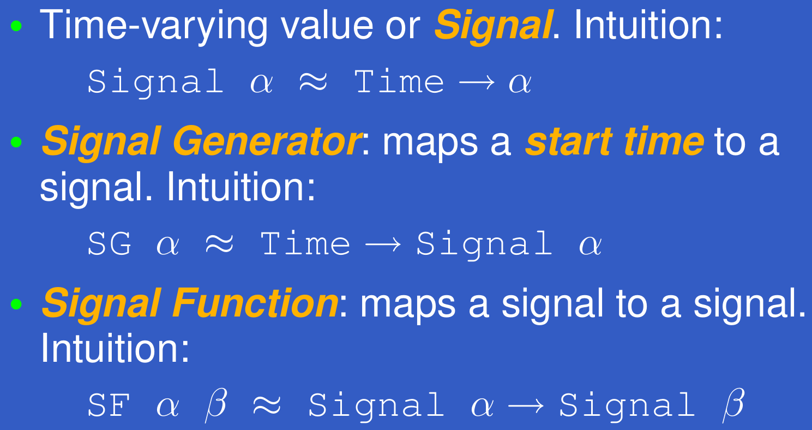

Causality Requirement
  output at time *t* must be determined by input on interval [0,t].

Signal Function Purity
- Pure/Stateless
  if output at time *t* only depends on input at time *t*.
  or if *y(t)* depends only on *x(t)*
- Impure/Stateful
  if output at time *t* depends on input over the interval [0,t].
  of if *y(t)* depends on *x(t)* and *state(t)*
  where *state(t)* summarizes input history *x(t')*, *t' \in [0,t]*

##### Classic FRP
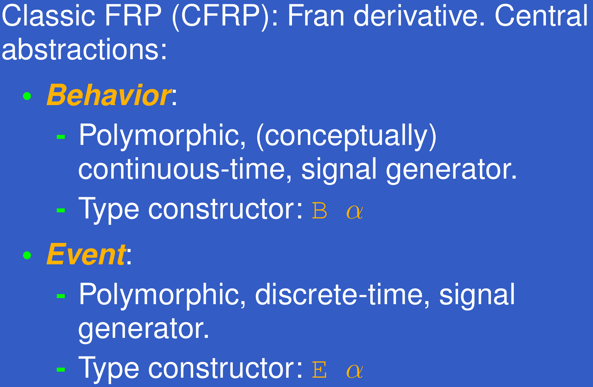
Classic FRP Behavior Examples:
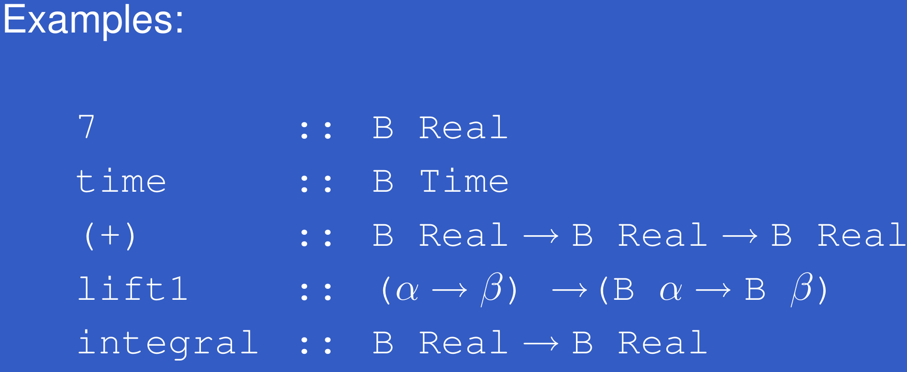

|                    7                     |                   time                   |                   (+)                    | lift1 :: (Real -> Real) -> (B Real -> B Real) |                 integral                 |
| :--------------------------------------: | :--------------------------------------: | :--------------------------------------: | :--------------------------------------: | :--------------------------------------: |
| 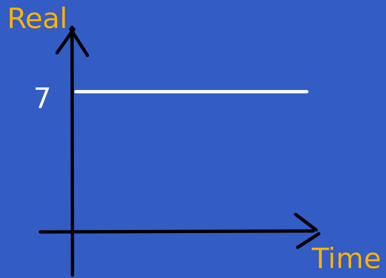 | 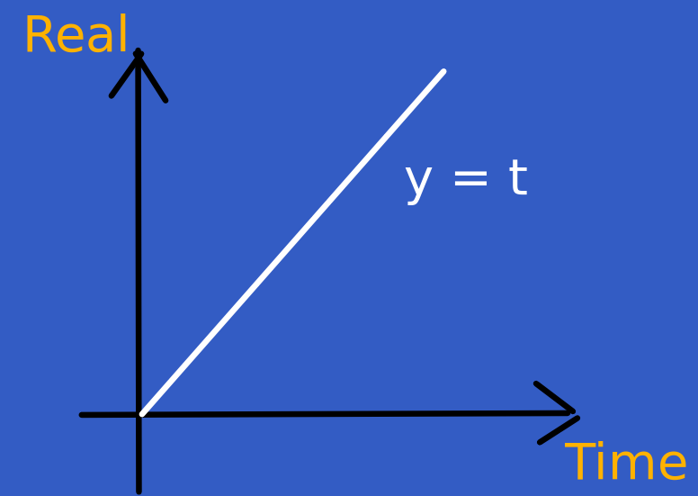 | 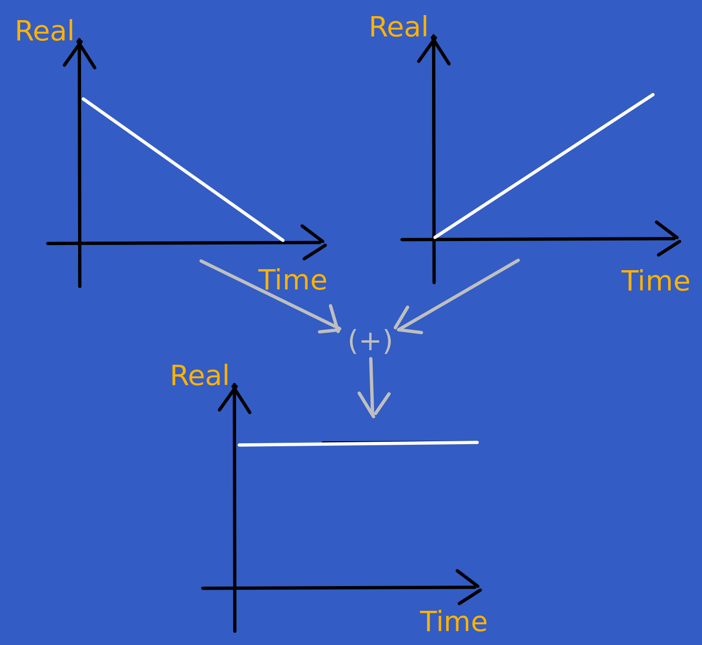 | 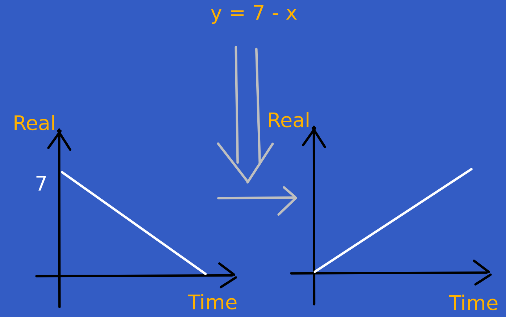 | 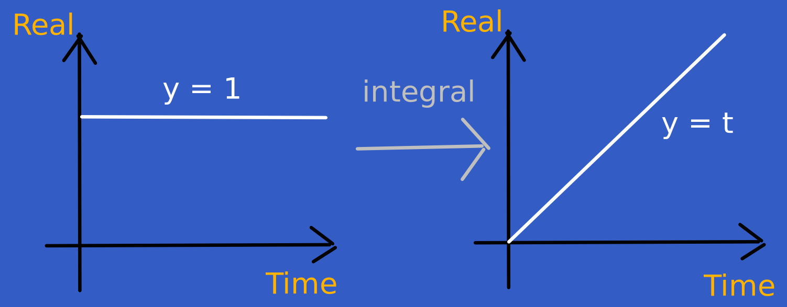 |

Classic FRP Event Examples:
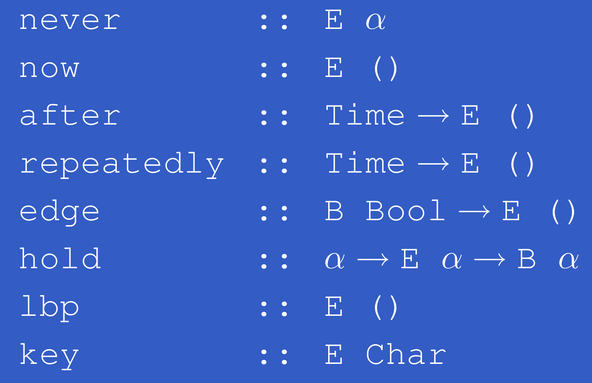

### 6. [Functional reactive programming - Johannes Kepler University 2012](http://lambdor.net/wp-content/uploads/2012/06/2012%20-%20Functional%20Reactive%20Programming%20-%20Gerold%20Meisinger.pdf)
- Programming Paradigms
  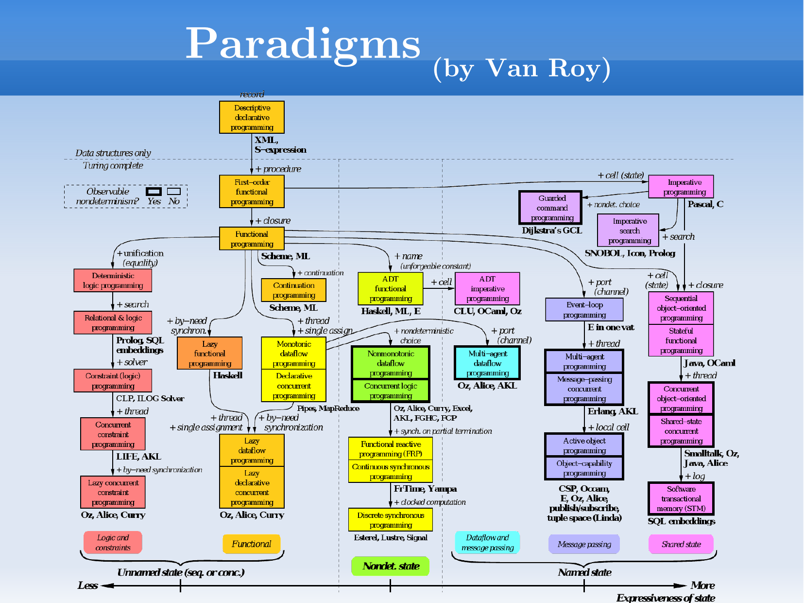

FRP Variants
- Classic FRP
  e.g. Fran, FrTime 
- Push-pull FRP
  e.g. reactive 
- Arrowized FRP
  e.g. Yampa, Elera

Haskell Type Classes
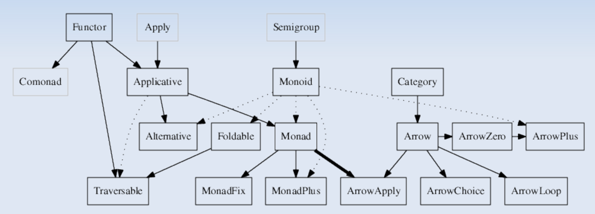

Yampa Switches
=> Dynamic Dataflow (DDF)
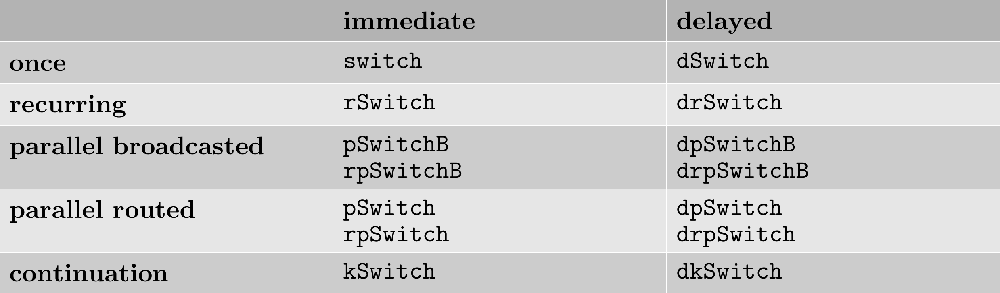

### 7. [FRP Zoo - Comparing many FRP implementations by reimplementing the same toy app in each](https://github.com/gelisam/frp-zoo)

> Evan's presentation classifies FRP libraries into four categories according to the choices they make regarding dynamic graphs. In our list of implementations at the top of this page, we tag each library with the category it belongs to, as well as the scenarios it can implement via dynamic graph changes. There are also other important distinctions between libraries which have nothing to do with dynamic graphs, whose corresponding tags are described in this section.
**Static signal graph v.s. Dynamic signal graph
**Higer-order FRP (any implementation allowing `Signal<Signal>` type) and Asynchronous data flow (e.g. ReactiveX implemented in Observer Pattern)
> - First-order FRP: from Evan's classification, an FRP library which only supports static graphs.
> - High-order FRP: from Evan's classification, an FRP library in which event streams are infinite and the graphs can be changed by collapsing a signal of signals of values into a signal of values.
> - Asynchronous data flow: from Evan's classification, an FRP library in which fast event-processing nodes may receive more recent events than their slower neighbours. Some versions of this model support "cold" signals, in which the event processing is skipped if nobody is listening for the results.
> - Arrowized FRP: from Evan's classification, an FRP library in which graph nodes are automatons which may or may not tick each frame, depending on whether or not they are currently part of the graph. Best for scenario 5. Another way to view this category is that the primary abstraction isn't signals, but functions between signals.
**Separation of Discrete Signal and Continuous Signal**
> - Events and behaviours: an FRP library in which there are two kinds of reactive objects: behaviours hold a value at every point in time, while events only hold values when the event they represent occurs.
> - Signals: an FRP library in which all reactive values hold a value at every point in time. Typically, events are represented via Maybe.
> - Step signals: a separate representation for signals whose value only changes at specific points in time, typically when an event occurs.
> - Continuous: an FRP library in the style of Conal Elliott, meaning that signals are functions from time to values. This built-in notion of time allows interpolation between values, and other time-based transformations.

### 8. [flapjax - Classic FRP](http://www.flapjax-lang.org/)
### 9. [Breaking down FRP](https://blog.janestreet.com/breaking-down-frp/)
Here are some properties that you might want from your FRP system:
- History-sensitivity, or the ability to construct calculations that react not just to the current state of the world, but also to what has happened in the past.
- Efficiency. This comes in two forms: space efficiency, mostly meaning that you want to minimize the amount of your past that you need to remember; and computational efficiency, meaning that you want to minimize the amount of the computation that must be rerun when inputs change.
- Dynamism, or the ability to reconfigure the computation over time, as the inputs to your system change.
- Ease of reasoning. You’d like the resulting system to have a clean semantics that’s easy to reason about.

#### Pure Monadic FRP
In pure monadic FRP, we make the choice to always give such an expression the same meaning, and thus preserve equational reasoning. We also end up with something that’s impossible to implement efficiently. In particular, this choice forces us to remember every value generated by every input forever.

#### Pure Applicative FRP
just drop the join operator, thus giving up dynamism.
static dependency graphs, without the ability to reconfigure

e.g. Elm

e.g. Arrowized FRP
Lets you create a finite collection of static graphs which you can switch between. If those static graphs contain history-dependent computations, then all the graphs will have to be kept running at all times, which means that, while it can be more efficient then applicative FRP, it’s not materially more expressive.

#### Impure Monadic FRP
gives up on equational reasoning.
In other words, the meaning of (max_dist_to_origin mouse_pos) depends on when you call it. Essentially, evaluating an expression that computes a history-sensitive signal should be thought of as an effect in that it returns different results depending on when you evaluate it.

reasoning about when a computation was called in a dynamic dependency graph is really quite tricky and non-local, which can lead to programs whose semantics is difficult to predict.

#### Self-Adjusting Computations (SAC)
give up on history-sensitivity.
no foldp operator

dynamism
The full set of monadic operators, including join
able to build highly configurable computations that can respond to reconfiguration efficiently.

lack of history-sensitivity, thus less suitable UI
suitable for efficient on-line algorithms that could be updated efficiently when the problem changes in a small way.

easy to reason about, all an SAC computation is doing is incrementalizing an otherwise ordinary functional program. 
full equational reasoning if avoid effects within SAC computation.

#### History sensitivity for SAC
The simplest and easiest approach to dealing with history within SAC is to create inputs that keep track of whatever history is important to your application.
you simply set up calculations outside of the system that create new inputs that inject that historical information into your computation.

### 10. [FRP - Dynamic Event Switching](https://apfelmus.nfshost.com/blog/2011/05/15-frp-dynamic-event-switching.html)

> My first design decision for the reactive-banana library was to **remove** this function from the set of combinators. In this post
> - I’m going to explain that the original switcher leads to **time leaks**.
> - I will argue that removing switcher is an **acceptable loss of expressivity**,
> - but nonetheless also **summarize two leak-free solutions** for dynamic event switching. These are relevant for future versions of reactive-banana, even though I have no immediate plans to incorporate them.


### 11. [Higher-order functional reactive programming without spacetime leaks](https://www.cl.cam.ac.uk/~nk480/simple-frp.pdf)

### 12. [purescript-behaviors](https://github.com/paf31/purescript-behaviors/tree/v6.0.0)
[youtube](https://www.youtube.com/watch?v=N4tSQsKZDQ8)

[purescript-event](https://github.com/paf31/purescript-event/blob/v1.2.4/generated-docs/FRP/Event.md)

> ``` purescript
> fix :: forall i o. (Event i -> { input :: Event i, output :: Event o }) -> Event o
> ```
> compute a fixed point

### 13. [TimeFiles: Push-Pull Signal-Function Functional Reactive Programming](https://github.com/eamsden/pushbasedFRP/raw/master/Docs/Thesis/thesis.pdf)

[briancavalier/arrow in JS](https://github.com/briancavalier/arrow)

> 2.1.2 Current Classic FRP Systems

> However, Elm does not provide a notion of switching or continuous time behaviors, though an approximation is given using discrete-time events which are actuated at repeated intervals specified during the event definition.
> This thesis asserts that Arrowized FRP can be embedded in Elm, but provides little support for this assertion

> The reactive-banana library is a push-based FRP system designed for use with Haskell GUI frameworks.
> using a dependency graph to update the network on event occurences.
> eschews generalized switching in favor of branching functions on behavior values
> Rather than a generalized switching combinator which allows the replacement of arbitrary behaviors, reactive-banana provides a step combinator which creates a stepwise behavior from the values of an event stream.

> 3.3.1 Signal Vectors

> 3.4 Combinators

> 3.4.4 Reactivity
> `switch` combinator

> 3.4.5 Feedback
> This combinator provides decoupling for signals but not events.
> This means that the programmer has the responsibility to ensure that feedback does not generate an infinite sequence of events in a single time-step.

> 3.4.6 Event-Specific Combinators
> 3.4.7 Joining
> 3.4.8 Time Dependence

> 3.5 Evaluation
> `signalHandler`, `eventHandler`, `emptyHandler`, `combineHandlers`
> `SFEvalState m svIn svOut`
> `initSFEval`, create the initial state for evaluating a signal function
> `SVSample sv`
> `sampe`, `sampleEvt`, `sampleNothing`, `combineSamples`

> 4 Implementation

### 14. [Signals, Not Generators!](http://ai2-s2-pdfs.s3.amazonaws.com/519f/3860d7f719d3cf89ecf507dd01aa0e149cdf.pdf)

### 15. [The Azimuth Project - Functional reactive programming summary](http://www.azimuthproject.org/azimuth/show/Functional+reactive+programming)

### 16. [FrTime: Functional Reactive Programming in PLT Scheme](https://github.com/papers-we-love/papers-we-love/blob/master/paradigms/functional_reactive_programming/frp-in-plt-scheme.pdf?raw=true)

[FrTime Type Specification - Racket Lang](http://docs.racket-lang.org/frtime/)

### 17. [Conal Elliott - Circuits as a bicartesian closed category](http://conal.net/blog/posts/circuits-as-a-bicartesian-closed-category)

### 18. [The operad of wiring diagrams: formalizing a graphical language for databases, recursion, and plug-and-play circuits](https://arxiv.org/abs/1305.0297)

### 19. [Introduction to Functional Game Programming with Scala - LambdaConf 2014](https://github.com/jdegoes/lambdaconf-2014-introgame)

### 20. [HaReactive - Purely functional reactive programming library for JavaScript and TypeScript](https://github.com/funkia/hareactive)

stateful behaviors

Behavior<Behavior<A>> : a behavior of a behavior is like a value that depends on two moments in time. This makes sense for scan because the result of accumulating depends both on when we start accumulating and where we are now.

To get rid of the extra layer of nesting we often use sample. 
It has the type (b: Behavior<A>) => Now<A>.
``` javascript
const count = sample(scan((acc, inc) => acc + inc, 0, incrementStream));
```
Here count has type Now<Behavior<A>> and it represents a Now-computation that will start accumulating from the present moment.

### 21.[FRP.Elerea.Simple](https://hackage.haskell.org/package/elerea-2.9.0/docs/FRP-Elerea-Simple.html)

### 22.[Practical Principled FRP](https://github.com/beerendlauwers/haskell-papers-ereader/blob/master/papers/Practical%20Principled%20FRP%20-%20Forget%20the%20past,%20change%20the%20future,%20FRPNow!.pdf)

### 23.[signal.js](https://github.com/yelouafi/signal)

[What is Functional reactive programming (FRP)](https://github.com/yelouafi/signal/wiki/What-is-Functional-reactive-programming-(FRP))
- Disambiguation: What vs How (Or Denotational vs Operational)
- Classic FRP

good interpretation of Conal Elliott's original paper

### 24.[Fran - Functional Reactive Animation library in Haskell - Conal Elliott (Microsoft)](http://conal.net/fran/)

[Composing Reactive Animations](http://conal.net/fran/tutorial.htm)

### 25.[Functional Reactive Programming for Real-Time Reactive Systems - Zhanyong Wan(PhD Thesis 2002)](http://haskell.cs.yale.edu/wp-content/uploads/2011/02/wan-thesis.pdf)

> **3.3 Two kinds of recursion**
> - Feedback
> - Cycles in state transition diagram

2nd case using a `switch` as a mechanism to dynamically switch among a set of behaviors may not be a form of recusion but can be interpreted as second-order state machine whose state is composed of smaller state machines.

> 3.3.3 Recursion in FRP
> there is no syntactic distinction between two forms of recursion in FRP.
> in practice can create confusion about the program.

> 4 Hybrid FRP
`Behaviors`, `Switchers`, `Events`

> 5 Event-driven FRP

There are two kinds of behaviors: *stateless* and *stateful*.

A stateless behavior `e` can be viewed as a pure function whose inputs are other behaviors, or it can be a constant when there is no input.
The value of `e` depends sorely on its current input, and is not affected by the history of the input at all.
In this sense, `e` is like a combinatorial/combinational circuit.

A stateful behavior `sf` has a state that can be updated by event occurrences.
The value of `sf` depends on both the current input and its state.
Therefore `sf` is analogous to a sequential circuit.

### 26.[Deprecating the Observer Pattern](https://infoscience.epfl.ch/record/148043/files/DeprecatingObserversTR2010.pdf)

> 7. Related Work
> 7.1 Functional Reactive Programming
> 7.2 Adaptive Functional Programming
> 7.3 Dataflow Programming
> 7.4 Complex Event Processing
> 7.5 Actors

### 27.[Testing and Debugging Functional Reactive Programming](https://dl.acm.org/citation.cfm?id=3136534.3110246)

### 28.[Lucid Synchrone manual](https://www.di.ens.fr/~pouzet/lucid-synchrone/lucid-synchrone-3.0-manual.pdf)

[Lucid Synchrone Programming Language](https://www.di.ens.fr/~pouzet/lucid-synchrone/index.html)

> Lucid Synchrone is an experimental language for the implementation of reactive systems. It is based on the synchronous model of time as provided by Lustre combined with some features from ML languages. The main characteristics of the language are the following:
>
> - It is a strongly typed, higher-order functional language managing infinite sequences or streams as primitive values. These streams are used for representing input and output signals of reactive systems and are combined through the use of synchronous data-flow primitives à la Lustre.
> - The language is founded on several type systems (e.g., type and clock inference, causality and initialization analysis) which statically guaranty safety properties on the generated code.
> - Programs are compiled into sequential imperative code.
> - The language is built above Objective Caml used as the host language. Combinatorial values are imported from Objective Caml and programs are compiled into Objective Caml code. A simple module system is provided for importing values from the host language or from other synchronous modules.

### 29.[Coursera - Functional Program Design in Scala](https://www.coursera.org/learn/progfun2/lecture/pEsTy/lecture-4-2-functional-reactive-programming)

[HW Solutions](https://github.com/izzyleung/Principles-Of-Reactive-Programming)

### 30. Reactive Programming Tutorial in Scala + GWT. Signal. 

[Part 1](http://www.kazachonak.com/2012/06/reactive-programming-tutorial-in-scala.html)

[Part 2](http://www.kazachonak.com/2012/06/reactive-programming-tutorial-in-scala_11.html)

### 31.[(Arrowized) Functional Reactive Programming, Continued*](http://haskell.cs.yale.edu/wp-content/uploads/2011/02/workshop-02.pdf)

> 1 Introduction
> AFRP gives Haskell programmers some, if not most, of the expressive capabilities of **synchronous dataflow** languages, as well as basic **hybrid modeling** functionality.
> Unlike most dataflow languages, *signal functions*, the AFRP analogue to a dataflow processing element, are first class objects.
> AFRP thus supports **higher-order network** descriptions, allowing an unusual flexibility in describing **structurally dynamic** systems.

> This paper mainly examines two recent additions to AFRP:
> - continuation-based switching
>   - allows stateful signal functions to be started (i.e., connected to an input singal), stopped (disconnected), and then resumed again
> - dynamic collections of signal functions
>   - allows varying number of signal functions to be connected into a network

> without loss of the internal signal function state when the network structure is changed

> 2 Arrowized Functional Reactive Programming

> 2.1 Basic Concepts
> emphasizing the signal function aspect of the behavior abstraction (through combinators which allow e.g. the composition of such functions or computing some form of **fixed point**), while relegating signals to second class status, appeared to have a number of significant **operational** advantages and clarify **semantical** issues.
> Taking this approach allows us to recast FRP as an instance of John Hughes's Arrow framework, which directly gave us firm theoretical underpinnings and allowed us to leverage Ross Patterson's work on arrow syntax.

> `SF a b = Signal a -> Signal b`
> where
> `Signal a = Time -> a`
> for real-valued time.

> only signal functions are first class entities; signals only exist indirectly, through the signal functions.

> Signal functions are not curried: multiple input or output signals are tupled together.

> In order to ensure that signal functions are properly executable, we require them to be **causal**:
> the output of a signal function at time `t` is uniquely determined by the input signal on the interval `[0,t]`.
> All primitive signal functions in AFRP are causal and all signal function transformations preserve causality.

in Yampa, `SF` is an instance of `Arrow` and `ArrowLoop`

> 2.2 Discrete and Continuous Time

> Many systems use discrete time semantics in which time is advanced in user-visible increments (stpes).

`elm-automaton` completely removed `continuous time` semantics,
which therefore is under event-driven FRP (E-FRP).
```elm
type Automaton a b
    = Step (a -> ( Automaton a b, b ))

```

> Here it is possible to reason precisely about program semantics and computational resources, but the program becomes less abstract.

directly fits current Elm runtime

> 2.3 Core Primitives

> `arr` is point-wise application:
> ``` haskell
> arr :: (a -> b) -> SF a b
> --                 Signal a  ->   Signal b
> --               (Time -> a) -> (Time -> b)
> arr f =
>   -- s :: Time -> a, signal function
>   \s ->
>     -- t :: Time, real-valued time
>     \t ->
>       -- (s t) :: a
>       -- f :: a -> b
>       -- f (s t) :: b
>       f (s t)
> ```

similar to `pure` in `elm-automaton`
```elm
pure : (a -> b) -> Automaton a b
pure f =
    Step <|
      \x ->
        ( pure f, f x )
```

> `(>>>)` is just reverse function composition
> ```haskell
> (>>>) :: SF a b -> SF b c -> SF a c
> sf1 >>> sf2 
>   =
>     \s ->
>       \t ->
>         (sf2 (sf1 s)) t
>{- = \s ->
>       (sf2 (sf1 s))
>   = \s ->
>       (sf2 . sf1) s -}
>   = sf2 . sf1
> ```

> The other three primitives provide mechanisms for specifying arbitrary wiring structures, using pairing to group signals
> We have omitted the definitions, since they follow naturally from the above wiring diagrams, but the type signatures are as follows:
> ```haskell
> first :: SF a b -> SF (a,c) (b,c)
> (&&&) :: SF a b -> SF a c -> SF a (b,c)
> loop :: SF (a,c) (b,c) -> SF a b
> ```

```haskell
first :: SF a b -> SF (a,c) (b,c)
-- (Signal a -> Signal b) -> (Signal (a,c) -> Signal (b,c))
-- ((Time -> a) -> (Time -> b)) -> ((Time -> (a,c)) -> (Time -> (b,c)))
first sf =
  -- s :: Signal (a,c) = Time -> (a,c)
  \s ->
    -- t :: Time
    \t ->
      let
        (a,c) = s t
             -- sf :: Signal a -> Signal b = (Time -> a) -> (Time -> b)
        b = (sf 
              -- supply sf with a constant signal :: Time -> a
              (\_ -> a)) t
      in
        (b,c)

(&&&) :: SF a b -> SF a c -> SF a (b,c)
-- (Signal a -> Signal b) -> (Signal a -> Signal c) -> (Signal a -> Signal (b,c))
sf1 &&& sf2 =
  \s ->
    \t ->
      let
        b = (sf1 s) t
        c = (sf2 s) t
      in
        (b,c)
  
loop :: SF (a,c) (b,c) -> SF a b
```

`loop` uses definition from `ArrowLoop`


### 32.[Elm: Concurrent FRP for Functional GUIs - Evan Czaplicki (2012)](https://www.seas.harvard.edu/sites/default/files/files/archived/Czaplicki.pdf)

#### 1. Introduction
> global delay
synchronous composition
> strict ordering of events is not always necessary, especially in the case of events that are not directly related
specify independent dimensions, able to use asynchronous composition
> needless recomputation
> every function - when given the same inputs - always produces the same output
pure functions, does it works for IO?
> Therefore, there is no need to recompute a function unless its input changes.
> A program consists of many independent functions, but changing one input to the program is unlikely to affect all of them.
> Previously, when one of the many inputs to an FRP program changes, the whole program is recomputed even though most of the inputs have not changed.
> Elm's ~concurrent~ runtime system avoids this with memorization
inputs = source variables (external state variables)

This is about efficiency in event propagation through the dependency/dataflow network.
In reactive programming, local mutation on a state variable (wrapped in an Observable) by default creates a "update" event and passes it to its down-stream dependency network.
This can be easily achieved by adding an additional logic to "update" event creation where if the up-stream event is discard, or in another word no mutation is caused by the up-stream event, then no "update" event is going to be created and passed on.

#### 2. Background and Related Works
> This chapter addresses two important approaches to introduce mutability:
>  Functional Reactive Programming and Message-Passing Concurrency.
> Both approaches elegantly bridge the gap between purely functional languages and mutable values such as user input.
Here the mutable values is an internal representation of external state variables such as user input.
These internal state variables synchronize with the corresponding external state variable by interpreting their state update events (which contains their latest values) and firing state transitions by direct state assignments.
Delay is expected.

Message-passing concurrency in FP: `MVar` (in `speechCollection/Haskell8`)

#### 2.1 Functional Reactive Programming
> FRP is a declarative programming paradigm for working with mutable values.
> It recasts mutable values as time-varying values, called signals, better capturing the temporal aspect of mutability.
> Signals can also be transformed and combined.
> The original formulation of FRP was extremely expressive, giving programmers many high-level abstractions. This expressiveness came at the cost of efficiency because there was not always a clear way to implement such high-level abstractions.

##### 2.1.1 Classical FRP
> Functional Reactive Animation, Paul Hudak and Conal Elliott, 1997
> two new types of values: `Behavior`s and `Event`s
> `Behavior`s are continuous, time-varying values. This is represented as a function from time to a value
> `Behavior a = Time -> a`
> These time indexed functions are just like the equations of motion in Newtonian physics.
> Behaviors help with a very common task in animation (the original intent): modeling physical phenomena.
> Position, velocity (first derivative), acceleration (second derivative), and analog signals can all be represented quite naturally with `Behavior`s.

> `Event`s represent a sequence of discrete events as time-stamped list of values.
> `Event a = [ (Time, a) ]`
> The time values must increase monotonically.
> Events can model any sort of discrete events, from user input to HTTP communications.
> Originally intended for animations, events would commonly be used to model inputs such as mouse clicks and key presses.

> memory usage may grow unexpectedly (space leaks), resulting in unexpectedly long computations (time leaks).
> Fran inherits a variety of space and time leaks from its host language, Haskell. (primarily from its lazy/non-strict evaluation strategy, make it easy to create infinite data structures)
> In FRP, the value of a behavior may be inspected infrequently, and thus, an accumulated computation can be quite large over time, taking up more and more memory (space leak).
> When inspected, the entire accumulated computation must be evaluated all at once, potentially causing a significant delay or even a stack overflow (time leak).
> This problem is solved by embedding FRP in a strict language.


##### 2.1.2 i) Real-time FRP (RT-FRP)
> Paul Hudak, 2001
> RT-FRP overcame both space and time leaks, but this came at the cost of expressiveness.
> To produce efficiency guarantees, RT-FRP introduce an isomorphism between `Behavior`s and `Event`s
> `Event a ~= Behavior (Maybe a)`
> where `Maybe a` is an abstract data type that can either be `Just a` (an event is occurring) or `Nothing` (an event is not occurring).
`Behavior` and `Event` are unified into `Signal`
> `Signal a = Time -> a`

> an unrestricted base language and a more limited reactive language for manipulating `Signal` s.
> The base language is a basic lambda calculus that supports recursion and higher order functions.
> This base language is embedded in a much more restrictive reactive language that carefully controls how `Signal`s can be accessed and created.
> The reactive language supports recursion but not higher-order functions.

> less expressive than Classical FRP
> Since the reactive language is not higher order, the connections between `Signal`s must all be explicitly defined in the source code.
> They cannot be specified with the full power of the embedded lambda calculus.

##### 2.1.2 ii) Event-driven FRP (E-FRP)
> Event-driven FRP, Hudak et al., 2002
> a direct descendent of RT-FRP that introduces discrete `Signal`s, `Signal`s that only change on events.
> many potential applications of FRP are highly event-oriented.

##### 2.1.3 Arrowized FRP (AFRP)
> Henrik Nilsson, Antony Courtney, and John Peterson, 2002
> AFRP aims to maintain the full expressiveness of Classical FRP without the difficult-to-spot space and time leaks.
> A signal function can be thought of as a function from `Signal` to `Signal`.
> `SF a b = Signal a -> Signal b`

> To avoid time and space leaks, `Signal`s are not directly available to the programmer.
> Because `SF`s are specified at the source level, it is possible to carefully control how recursive functions are evaluated, ensuring that intermediate computations are not kept in memory.
> This eliminates a major source of space and time leaks.

> `SF`s also ensure causality. `SF`s explicitly model input and output, so any future dependent signal function can be ruled out statically.

> `SF`s belong to the category of `Arrow`s, an abstraction developed by John Hughes in 2000.

> AFRP achieves the flexibility of Classical FRP with continuation-based switching and dynamic collections of `SF`s.

> instant-update assumption: "as the sampling interval goes to zero, the implementation is faithful to the formal, continuous semantics"
impossible on digital computer
> **Global delays** and **unnecessary updates** both result from the **instantaneous update assumption** and the use of **continuous signals**.
> Continuous `Signal`s assume that `Signal` values are always changing.

#### 2.2 Message-passing Concurrency
> John Reppy, Emden Gansner, 1987
> Their subsequent work resulted in Concurrent ML and eXene, which together form the basis of a robust GUI framework.
> Previous work in FRP has assumed that all events are strictly ordered and processed one at a time.
> Concurrent ML and eXene illustrate that this is an unnecessary restriction.
> By relaxing the event ordering restrictions, message-passing concurrency provides solutions to Arrowized FRP's two efficiency problems.
> Conceptually, message-passing concurrency is a set of concurrent threads that communicate by sending messages.
Channels, an implicit lock strategy, deadlocks are not avoided

##### 2.2.1 Concurrent ML
##### 2.2.2 eXene: Creating concurrent GUIs
> deadlock and livelock

> In Elm, prevention of event ordering is handled primarily by the compiler, not hte programmer.

TODO: Elm Scheduler
`elm-stuff/packages/elm-lang/core/5.1.1/src/Native/Scheduler.js`
```javascript
var MAX_STEPS = 10000; // Hard-coded?
```

#### 2.3 Existing FRP GUI Frameworks

> Haskell Libraries
> - FranTk
> - Fruit
> - Yampa / Animas
> - Reactive Banana

> Because Haskell-embedded FRP libraries map onto imperative backends, there is also a danger of incorporating imperative abstractions into the library.
> e.g. FranTk included event listeners - an imperative abstraction - because they mapped more naturally onto the Tcl/Tk backend

> implementations in other languages
> - Frappe, Java, 2001
> - Flapjax, JS, 2009

#### 3 The Core Language

##### 3.1.1 Transformation

```Haskell
lift :: (a -> b) -> Signal a -> Signal b
```

TODO: `Time`
```elm
type alias Time = 
    Float
```
> Using the Time constants instead of raw numbers is very highly recommended.

### 33.[A Farewell to FRP - Making signals unnecessary with The Elm Architecture](http://elm-lang.org/blog/farewell-to-frp)

remove continuous `Signal`
=> stay in the discrete `Signal` / `Event` territory
=> no need to model `Event` as a time-varying function `Time -> Maybe a`
=> back to extended finite state machine


### 33.[Effects, Asynchrony, and Choice in Arrowized Functional Reactive Programming](https://pdfs.semanticscholar.org/4aa5/7bbffe8d94d356237c4d974357aa27778cd3.pdf)

### 34.[Modeling User Interfaces in a Functional Language - Antony Courtney PhD thesis](https://www.antonycourtney.com/pubs/ac-thesis.pdf)

> [Antony Courtney](https://www.antonycourtney.com/) - coauther of Yampa


### 35.[Sirea - Simply Reactive! Declarative orchestration in Haskell using RDP](https://github.com/dmbarbour/Sirea)

> Reactive Demand Programming (RDP)
> an RDP application is a complex symphony of signals and declarative effects orchestrated in space and time
> RDP is stateless logic on a stateful grid

> declarative effects
> For a small subset of effects, 
> that have nice properties - e.g. **idempotence, commutativity, monotonicity**
> one can achieve equational reasoning and refactoring on par with the very best pure, law abiding programming models.
> This includes state, video, music, sensor networks, control systems, user interface.

> In RDP, the only effect is observing of the active set of **demands** by a resource.
> RDP's effect model was inspired from a symmetric observer effect in physics and psychology: one cannot observe a system without influencing its behavior.
> Demands are represented as long-lived signals. Signal processing is local, modular, and composable. Treating the signals as a set is essential for RDP's spatial idempotence and commutativity.

> RDP is a **bidirectional dataflow** model. 
> In addition to receiving values, every downstream client is also pushing values upstream: parameters. 
> The cost of supporting bidirectional dataflow and effects on externals is RDP must abandon the illusion of "instantaneous" dataflow. 
Asynchronous/Concurrent dataflow

> weaknesses
> - must use a point-free style for RDP behaviors
> - ideally need robust, monotonic, well synchronized clocks 
why, if concurrent already? For built-in scheduler?
> - Performance of dynamic behaviors is poor
>   designed with an assumption of having very few, relatively stable 'layers' of dynamic behavior, e.g. for staged metaprogramming

#### Domain Model


> - Resources 
> might broadly be classed into sensors, actuators, state, and services. 
> Specific examples include keyboard, mouse, joystick, webcam, microphone, monitor, speaker, filesystem, databases, network, printers. By nature, resources are external to RDP, but may be accessed by RDP behaviors. 
> Resources cannot be created in RDP: there is no equivalent to OOP new. 
> However, resources may be dynamically discovered at runtime, and clever manipulations of stateful resources (such as a filesystem) can model creation in terms of discovery (e.g. by computing a unique filename).

Drivers, IO handling

> - Behaviors 
> describe computation-rich data plumbing between resources. 
> Some behaviors will represent access to a resource, providing a capability to observe or influence it. 
> But the majority of behaviors in an RDP application are often simple data plumbing and pure transforms (cf. Sirea.Behavior). 
> RDP behaviors cannot accumulate state; all state is kept in external resources. 
> A simple, linear behavior might gain a joystick signal from GLFW, transform that signal into controls for a robotic arm, bcross over to a partition representing the robot resource, then push the signal to the robotic arm. (getJoyData >>> bfmap joyToRobotArmCtrl >>> bcross >>> controlArm). 
> RDP can express many independently concurrent behaviors, e.g. using |*|. Behaviors can be dynamic, i.e. there is a behavior to evaluate behaviors (beval).

internal representation of external state

> - Signals 
> describe values as they change over time. 
> Those values typically represent states - e.g. the position of a mouse, frames from a webcam, content for a video display. 
> Future states are not entirely predictable, so signals must be updated over time. 
> Propagating those updates and transforming the signals are the primary roles of behaviors. 
> It is not possible to observe a signal's history, and consequently signals are constrained by durations of explicit, active observation. 
> For example, a signal describing the position of a joystick is only active while a behavior is actively observing it. 
> Behaviors cannot create or destroy signals, but can manipulate existing signals in flexible ways.

internal state

> Signals and resources are not programmable abstractions within RDP. They are not first class. However, signals and resources are useful concepts for motivating, understanding, and explaining behaviors.

### 36.[Awelon Blue - RDP author's blog](https://awelonblue.wordpress.com/)

[awelon -  Awelon project is a new UI model with a new language.](https://github.com/dmbarbour/awelon)

a DSL for RDP

### 37.[ajnsit/concur - An unusual Web UI Framework for Haskell](https://github.com/ajnsit/concur)

[purescript-concur](https://github.com/ajnsit/purescript-concur)

### 38.[John Hughes: Generalising monads to arrows](https://www.sciencedirect.com/science/article/pii/S0167642399000234)

## Self-adjusting Computation (SAC)

### 1.[Self-Adjusting Computation - Umut Acar - Carnegie Mellon University](http://www.umut-acar.org/self-adjusting-computation)

[Self-Adjusting Computation. PhD. Thesis. 2005. Umut A. Acar.](http://www.umut-acar.org/publications/umut-thesis.pdf?attredirects=0)

[Self-Adjusting Machines, Ph.D. Thesis, 2012, Matthew Hammer.](http://www.umut-acar.org/publications/matt-thesis.pdf?attredirects=0)

[Functional Programming for Dynamic and Large Data with Self-Adjusting Computation.](http://www.umut-acar.org/publications/icfp2014.pdf?attredirects=0)

### 2.[Introducing Incremental - a SAC library](https://blog.janestreet.com/introducing-incremental/)

### 3.[Breaking down FRP](https://blog.janestreet.com/breaking-down-frp/)


## Process Algebra/Calculus

### 1.[A gentle introduction to Process Algebras](https://pdfs.semanticscholar.org/12d9/eae1638729aeb237b5be445ee91ecdd3c5d7.pdf)

### 2.[Process Calculus - Wikipedia](https://en.wikipedia.org/wiki/Process_calculus)
History

In the first half of the 20th century, various formalisms were proposed to capture the informal concept of a computable function, with μ-recursive functions, Turing machines and the lambda calculus possibly being the best-known examples today. The surprising fact that they are essentially equivalent, in the sense that they are all encodable into each other, supports the Church-Turing thesis. Another shared feature is more rarely commented on: they all are most readily understood as **models of sequential computation**. The subsequent consolidation of computer science required a more subtle formulation of the notion of computation, in particular explicit representations of concurrency and communication.

**Models of concurrency** such as the process calculi, Petri nets in 1962, and the actor model in 1973 emerged from this line of inquiry.

## Petri Nets

[Communicating finite-state machine](https://en.wikipedia.org/wiki/Communicating_finite-state_machine)

### 1.[Petri Net](https://en.wikipedia.org/wiki/Petri_net)

### 2.[A Unified Frame Work for Discrete Event Systems](https://link.springer.com/article/10.1007/s12555-012-9408-6)

Petri net models are normally more compact than similar automata based models and are better suited for the representation of discrete event systems.

### 3.[Petri nets: properties, analysis, and applications](https://inst.eecs.berkeley.edu/~ee249/fa07/discussions/PetriNets-Murata.pdf)

### 4.[An Introduction to the Practical Use of Colored Petri Nets](https://pdfs.semanticscholar.org/c46a/a30cea94b734e4e653d410a3f9c2f5508434.pdf)

### 5.[Petri Nets: Fundamental Models, Verification and Applications](https://books.google.com/books/about/Petri_Nets.html?id=6YRmLxXp5uQC)

### 6.[CPN Tools - A tool for editing, simulating, and analyzing Colored Petri nets](http://cpntools.org/)

[Coloured Petri net](https://en.wikipedia.org/wiki/Coloured_Petri_net)

## TLA+

### 1.[Hillel Wayne Blog](https://www.hillelwayne.com/tags/tla+/)

[List of TLA+ Examples](https://www.hillelwayne.com/post/list-of-tla-examples/)

[Modeling Redux with TLA+](https://www.hillelwayne.com/post/tla-redux/)

### 2.[Learn TLA+](https://learntla.com/introduction/)

## Reactive JS
### 1.[Popmotion- A functional, reactive animation library](https://github.com/Popmotion/popmotion)

### 2.[RxJS 6](https://github.com/ReactiveX/rxjs)

### 3.[most - Monadic streams for reactive programming](https://github.com/cujojs/most)

### 4.[xstream - An extremely intuitive, small, and fast functional reactive stream library for JavaScript](http://staltz.github.io/xstream/)

### 5. [HaReactive - Purely functional reactive programming library for JavaScript and TypeScript](https://github.com/funkia/hareactive)

## Functional JS
### 1.[Jabz - powerful and practical abstractions for JavaScript](https://funkia.github.io/jabz/)

### 2.[fp-ts](https://github.com/gcanti/fp-ts)

Lightweight higher-kinded polymorphism

[StateIO](https://github.com/gcanti/fp-ts/blob/master/examples/StateIO.ts)
[Free](https://github.com/gcanti/fp-ts/blob/master/examples/Free.ts)
[Moore](https://github.com/gcanti/fp-ts/blob/master/examples/Moore.ts)

### 3. [Sanctuary](https://github.com/sanctuary-js/sanctuary)
[Sanctuary-Type-Classes](https://github.com/sanctuary-js/sanctuary-type-classes)

### 4. [union-type](https://github.com/paldepind/union-type)

### 5. [Common combinators in JavaScript](https://gist.github.com/Avaq/1f0636ec5c8d6aed2e45)

### 6.[Akh - Javascript Monad and Monad Transformer Collection](https://github.com/mattbierner/akh)

### 7.[Mostly Adequate Guide to FP - Chapter 11: Transform Again, Naturally](https://mostly-adequate.gitbooks.io/mostly-adequate-guide/ch11.html)

### 8.[(experimental) monad-t - Transformers for monadic algebraic structures bridging types from various monadic libraries (Fluture, monet)](https://github.com/char0n/monad-t)

### 9.[Functional-Light JavaScript - Pragmatic, balanced FP in JavaScript.](https://github.com/getify/Functional-Light-JS)

## Algebraic Automata

### 1. [Cellular Automata - Part2: PNGs and Moore](https://www.schoolofhaskell.com/school/to-infinity-and-beyond/pick-of-the-week/part-2)

### 2. [Moore for Less](https://www.schoolofhaskell.com/user/edwardk/moore/for-less)

Moore Machine can be seen as a CoFree CoMonad


### 5. [Sequences, streams, and segments](http://conal.net/blog/posts/sequences-streams-and-segments)


### 9. Intro to Machines & Arrows
[Intro to Machines & Arrows - Part 1: Stream and Auto](https://blog.jle.im/entry/intro-to-machines-arrows-part-1-stream-and.html)

[Intro to Machines & Arrows - Part 2: Auto as Category, Applicative & Arrow](https://blog.jle.im/entry/auto-as-category-applicative-arrow-intro-to-machines.html)

[Intro to Machines & Arrows - Part 3: Effectful, Recursive, Real-World Autos](https://blog.jle.im/entry/effectful-recursive-real-world-autos-intro-to-machine.html)

### 10. [CLaSH.Prelude.Mealy](https://hackage.haskell.org/package/clash-prelude-0.11.2/docs/CLaSH-Prelude-Mealy.html)

Mealy machine synchronised to the system clock

### 11. [Finite State Transducers in Haskell? - Stack Overflow](https://stackoverflow.com/questions/27997155/finite-state-transducers-in-haskell)

[Finite-State Transducer - Wikipedia](https://en.wikipedia.org/wiki/Finite-state_transducer)

A Mealy machine alternately reads an `a` from a stream of inputs `a` and outputs `a` b to a stream of outputs. It reads first and then outputs once after each read.

``` haskell
newtype Mealy a b = Mealy { runMealy :: a -> (b, Mealy a b) }
```

A Moore machine alternately outputs a `b` to a stream of outputs and reads an input `a` from a stream of inputs. It starts with an output of `b` and then reads once after each output.

``` haskell
data Moore a b = Moore b (a -> Moore a b)
```

An FST either reads from it's input, writes to its output, or stops. It can read as many times in a row as it wants or write as many times in a row as it wants.

``` haskell
data FST a b
    = Read  (a -> FST a b)
    | Write (b,   FST a b)
    | Stop
```

The equivalent of an FST from machines is Process. It's definition is a little spread out. To simplify the discussion we are going to forget about Process for now and explore it from the inside-out.

### 12. [Haskell - Data.Machine.Mealy](https://hackage.haskell.org/package/machines-0.6.3/docs/Data-Machine-Mealy.html)

### 13. [Purescript - Data.Machine.Mealy](https://pursuit.purescript.org/packages/purescript-machines/4.0.0/docs/Data.Machine.Mealy)

### 14. [Elm-Automaton - experimental Arrowized FRP in Elm](https://github.com/evancz/automaton)

### 15. [AFSM: Arrowized functional state machines - Haskell Library](https://hackage.haskell.org/package/AFSM)

> In functional reactive programming(FRP), the key concepts are the signal, Signal a :: Time -> a, and the signal function from signal to signal, SF a b :: Signal a -> Signal b.
>
> The model of FRP is beautiful, but one difficult thing is that the signal is continuous function, and our computers are discrete systems.
>
> However, what if we do not care about time, and only focus on the sequence of input. There is reason to believe that computational tasks usually are time-insensitive. For example, the parsing process. So [a] and [Event a] are the only things we expected in our system.
>
> For discrete system, simplifying the input type is kind of generalizing [(Time,a)] to [a]. This simplified model is still able to process the time sequences by using [(Time, a)] as the input. In conclusion, we doesn't consider time as an essential part of the input, but if the input involves time, users can add time back as a part of the input.

## State Machine Implementations

### Unity

#### 1.[Unity: PlayMaker](https://assetstore.unity.com/packages/tools/visual-scripting/playmaker-368)

### JS

#### 1.[How I Learned to Stop Worrying and ❤️ the State Machine](http://raganwald.com/2018/02/23/forde.html)
#### 2.[JS: xstate - Functional, Stateless JS Finite State Machines and Statecharts](https://github.com/davidkpiano/xstate)
#### 3.[JS: statechart - A javascript implementation of a Harel Statechart](https://github.com/burrows/statechart.js)
#### 4.[JS: royal](https://github.com/jdque/royal)

[Hacker News Discussion](https://news.ycombinator.com/item?id=16468280)


## Algebraic Data Type
### 1.[Typeclassopedia](https://wiki.haskell.org/Typeclassopedia)

> There are two keys to an expert Haskell hacker’s wisdom:
> - Understand the types.
> - Gain a deep intuition for each type class and its relationship to other type classes, backed up by familiarity with many examples.

### 2. [Functors, Applicatives, And Monads In Pictures](http://adit.io/posts/2013-04-17-functors,_applicatives,_and_monads_in_pictures.html)
### 3. [Three Useful Monads](http://adit.io/posts/2013-06-10-three-useful-monads.html)
### 4. [ADT & Dependent Type - Tom Harding](http://www.tomharding.me/)

#### [Functions as Functors](http://www.tomharding.me/2017/04/15/functions-as-functors/)

> Reader Monad

lead me to the idea of unifying `Monoid`, `Category`(<= `Semigroupoid`), `Monad`(<= `Functor`, `Apply`, `Applicative`, `Bind`)

[Monads, Monoids, and Categories - Bartosz Milewski](https://bartoszmilewski.com/2017/09/06/monads-monoids-and-categories/)

#### 10. [Alt, Plus, and Alternative](http://www.tomharding.me/2017/04/24/fantas-eel-and-specification-10/)

> `Alt`: `Functor`-level `Semigroup`
> You can do [database connection failover](https://gist.github.com/i-am-tom/9651cd1e95443c4cbf3953429e988b07), [API/resource routing](https://github.com/slamdata/purescript-routing/blame/master/GUIDE.md#L96-L102), and, most magically of all, [text parsing](https://github.com/purescript/purescript/blob/master/src/Language/PureScript/Parser/Declarations.hs#L161-L169). 
> The key thing all these cases have in common is that you want to try something **with a contingency plan for failure**.
> `Plus`: `Functor`-level `Monoid`
> `Alternative`: `Plus` and `Applicative`
> - Distributivity: `x.ap(f.alt(g)) === x.ap(f).alt(x.ap(g))`
> - Annihilation: `x.ap(A.zero()) === A.zero()`
> You’ll often hear `Alternative` types described as `monoid`-shaped `applicative`s, and this is a good intuition. 
> We talked about `of` as being the `identity` of `Applicative`, but this is only at context-level.
> For an `Alternative` type, `zero` is the `identity` value at context- and value-level.

### 5. A functional approach to building React applications. 
[Part 1 - Deconstructing the React Component](https://jaysoo.ca/2017/04/30/learn-fp-with-react-part-1/)

[Part 2 - The Reader monad and read-only context](https://jaysoo.ca/2017/05/10/learn-fp-with-react-part-2/)

[Part 3 - Functional state management with Reducer (W.I.P.)](https://jaysoo.ca/)

### 6. [Revisiting 'Monadic Parsing in Haskell'](http://vaibhavsagar.com/blog/2018/02/04/revisiting-monadic-parsing-haskell/)

### 7. [HLearn](https://github.com/mikeizbicki/HLearn)

| Structure     | What we get                           |
|:--------------|:--------------------------------------|
| Monoid        | parallel batch training               |
| Monoid        | online training                       |
| Monoid        | fast cross-validation                 |
| Abelian group | "untraining" of data points           |
| Abelian group | more fast cross-validation            |
| R-Module      | weighted data points                  |
| Vector space  | fractionally weighted data points     |
| Functor       | fast simple preprocessing of data     |
| Monad         | fast complex preprocessing of data    |

### 8.[The ReaderT Design Pattern - Avoid WriterT, StateT, ExceptT](https://www.fpcomplete.com/blog/2017/06/readert-design-pattern)
### 9. [Monads for drummers](https://github.com/anton-k/monads-for-drummers)
### 10.[What a Monad is not](https://wiki.haskell.org/What_a_Monad_is_not)
### 11.[Combinator Parsing: A Short Tutorial](http://www.cs.uu.nl/research/techreps/repo/CS-2008/2008-044.pdf)

from ["Free monad considered harmful"](https://markkarpov.com/post/free-monad-considered-harmful.html)

Levi Pearson comments:
Regarding "inspection", building a structure out of a free Applicative rather than Monad removes the excess "dynamism" that prevents deep inspection. I guess you were probably already aware of this too, but I figured it was worth a mention in case you weren't. You can see this in Haxl ( https://code.facebook.com/p... ), and UU-Parsinglib ( https://hackage.haskell.org... ) takes advantage of the inspectability of Applicative structure to do interesting things to parsers built with an Applicative-based DSL.

### 12.[Chart: hierarchy of the numeric type classes in Haskell](https://rufflewind.com/2014-08-03/haskell-numeric-type-classes-hierarchy)

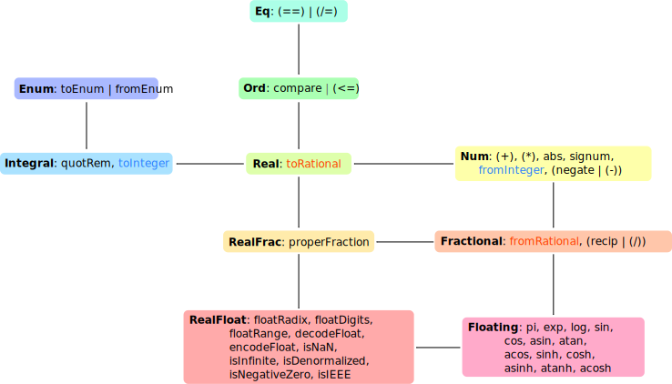

### 13.[OOP vs type classes](https://wiki.haskell.org/OOP_vs_type_classes)

### 14.[Type classes v.s. Java interfaces](https://www.schoolofhaskell.com/school/starting-with-haskell/introduction-to-haskell/5-type-classes)

**multiple dispatch**

### 15.[Monoids, Functors, Applicatives, and Monads: 10 Main Ideas](https://monadmadness.wordpress.com/2015/01/02/monoids-functors-applicatives-and-monads-10-main-ideas/)

> Main Idea #1: Monoids, functors, applicatives, and monads are all different algebras
>
> Main Idea #2: Monoids, functors, applicatives, and monads are ideas about computation, and are not just specific to Haskell
>
> Main Idea #3: Functors transform values inside containers, while applicatives and monads combine values inside containers
>
> Main Idea #4: Things that are monads can be combined using a special type of function composition
>
> Main Idea #5: You can put values inside a container but you can’t always take them out
>
> Main Idea #6: Applicatives and monads offer an elegant way to manage side effects and state
>
> Main Idea #7: Applicatives and monads both model running computations in sequence, but monads are more powerful
>
> Main Idea #8: Applicatives and monads come with nice syntax
>
> Main Idea #9: Monoids are a general algebra for combining things in a certain way
>
> Main Idea #10: Monads are monoids in the category of endofunctors

### 16.[What a Monad is not](https://wiki.haskell.org/What_a_Monad_is_not#Haskell_doesn.27t_need_Monads)

### 17.[Abstract Data Types and Objects - Two fundamental approaches to data abstraction](https://medium.com/@JosephJnk/abstract-data-types-and-objects-17828bd4ab dc)

### 18.[Notions of Computation as Monoids](https://arxiv.org/abs/1406.4823)

> There are different notions of computation, the most popular being monads, applicative functors, and arrows.
> In this article we show that these three notions can be seen as monoids in a monoidal category. 

### 19.[Profunctors, Arrows, & Static Analysis](https://elvishjerricco.github.io/2017/03/10/profunctors-arrows-and-static-analysis.html)

#### Background - Analysis of Expressive Programs: Applicative
> The difference between applicatives and monads is that with applicatives, you can see what those components are before you run the program.
> You don’t know what their results will be, but you can at least see what they’re going to try to do. 
```haskell
(,) <$> getUsername userId1 <*> getUsername userId2
``` 
> It could in principle batch both calls into one SQL query.
> the thing being analyzed is static for the duration of the analysis, so for all intents and purposes, it’s **static analysis**. 
```haskell
class (Functor t, Foldable t) => Traversable t where
  traverse :: Applicative f => (a -> f b) -> t a -> f (t b)

instance Traversable [] where
  traverse _ [] = pure []
  traverse f (a:as) = (:) <$> f a <*> traverse f as
``` 
> This allows you to iterate applicative effects over collections of data whose size and shape are unknown. 
> If the applicative is capable of analyzing those components, then using `traverse` allows that applicative to analyze any arbitrary sequence of components.
> In the case of `traverse getUsername ids`, you could imagine the applicative building one big long SQL query that gets the usernames for a bunch of IDs in one go.

Applicative: coordinate results from independent computations.

#### Composition: Category
```haskell
import Prelude hiding (id, (.))

-- Laws:
--
-- f . id = id . f = f
-- (f . g) . h = f . (g . h)
class Category cat where
  id :: cat a a
  (.) :: cat b c -> cat a b -> cat a c

(>>>) :: Category cat => cat a b -> cat b c -> cat a c
(>>>) = flip (.)

instance Category (->) where
  id = \a -> a
  f . g = \a -> f (g a)
```
> The key difference is that with a category, information is being threaded through the program.
> Unlike applicative, where the inputs are known statically, and the outputs are computed at runtime, categories make inputs and outputs both at runtime.
> But the structure of the computation remains static.

> - Mapping
> - Strength
> - Choice
> - Traversing


### 20.[Monads are just monoids in the category of endofunctors](https://blog.merovius.de/2018/01/08/monads-are-just-monoids.html)

> - Categories
> - Monoids
> - Functors
> - Natural Transformations
> - Monads

### 21.[I love profunctors. They're so easy.](https://www.schoolofhaskell.com/school/to-infinity-and-beyond/pick-of-the-week/profunctors#contravariant-functors)

> - Covariant Functor
> - Contravariant Functor
> - Bifunctor
> - Profunctor

> A Profunctor is just a bifunctor that is contravariant in the first argument and covariant in the second.

```haskell
class Profunctor f where
    dimap ∷ (c → a) → (b → d) → f a b → f c d

      g   ∷   a    ←   c   (contravariant)
        h ∷     b  →     d (covariant)
dimap g h ∷ f a b  → f c d
```

> The simplest and most common Profunctor is (→). The specialised type of dimap would be:

``` haskell
dimap :: (c → a) → (b → d) → (a → b) → (c → d)
```

### 22. [Reading Configuration with Kleisli Arrows](https://blog.ssanj.net/posts/2017-06-12-reading-configuration-with-kleisli-arrows.html)

### 23. [Applicative Programming with Effects](http://www.staff.city.ac.uk/~ross/papers/Applicative.html)

> 4 Monoids are phantom Applicative functors

> 5 Applicative versus Monad?
> One situation where the full power of monads is not always required is parsing,
> although only certain pairs of monads are composable, the Applicative class is closed under composition
> For example, both `Maybe ◦ IO` and `IO ◦ Maybe` are applicative: 
> `IO ◦ Maybe` is an applicative functor in which computations have a notion of ‘failure’ and ‘prioritised choice’, even if their ‘real world’ side-effects cannot be undone. 
> Note that `IO` and `Maybe` may also be composed as monads (**though not vice versa**), but the applicative functor determined by the composed monad differs from the composed applicative functor: the binding power of the monad allows the second `IO` action to be aborted if the first returns a failure.

> 6 Applicative functors and Arrows

> 7 Applicative functors, categorically
> applicative functors are **strong lax monoidal functors**

### 24.[The Monad.Reader - a electronic magazine about all things Haskell](https://themonadreader.wordpress.com/)


## Functional Data Structures

### 1.[Functional Data Structures - Prabhakar Ragde](https://cs.uwaterloo.ca/~plragde/flaneries/FDS/)

### 2.[Purely Functional Random-Access Lists - Chris Okasaki (CMU)](https://www.westpoint.edu/eecs/SiteAssets/SitePages/Faculty%20Publication%20Documents/Okasaki/fpca95.pdf)

### 3.[MonadReader - issue 16](https://themonadreader.files.wordpress.com/2010/05/issue16.pdf)
> Playing with Priority Queues - Louis Wasserman

## Model Theory
### 1.[Model Theory - Wikipedia](https://en.wikipedia.org/wiki/Model_theory)
universal algebra + logic = model theory
model theory = algebraic geometry − fields

### 2.[Combinatorics - Wikipedia](https://en.wikipedia.org/wiki/Combinatorics)
an area of mathematics primarily concerned with counting, both as a means and an end in obtaining results, and certain properties of finite structures
> - the enumeration (counting) of specified structures, sometimes referred to as arrangements or configurations in a very general sense, associated with finite systems,
> - the existence of such structures that satisfy certain given criteria,
> - the construction of these structures, perhaps in many ways, and
> - optimization, finding the "best" structure or solution among several possibilities, be it the "largest", "smallest" or satisfying some other optimality criterion.

- Partition Theory
- Graph Theory
- Design Theory
- Order Theory
- Probabilistic Combinatorics
- Algebraic Combinatorics (abstract algebra)
- Combinatorics on words (formal languages)
- Coding Theory (error-correcting codes, information theory)

### 3.[Abstract Algebra - Wikipedia](https://en.wikipedia.org/wiki/Abstract_algebra)

> **Category theory** is a formalism that allows a unified way for expressing properties and constructions that are similar for various structures.
> **Universal algebra** is a related subject that studies types of algebraic structures as single objects. For example, the structure of groups is a single object in universal algebra, which is called variety of groups.


## Category Theory
### Theory
#### 1.[A Concise Course in Algebraic Topology](https://www.math.uchicago.edu/~may/CONCISE/ConciseRevised.pdf)
#### 2.[Abstract and Concrete Categories](http://katmat.math.uni-bremen.de/acc/acc.pdf)
#### 3.[Toposes, Triples and Theories](http://www.tac.mta.ca/tac/reprints/articles/12/tr12.pdf)

#### 4.[The collected works of F. W. Lawvere - Github](https://github.com/mattearnshaw/lawvere)

#### 5.[Basic Category Theory](https://arxiv.org/abs/1612.09375)

#### 6.[Seven Sketches in Compositionality: An Invitation to Applied Category Theory](https://arxiv.org/abs/1803.05316)

### Application
#### 1.[Memory Evolutive System (MES)](http://vbm-ehr.pagesperso-orange.fr/AnintroT.htm)

#### 2.[Understanding Visualization: A Formal Approach using Category Theory and Semiotics](https://arxiv.org/abs/1311.4376)

#### 3.[The Topos of Music: Geometric Logic of Concepts, Theory, and Performance - Guerino Mazzola](https://www.amazon.com/Topos-Music-Geometric-Concepts-Performance/dp/3764357312/)

#### 4.[Categorical Informatics - MIT](http://catinf.com/)

> an improved data model over current-generation data models (Relational, RDF/OWL, Graph, Key-Value, LINQ)
> AQL: an algebraic query language

### connection to Dialectics

#### 1.[Unity and identity of opposites in calculus and physics - F. William Lawvere](https://link.springer.com/article/10.1007/BF00122250)

> The dialectical philosophy, developed 150 years ago by Hegal, Schleiermacher, Grassmann, Marx, and others, may provide significant insights to guide the learning and development of mathematics, while categorical precision may dispel some of the mystery in the philosophy.

[Stack Exchange - David Myers](https://math.stackexchange.com/questions/2357569/can-you-explain-lawveres-work-on-hegel-to-someone-who-knows-basic-category-theo)
> Lawvere is concerned with objective logic in this more mathematical sense as the logic of objects in a category.
> The logic takes the form of tools we can use to make and understand objects using others.
> In turn, the existence of these tools can be seen as axioms for a suitable category.

> Lawvere had noticed before his Hegelian turn (I think) that these axioms can be encoded using adjunctions. 
> The cartesian product is right adjoint to the diagonal functor which duplicates each object and arrow, and the coproduct is the corresponding left adjoint. 
> The internal hom is defined as a right adjoint to the functor which takes a fixed cartesian product. 

> The basic idea of a unity of opposites is that in order to entertain any idea, you need to be able to entertain its opposite; otherwise, your idea is vacuous in the sense that it could apply to anything. 

> In fact, Hegel's first unity of opposites is just that: the unity of the opposition between vacuity (applying to nothing) and tautology (applying to anything). 
> This is his unity between Nothing and Being. 
> He explains this as something like: to even talk of Nothing is to consider it as a thing, and to make it be. 
> But it is a thing with no characteristics, a pure Being. 
> On the other hand, pure Being has no characteristics either, it simply is; thus it is contentless, and therefore Nothing.

> Lawvere's interpretation of this opposition is to see Nothing as the initial object ∅ and Being as the terminal object 1 since in a category of spaces -- e.g. a topos or at least an extensive category -- ∅ is an empty space and 1 is a single point. These are opposite in the sense that they are distinct (and intuitively, very distinct), but are unified in that they are the left and right adjoints of the same functor. 

#### 2.[Hegel's "Logic" as Modal Type Theory - nLab, Urs Schreiber](https://ncatlab.org/nlab/show/Hegel's+"Logic"+as+Modal+Type+Theory)
> While analytic philosophy famously rejected the speculative metaphysics of Hegel in favor of the analysis of concepts by means of mathematical logic, in particular predicate logic,
> recent developments in the foundations of mathematics via **homotopy type theory** offer a way to re-read Hegel as having useful formal meaning not in predicate logic, but in ‘modal type theory’.

#### 3.[Science of Logic- nLab, Urs Schreiber](https://ncatlab.org/nlab/show/Science+of+Logic)
> Formalization in Categorical logic / in Modal homotopy type theory
> 3. Die Lehre vom Sein / The Doctrine of Being
> 4. Die Lehre vom Wesen / The doctrine of essence
> 5. Die Lehre vom Begriff / The doctrine of the notion
> 6. Die Philosophie der Natur / Philosophy of Nature
> 7. Die Philosophie des Geistes / Philosophy of Spirit

[Hegel’s Science of Logic](https://www.marxists.org/reference/archive/hegel/works/hl/hl000.htm)


## Guarded Recursion
### 1.[A Modality for Recursion](https://pdfs.semanticscholar.org/a177/47f98e5b821f03ec8be858794f2f83a683b7.pdf)
### 2.[A Model of Guarded Recursion with Clock Synchronisation](http://www.itu.dk/people/mogel/papers/clocks-mfps2015.pdf)


## OOP missing features

1. Multiple Dispatch

Overloaded functions dispatch based on runtime subtypes.

OOP: class-based Single Dispatch (Function Dispatch doesn't enforce subtyping)

Visitor Pattern: reverse caller-callee once called for a extra Single Dispatch, called Double Dispatch
 (two calls: A call B to get subtype of A, then B call A to get subtype of B, then the end function have subtypes from both A and B)
 
Strong coupling between concrete Visitor classes and subtypes of B.
(Adding/Removing subtypes from B will cause a reimplementation of Visitor.)

2. Unit ()

OOP: Void, lead to functions not pure nor composable.

3. Type Alias

> data - creates new algebraic type with value constructors
> - Can have several value constructors
> - Value constructors are lazy
> - Values can have several fields
> - Affects both compilation and runtime, have runtime overhead
> - Created type is a distinct new type
> - Can have its own type class instances
> - When pattern matching against value constructors, WILL be evaluated at least to weak head normal form (WHNF) *
> - Used to create new data type (example: Address { zip :: String, street :: String } )
>
> newtype - creates new “decorating” type with value constructor
> - Can have only one value constructor
> - Value constructor is strict
> - Value can have only one field
> - Affects only compilation, no runtime overhead
> - Created type is a distinct new type
> - Can have its own type class instances
> - When pattern matching against value constructor, CAN be not evaluated at all *
> - Used to create higher level concept based on existing type with distinct set of supported operations or that is not interchangeable with original type (example: Meter, Cm, Feet is Double)
>
> type - creates an alternative name (synonym) for a type (like typedef in C)
> - No value constructors
> - No fields
> - Affects only compilation, no runtime overhead
> - No new type is created (only a new name for existing type)
> - Can NOT have its own type class instances
> - When pattern matching against data constructor, behaves the same as original type
> - Used to create higher level concept based on existing type with the same set of supported operations (example: String is [Char])
    
C# only supports `type` with `using`

4. Advanced Pattern Matching

[Match Me if you can: Swift Pattern Matching in Detail.](https://appventure.me/2015/08/20/swift-pattern-matching-in-detail/)

> - Wildcard Pattern (`_`)
> - Identifier Pattern (Concrete Value)
> - Value-Binding Pattern (Destructuring into Variables)
> - Tuple Pattern (Product Type)
> - Enumeration Case Pattern (Sum Type, not strict about Totality, support recursion i.e. Recursive Enumerations)
> - Type-Casting Patterns (Runtime/Dynamic Subtypes, Foreign data)
> - Expression Pattern (`~=` operator, e.g. Int ranges `0..9`)
> - Fallthrough (default break in swtich), Break, and Labels


## Post-OOP

### 1.[Entity–component–system - Wikipedia](https://en.m.wikipedia.org/wiki/Entity–component–system)

*Used in Unity

Composition over Inheritance

behavior of an entity can be changed at runtime by adding or removing components

Common ECS approaches are highly compatible and often combined with **data oriented design** techniques.

### 2.[Data-oriented design - Wikipedia](https://en.m.wikipedia.org/wiki/Data-oriented_design)

The claim is that traditional object-oriented programming (OOP) design principles result in **poor data locality**, more so if runtime polymorphism (dynamic dispatch) is used (which is especially problematic on some processors[3]).[4]
Although OOP does superficially seem to organise code around data, the practice is quite different. OOP is actually about organising source code around **data types**, rather than physically grouping individual fields and arrays in a format efficient for access by specific functions.
It also often **hides layout details** under abstraction layers, while a data-oriented programmer wants to consider this first and foremost.

### 3.[One Weird Trick to Write Better Code](http://etodd.io/2015/09/28/one-weird-trick-better-code/)

Rather than inheriting functionality, Unity entities are just bags of components. 

[Data first, not code first - Hacker News](https://news.ycombinator.com/item?id=10291688)

### 4.Wizards and warriors
(?) from OOP encoding rules in Type System to Rule Engine / Function on Data

*Interesting Debates in Comments

[Wizards and warriors, part one](https://ericlippert.com/2015/04/27/wizards-and-warriors-part-one/)

[Wizards and warriors, part two](https://ericlippert.com/2015/04/30/wizards-and-warriors-part-two/)

[Wizards and warriors, part three](https://ericlippert.com/2015/05/04/wizards-and-warriors-part-three/)

[Wizards and warriors, part four](https://ericlippert.com/2015/05/07/wizards-and-warriors-part-four/)

[Wizards and warriors, part five](https://ericlippert.com/2015/05/11/wizards-and-warriors-part-five/)

[Hacker News Comments: How I Learned to Stop Worrying and Love the State Machine](https://news.ycombinator.com/item?id=16468280)

##### pinkythepig

> ``` haskell
> data Player =
>     Player (Maybe Weapon) Class
>
> data Weapon =
>       Sword
>     | Staff
>     | Dagger
>
> data Class =
>       Warrior
>     | Wizard
>
> type Error = String
>
> mkPlayer :: Maybe Weapon -> Class -> Either Error Player
>
> mkPlayer (Just Sword) Warrior = Right (Player (Just Sword) Warrior)
> mkPlayer (Just Dagger) Warrior = Right (Player (Just Dagger) Warrior)
> mkPlayer Nothing Warrior = Right (Player Nothing Warrior)
> mkPlayer (Just Staff) Warrior = Left "A Warrior cannot equip a Staff"
>
> mkPlayer (Just Staff) Wizard = Right (Player (Just Staff) Wizard)
> mkPlayer (Just Dagger) Wizard = Right (Player (Just Dagger) Wizard)
> mkPlayer Nothing Wizard = Right (Player Nothing Wizard)
> mkPlayer (Just Sword) Wizard = Left "A Wizard cannot equip a Sword"
> ```
>
> A player is always a defined class(wizard or warrior), but they may not have a weapon equipped. This solution is a bit wordy, but comes with the benefit that if you ever add a new weapon/class, the compiler will scream at you if you haven't handled the case for it properly.
>
> You would only export the mkPlayer function in the library and you could potentially have much fancier error handling, such as building a data structure that contains an 'invalid' player anyways (e.g. `Left (Player (Just Sword) Wizard)`) so you can custom build an error message at the call site ("A $class cannot equip a $weapon") or even completely ignore the error if that is a potential usecase (such as building an armor/weapon preview tool, where you don't care whether they can use the weapon/armor).
>
> Modifying it is pretty easy too. Say I wanted to allow for 2handed weapons, plus offhand weapons (shields, orbs, charms, etc.) I could encode that in a data type like:
>
> ``` haskell
> data EquippedWeapon =
>       TwoHanded TwoHandWeapon
>     | OneHanded (Maybe OneHandWeapon) (Maybe Offhand)
>     | Unequipped
> ```
>
> and swap it into the Player definition:
>
> ``` haskell
> data Player =
>     Player EquippedWeapon Class
> ```
>
> And now I wouldn't be able to compile until I fixed the mkPlayer function and any other place that uses a Player and is dependent upon the weapon portion of the data structure.
>
> e.g. This function wouldn't need to change
>
> ``` haskell
> areYouAWizardHarry :: Player -> Bool
> areYouAWizardHarry (Player _ Wizard) = True
> areYouAWizardHarry (Player _ _) = False
> ```

##### FBT

> The answer is very much "practicality issue". Haskell's more advanced type level features (including GADTs and type families) are very much suited for this, but they're also the sort of thing that gives Haskell a reputation for being complicated. If your just using Haskell's core features the way the parent post does, Haskell is a very simple, very elegant language.
>
> But better yet, it certainly does have the big guns which you can pull out.
>
> ``` haskell
> -- Just like before, we define `Class` and `Weapon`:
> data Class = Warrior | Wizard
> data Weapon = Sword | Staff | Dagger
>
> -- The one really annoying thing is that
> -- at the moment you have to use a little bit
> -- of annoying boilerplate to define singletons
> -- (not related to the OOP concept of singletons, by
> -- the way), or use the `singletons` library. In the
> -- future, with DependentHaskell, this won't be necessary:
> data SWeapon (w :: Weapon) where
>   SSword :: SWeapon 'Sword
>   SStaff :: SWeapon 'Staff
>   SDagger :: SWeapon 'Dagger
>
> -- Now we can define `Player`:
> data Player (c :: Class) where
>   WizardPlayer :: AllowedToWield 'Wizard w ~ 'True => SWeapon w -> Player 'Wizard
>   WarriorPlayer :: AllowedToWield 'Warrior w ~ 'True => SWeapon w -> Player 'Warrior
> ```
>
> This last part shouldn't be to difficult to understand, if you ignore the SWeapon boilerplate: Player is parameterized over the player's class, with different constructors for warriors and wizards. Each constructor has a parameter for the weapon the player is wielding, which is constrained by the type family (read: type-level function) named AllowedToWield.
>
> AllowedToWield isn't that complicated either, it's just a (type-level) function that takes a Class and a Weapon and returns a `Bool` using pattern matching:
>
> ``` haskell
> type family AllowedToWield (c :: Class) (w :: Weapon) :: Bool where
>   AllowedToWield 'Wizard 'Sword = 'False
>   AllowedToWield 'Wizard 'Dagger = 'True
>   AllowedToWield 'Wizard 'Staff = 'True
>   AllowedToWield 'Warrior 'Sword = 'True
>   AllowedToWield 'Wizard 'Dagger = 'True
>   AllowedToWield 'Wizard 'Staff = 'False
> ```
>
> And there it is. What do you gain from all this? Something which it is very had to get in certain other languages: compile-time type checking that there is no code that will allow a wizard to equip a sword, or a warrior to equip a staff.
>
> Once again, I want to make it clear that you absolutely don't need to do this, even in Haskell. You're absolutely allowed to write the simple code like in the parent post. But in my opinion, this is an extremely powerful and useful tool that Haskell lets you take much further than many other languages.
>
> So long story short, the answer to your question is that it is indeed a "practicality issue", although I don't think that my code is that impracticable. It certainly is absolutely not a Haskell limitation: in fact if anything, Haskell makes it a bit too tempting to go in the other direction, and go way overboard with embedding this kind of thing in the type system.

### 5.[Design Patterns in Dynamic Languages](http://www.norvig.com/design-patterns/)

### 6.[Are Design Patterns Missing Language Features](http://wiki.c2.com/?AreDesignPatternsMissingLanguageFeatures)

### 7.[OOP vs type classes](https://wiki.haskell.org/OOP_vs_type_classes)

### 8.[Data-Oriented Design (Or Why You Might Be Shooting Yourself in The Foot With OOP)](http://gamesfromwithin.com/data-oriented-design)

> When we think about objects, we immediately think of trees— inheritance trees, containment trees, or message-passing trees, and our data is naturally arranged that way. As a result, when we perform an operation on an object, it will usually result in that object in turn accessing other objects further down in the tree. Iterating over a set of objects performing the same operation generates cascading, totally different operations at each object (see Figure 1a).

> To achieve the best possible data layout, it’s helpful to break down each object into the different components, and group components of the same type together in memory, regardless of what object they came from. This organization results in large blocks of homogeneous data, which allow us to process the data sequentially (see Figure 1b).
> A key reason why data-oriented design is so powerful is because it works very well on large groups of objects. 
>
> OOP, by definition, works on a single object.
>
> OOP ignores that and deals with each object in isolation.
>
> Advantages of Data-Oriented Design
> - Parallelization
> - Cache utilization
> - Modularity
> - Testing

### 9.[Design patterns implemented in Java](http://java-design-patterns.com/)

### 10.[Classless Object Semantics - Jones, Timothy ](https://researcharchive.vuw.ac.nz/handle/10063/6681)

### 11.[Programming Paradigms and Beyond - Brown University](http://cs.brown.edu/~sk/Publications/Papers/Published/kf-prog-paradigms-and-beyond/paper.pdf)

Operational Semantics vs. Denotational Semantics

> 2 Paradigms as a Classical Notion of Classification

> imperative, object-oriented (OO), functional (FP), and logic
> scripting, Web, database, reactive

> in reactive languages, the program expresses dependencies but the language handles updating the values of variables in the presence of mutation

> OO is a widely-used term chock-full of ambiguity.
> FP is characterized by two more traits: the ability to pass functions as values, which creates much higher-level operations than traditional loops (an issue that manifest s in plan composition (sec. 6.3)), and tail - calls, which make loop - like recursive solutions just as efficient as loops, thus enabling recursion as a primary, and g eneralizable, form of looping.

> 3 Beyond Paradigms

> Put differently, while OO and FP are statements about program organization , **reactivity** is a statement about program behavior on update. These are essentially orthogonal issues, enabling reactivity to be added to existing languages.

> Thus **event-driven** programming is another cross-cutting notion that is independent of and orthogonal to the program’s organization 
> — rather, it is a statement about the program’s relationship with its operating environment.

> 4 Notional Machines

> 4.1 The Challenge of Mutation and State

Complexity of state management

> Notional machines are a useful lens through which to explore the complexities of reasoning about state (program behavior in the presence of mutation). 
> Stateful programming has been taken by many as a sine qua non of programming education.
> At the same time, numerous studies show that students struggle with this concept, both as novices and as upper-level students (through interactions between state and other language features), while students working in non-stateful paradigms sometimes perform well on problems that are challenging in stateful context.
> Taken together, these observations make **comparative studies between stateful and non-stateful** features one of the most significant **understudied** topics in computing education.

> If state is so challenging for students to learn, why is it so popular in introductory contexts? 
> Purely as a language feature (setting aside pedagogy for a moment), state has many benefits:
> - It provides cheap communication channels between different parts of a program.
> - It trades off persistence for efficiency.
> - It appears to have a relatively straightforward notional machine, which lends itself to familiar-looking metaphors (like “boxes”).
> - It corresponds well to traditional control operations like looping.

>However, these benefits of state become far less clear once we broaden our scope beyond very rudimentary programming. For instance:
> - State introduces time and ordering (as Program 1 reveals) and forces students to think about them.
> - State reveals aliasing (as Program 2 reveals). Aliasing is particularly problematic in the case of parallelism/concurrency, which is increasingly a central feature in programming.

> State thus requires a complex notional machine to account for all these factors.
> The apparent simplicity of stateful notional machines arises because most computing education literature usually just ignores some of these features (e.g., compound data with references to other compound data).
> This results in notional machines that are not faithful to program behavior, and hence are either useless or even misleading to students.

### 12.[What is an Entity Component System architecture for game development?](http://www.richardlord.net/blog/ecs/what-is-an-entity-framework.html)

a step-by-step derivation of an entity component system


## Control Theory
### 1.[Mathematical Control Theory: Deterministic Finite Dimensional Systems](http://www.math.rutgers.edu/~sontag/FTPDIR/sontag_mathematical_control_theory_springer98.pdf)

> 1.4 Feedback Versus Precomputed Control
> 1.5 State-Space and Spectrum Assignment
> 2.1 Basic Definitions
> 2.1.2 A **system** or **machine**
> time, state space, input-value space, transition map
> 2.6 Continuous-Time
> 7 Observers and Dynamic Feedback

### 2.[An Introduction to Mathematical Optimal Control Theory](https://math.berkeley.edu/~evans/control.course.pdf)

> Chapter 7: Introduction to stochastic control theory

## Computer Model
**Correct this section after reading "Microprogrammed State Machine Design"**

- discrete/continuous-time
- discrete/continuous-value

### 1.[Analog computer - Wikipedia](https://en.wikipedia.org/wiki/Analog_computer)
### 2.[Digital electronic computer - Wikipedia](https://en.wikipedia.org/wiki/Digital_electronic_computer)
### 3.[Hybrid computer - Wikipedia](https://en.wikipedia.org/wiki/Hybrid_computer)

## Scalable Architecture

### 1.[Functional Design and Architecture](https://github.com/graninas/Functional-Design-and-Architecture)

### 2.[Message Oriented Programming](https://www.joeforshaw.com/blog/message-oriented-programming)

### 3.[Event Notifier, a Pattern for Event Notification](http://www.marco.panizza.name/dispenseTM/slides/exerc/eventNotifier/eventNotifier.html)

### 4.[Unidirectional User Interface Architectures](https://staltz.com/unidirectional-user-interface-architectures.html)

### 5.[Elm Static Types to Effectively Model Application Domain](https://egghead.io/courses/elm-static-types-to-effectively-model-application-domain)

### 6.[The Architecture of Open Source Applications](http://aosabook.org/en/index.html)

[Dagoba: an in-memory graph database](http://aosabook.org/en/500L/dagoba-an-in-memory-graph-database.html)

[Web Spreadsheet](http://aosabook.org/en/500L/web-spreadsheet.html)

[ZeroMQ](http://aosabook.org/en/zeromq.html)


## Scala

### 1.[Scala.js for JavaScript developers](https://www.scala-js.org/doc/sjs-for-js/)

### 2.[The Limitations of Type Classes as Subtyped Implicits by Adelbert Chang](https://adelbertc.github.io/publications/typeclasses-scala17.pdf)

> The natural encoding of type classes combines subtyping and implicits, both central features of Scala.

> limitations:
> If the type class hierarchy branches, seemingly valid programs can hit **implicit resolution failures**.
> These failures must then be solved by explicitly passing the implicit arguments which is cumbersome and negates the advantages of type classes.

> 3 Type Class Coherency
> One critical difference is the restriction that type class resolution must be coherent.
> This means for a given superclass (e.g. Functor[F]), the resolution through any of its subclasses (e.g. Traverse[F] or Monad[F]) must return a semantically equal instance.
> Both Haskell and Rust achieve coherency by restricting where type class instances can be defined.
> To define an instance of a type class TC for a type A, the instance must either be defined with the code for TC or with the code for A.
> (type class, type) pair is globally unique

interface inheritance with instance carried

> Implicits in Scala has no restriction on where or how many implicits can be defined.
> the implicit resolver has no promise of coherency when picking implicits as it is possible for different parameters of the same supertype to have different semantics as subtypes.

diamond problem / multiple inheritance in type class hierarchy

Both `Traversable` and `Monad` are `Functor`.
When defining `Traversable-and-Monad` 
Using subtyped implicits to encode type classes in Scala does not enforce one unique `Functor` instance for both `Traversable` and `Monad`
`ambiguous implicit values`: implicit resolver does not know which `Functor` instance to choose

> 4 Potential Scala Solutions

> 4.1 The Scato Encoding

still possible to have multiple instances for the same superclass but enforce one resolution path at library level which needs to be documented as design choices

> 4.2 Making Scala Type Class-aware

> introduces a new marker trait which would be used to distinguish between type classes (implicits with coherency constraint) and regular implicits

### 3. Implicits, type classes, and extension methods

1. [with type classes in mind](https://kubuszok.com/2018/implicits-type-classes-and-extension-methods-part-1/)

2. [implicit derivation](https://kubuszok.com/2018/implicits-type-classes-and-extension-methods-part-2/)

3. [conversions and implicit-based patterns](https://kubuszok.com/2018/implicits-type-classes-and-extension-methods-part-3/)

4. [understanding implicits](https://kubuszok.com/2018/implicits-type-classes-and-extension-methods-part-4/)

### 4. [Applied Functional Programming with Scala - Fantasyland Institute of Learning.](https://gist.github.com/jdegoes/97459c0045f373f4eaf126998d8f65dc)

### 5. [learning Scalaz](http://eed3si9n.com/learning-scalaz/index.html)


## Bayesian Network & Causality

### 1.[The Book of Why: The New Science of Cause and Effect](https://www.amazon.com/Book-Why-Science-Cause-Effect/dp/046509760X)

> To appreciate the depth of this gap, imagine the difficulties that a scientist would face in trying to express some obvious causal relationships-says, that the barometer reading B tracks the atmospheric pressure P.
> We can easily write down this relationship in an equation such as B = kP, where k is some constant of proportionality.
> The rules of algebra now permit us to rewrite this same equation in a wild variety of forms, for example, P = B/k, k = B/P, or B–kP = 0.
> They all mean the same thing—that if we know any two of the three quantities, the third is determined.
> **None of the letters k, B, or P is in any mathematical way privileged over any of the others.**
> How then can we express our strong conviction that it is the pressure that causes the barometer to change and not the other way around?
> And if we cannot express even this, how can we hope to express the many other causal convictions that do not have mathematical formulas, such as that the rooster’s crow does not cause the sun to rise?

A group constraint among three state variables `k, B, P`.

### 2.[Wikipedia - Causal loop diagram](https://en.wikipedia.org/wiki/Causal_loop_diagram)

> A causal loop diagram (CLD) is a causal diagram that aids in visualizing how different variables in a system are **interrelated**.

### 3.[the Seven Pillars of Causal Reasoning with Reflections on Machine Learning](http://ftp.cs.ucla.edu/pub/stat_ser/r481.pdf)

To achieve human-level intelligence, learning machines need the guidance of a model of external reality, similar to the ones used in causal inference tasks.

## Purescript

### 1.[purescript-base documentation](https://github.com/purescript-contrib/purescript-base/tree/master/docs)

### 2. Elm Architecture in PureScript - To Overcome

[Elm vs PureScript I: War of the Hello, Worlds](http://www.parsonsmatt.org/2015/10/03/elm_vs_purescript.html)

[Elm vs PureScript II: The Elm Architecture, in PureScript](http://www.parsonsmatt.org/2015/10/05/elm_vs_purescript_ii.html)

[Elm Architecture in PureScript III: Dynamic Lists of Counters](http://www.parsonsmatt.org/2015/10/10/elm_architecture_in_purescript_iii.html)

[Elm Architecture in PureScript IV: Effects](http://www.parsonsmatt.org/2015/10/11/elm_architecture_in_purescript_iv_effects.html)

## Haskell

### 1.[Three Layer Haskell Cake - To Overcome](http://www.parsonsmatt.org/2018/03/22/three_layer_haskell_cake.html)

> Layer 1:
```haskell
newtype AppT m a 
    = AppT 
    { unAppT :: ReaderT YourStuff m a 
    } deriving (Functor, Applicative, Monad, etc)
```

> The ReaderT Design Pattern, essentially.

injecting dependencies/environment and configuration

> This is what everything gets boiled down to, and what everything eventually gets interpreted in.
> This type is the backbone of your app.
> For some components, you carry around some info/state (consider MonadMetrics or katip’s logging state/data); for others, you can carry an explicit effect interpreter.
> This layer is for defining how the upper layers work, and for handling operational concerns like performance, concurrency, etc.

> Layer 2:
> This layer provides a bridge between the first and third layer.
> Here, we’re mostly interested in mocking out external services and dependencies.
> The most convenient way I’ve found to do this are mtl style classes, implemented in terms of domain resources or effects.

simple dependency injection with mocking, for unit tests

> Layer 3:
> Business logic.
> This should be entirely pure, with no IO component at all.
> This should almost always just be pure functions and relatively simple data types.
> Reach for only as much power as you need – and you need much less than you think!


## React

### 1.[Simple React Patterns - Dealing With Side-Effects In React](http://lucasmreis.github.io/blog/simple-react-patterns/)

### 2.[React in Patterns - A free book that talks about design patterns/techniques used while developing with React.](https://github.com/dtinth/react-in-patterns)

> 2.3 Composition
> 4.1 Dependency injection
> 4.2 Styling

## Redux

### 1.[Slack clone built with Elixir, Phoenix, and React Redux](https://github.com/bnhansn/sling)

### 2.[markerikson/react-redux-links - article collections](https://github.com/markerikson/react-redux-links)

### 3.[gaearon/connect.js - simplified for concept](https://gist.github.com/gaearon/1d19088790e70ac32ea636c025ba424e)

> re-render whenever the store state changes

can be improved by caching and diffing (I assume they did in the real library)

## Elm

### 1. [Scaling The Elm Architecture](https://github.com/evancz/guide.elm-lang.org/tree/master/reuse)

> **We do not think in terms of reusable components.** Instead, we focus on reusable functions.
> we create **reusable views** by breaking out helper functions to display our data.

### 2. Advanced Types in Elm - Charlie Koster

[Part I: Opaque Types](https://medium.com/@ckoster22/advanced-types-in-elm-opaque-types-ec5ec3b84ed2)

[Part II: Extensible Records](https://medium.com/@ckoster22/advanced-types-in-elm-extensible-records-67e9d804030d)

[Part III: The Never Type](https://medium.com/@ckoster22/advanced-types-in-elm-the-never-type-ca9b3297bbd4)

[Part IV: Phantom Types](https://medium.com/@ckoster22/advanced-types-in-elm-phantom-types-808044c5946d?source=user_profile---------5-------------------)

one or more parameters in the Type constructor than in the Data constructor

> ```elm
> type APhantomType a
>     = Tag1 String
>     | Tag2
> ```

> Phantom types are useful for restricting function arguments

### 3. [How to turn a Msg into a Cmd Msg in Elm? - You can, but you probably shouldn’t](https://medium.com/elm-shorts/how-to-turn-a-msg-into-a-cmd-msg-in-elm-5dd095175d84)

### 4. [elm-visualization - A visualization package for Elm (D3-like)](https://github.com/gampleman/elm-visualization)

Denotational visualization: from data, to positions on screen, to geometries that connect these positions.

[Elm Europe 2017 - Jakub Hampl - Visualizing data with elm](https://www.youtube.com/watch?v=Pf1xQ76JgmQ)

### 5. [Elm Europe 2017 - Richard Feldman - Scaling Elm Apps](https://www.youtube.com/watch?v=DoA4Txr4GUs&t=986s)
Refactoring into smaller pieces

### 6. [Compilers as Assistants - Making Elm faster and friendlier in 0.16](http://elm-lang.org/blog/compilers-as-assistants)

> Simplified Records

> Elm uses a very cool record system. It is based on an excellent paper by Daan Leijen that lets you add and remove fields from records, all while keeping the types simple. I really love this mix of power and simplicity!

[Extensible records with scoped labels](https://www.microsoft.com/en-us/research/publication/extensible-records-with-scoped-labels/)

> I added support for this back in 0.7, and at the time, I had never seen a language (with a real working compiler) that allowed field addition and deletion like this. So I had intuition, but no way to get real experience. I worried that it could encourage overly complex code, so from the start I was very conservative, knowing that we could expand or contract the features as we got more data.
>
> Well it has been more than two years since then, and the results are in. Pretty much no one ever used field addition or deletion. In the few cases where people did use it, it got pretty crazy pretty quickly. The one real-world case I know of is recorded here if you want to see, and the code could be rewritten with union types, which turned out nicer anyway.

### 7.[jvoigtlaender/circuits - exploring elm interactive graphics (and also teaching my son some basic circuitry)](https://github.com/jvoigtlaender/circuits)

### 8.[Elm, preventDefault, and onWithOptions](https://medium.com/@ckoster22/elm-preventdefault-and-onwithoptions-99a6a56e6638)

### 9.[elm-sortable-table](https://github.com/evancz/elm-sortable-table)

### 10.[elm-autocomplete](https://github.com/thebritican/elm-autocomplete)

[The API Design Session video w/ Evan Czaplicki (@evancz)](https://www.youtube.com/watch?v=KSuCYUqY058)

### 11.[abadi199/datetimepicker](https://github.com/abadi199/datetimepicker)

### 12.[abadi199/elm-input-extra](https://github.com/abadi199/elm-input-extra)

### 13.[folkertdev/outmessage - Streamlining parent-child communication with The Elm Architecture](https://github.com/folkertdev/outmessage/)

### 14.[imbybio/outmessage-nested - Extension to folkertdev/outmessage for nested components](https://github.com/imbybio/outmessage-nested/)

> Health warning

> Having nested child modules is a sign that your Elm application is complex and potentially over-engineered. 
> There are perfectly valid reasons for doing so and this package will help you when this is the case.
> However, you may also consider re-factoring your application to get rid of the nesting and simplify your design.


### 15.[vipentti/elm-dispatch - Dispatch multiple messages in response to a single Html.Event](https://github.com/vipentti/elm-dispatch/tree)

### 16.[Structured TodoMVC example with Elm](https://github.com/rogeriochaves/structured-elm-todomvc/)

> - [NoMap approach with Domain focus](https://github.com/rogeriochaves/structured-elm-todomvc/tree/nomap-domain)
> - [NoMap approach with Technical focus](https://github.com/rogeriochaves/structured-elm-todomvc/tree/nomap-technical)
> - [OutMsg approach](http://folkertdev.nl/blog/elm-child-parent-communication/)
> - [Translator approach](https://medium.com/@alex.lew/the-translator-pattern-a-model-for-child-to-parent-communication-in-elm-f4bfaa1d3f98)

### 17.[elm-generic-dict](http://package.elm-lang.org/packages/robertjlooby/elm-generic-dict/latest)

> The core Dict/Set implementations only allows keys of `comparable` type. (This includes `Int`, `Float`, `Time`, `Char`, `String`, and `Tuple`s or `List`s of `comparable` types.)
> This implementation builds off the core implementation but allows the user to provide their own comparer function for ordering the keys.

> 
```elm
{-| Convert an association list into a dictionary using the given comparer.
-}
fromList : (k -> k -> Order) -> List (k, v) -> GenericDict k v
```

## Swift

### 1.[An Introduction to WebObjects, in Swift](http://www.alwaysrightinstitute.com/wo-intro/)

### 2.[Can Swift replace Front-End or Isomorphic JavaScript?](https://medium.com/@stawecki/can-swift-replace-front-end-or-isomorphic-javascript-2191c58f35d7)

### 3.[Swift in Depth](https://www.manning.com/books/swift-in-depth)

> Chapter 8
> Protocals -- similar to typeclasses in Haskell or traits in Rust
No exact, missing typeclass instance auto dispatch

> 8.1.5
> generics live in the compile-time world (static dispatch)
> "regular" protocols live in the runtime world (dynamic dispatch)


### 4.[typelift/Swiftz -  Functional programming in Swift](https://github.com/typelift/Swiftz)


## UI Prototype Tool

### 1.[sketch.systems](https://sketch.systems/)
Minimalist State-based UI design

### 2.[pagedraw](https://pagedraw.io/)
Draw your React components, but use them like components coded manually.

## Combinational Logic Circuit Design

### 1.[LogicEmu - a digital logic simulator and interactive tutorials](http://lodev.org/logicemu/#)

## Widget System

### 1.[MRuby-Zest: a Scriptable Audio GUI Framework](http://log.fundamental-code.com/2018/06/16/mruby-zest.html)

## UI Design Analysis Material

### 1.[Material Dashboard](https://github.com/creativetimofficial/material-dashboard)

### 2.[Behance - Johny vino | Product designer](https://www.behance.net/johnyvino)

[100 Mobile App UI Interaction | Ae, Ps, Xd](https://www.behance.net/gallery/53917017/100-Mobile-App-UI-Interaction)

Metric
- Shape (Flat, Rounded)
- Space (Flow, Density, Layout)
- Color (Mixing, Contrast)
- Animation (Effects, Movements, Timing) (User Focus)
- Interaction

### 3.[Atomic Design](http://atomicdesign.bradfrost.com/table-of-contents/)

> Chapter 1: Designing Systems - Create design systems, not pages

> # Systematic UI design

[Responsive Web Design](http://alistapart.com/article/responsive-web-design)

[Responsive Patterns](http://bradfrost.github.io/this-is-responsive/patterns.html)

> # UI frameworks, in theory and in practice
> pro - speed up process, tested by community
> # Trouble in framework paradise
> con - a specific solution, a particular look an feel

### 4.[Is timeless UI design a thing?](https://www.imaginarycloud.com/blog/timeless-classic-ui-design/amp/)
> Sometimes you need your product out really quick because you know it will lose its timing very soon, so you just want to bank now.
> In that case, you don't need to go for timeless and trendproof. 
> In other cases, you should want your design to last long because the longer it lasts, the more established it becomes.

> The Swiss Style: Functionality is timeless.
> Typefaces
> Colors
> Shapes and illustration

### 5.[Brutalist Web Design - Raw content true to its construction](https://brutalist-web.design/)

### 6.[Martian Chronicles - Evil Martians’ team blog ](https://evilmartians.com/chronicles)

### 7.[The Encyclopedia of Human-Computer Interaction, 2nd Ed.](https://www.interaction-design.org/literature/book/the-encyclopedia-of-human-computer-interaction-2nd-ed)

> 6.3.2 Ecological perception theory
> Two important concepts within Gibson's theory are affordances and effectivities. 
> This approach, and more specifically affordances, has been introduced to design by Donald Norman (1988) and the present authors (Smets et al, 1988; Smets and Overbeeke, 1994). 

> 6.4 Accumulated principles of industrial design

> 1. Being in the world
> 2. The primacy of action
> 3. Reflection on action
> 4. Design methods
> 5. Intuition and common sense
> 6. First / third person perspective
> 7. Creating opportunities for transformation through subtlety

> 6.4.1 Principle 1. Being in the world
> 6.4.1.2 Related themes and research: 'being in the world'
> 6.4.1.2.1 Transformation of human action
> 6.4.1.2.2 Transformation of experience
> 6.4.1.2.3 Sensible Alternative
> 6.4.1.2.4 Frogger and interactive materiality


## Color

### 1.[Painting Vibrant Watercolors: Discover the Magic of Light, Color and Contrast](https://www.amazon.com/Painting-Vibrant-Watercolors-Discover-Contrast-ebook/dp/B0056JSLXI/)

### 2.[The Designer's Guide to Color Combinations - 500+ Historic and Modern Color Formulas in CMYK (1880~2000)](https://www.amazon.com/Designers-Guide-Color-Combinations-ebook/dp/B005DIAT2S/)

### 3.[Art Journal Freedom: How to Journal Creatively With Color & Composition](https://www.amazon.com/Art-Journal-Freedom-Creatively-Composition-ebook/dp/B00B9L3Y70/)

> Chapter 6
> Color Basics: Hue, Value, Tint, Shade, Color wheel, Primary colors, Secondary colors, Tertiary colors, Warm and cold
> Color Schemes: Monochromatic, Complementary, Analogous, Analogous with complement, Triadic, Split complementary, Double complementary.
> Cracking the Color Wheel, Make one Dominant, Limiting Your Color Palette.
> How Color Mixes

### 4.[Color and Composition for the Creative Quilter: Improve Any Quilt with Easy-to-Follow Lessons](https://www.amazon.com/Color-Composition-Creative-Quilter-Follow-ebook/dp/B00W46GY6W/)

> Value and Color
> Monochromatic and Achromatic Color Schemes
> Analogous Color Scheme
> Warm and Cold Color Scheme
> Complementary Color Scheme
> Split and Dual Complementary Color Schemes
> Triadic Color Scheme
> Rainbow Color Scheme

### 5.[Your Friendly Guide to Colors in Data Visualisation - An overview of color tools](https://blog.datawrapper.de/colorguide/)

> - distinctive colors
>   - categorical data
> - color gradient
>   - continuous data

> 1. Color gradients for data visualisation
>   - [ColorBrewer 2.0](http://colorbrewer2.org/)
>   - [Colorpicker for data](http://tristen.ca/hcl-picker/#/hlc/6/1.05/CAF270/453B52)
>   - [Chroma.js Color scale helper](http://gka.github.io/palettes/#diverging%7Cc0=darkred,deeppink,lightyellow%7Cc1=lightyellow,lightgreen,teal%7Csteps=13%7Cbez0=1%7Cbez1=1%7CcoL0=1%7CcoL1=1)
[Mastering Multi-hued Color Scales with Chroma.js](https://www.vis4.net/blog/2013/09/mastering-multi-hued-color-scales/)

> 2a. Color combinations: Make sure they work
>   - [Viz Palette](http://projects.susielu.com/viz-palette?colors=%5B%22#1DABE6%22,%22#1C366A%22,%22#C3CED0%22,%22#E43034%22,%22#FC4E51%22,%22#AF060F%22%5D&backgroundColor=%22white%22&fontColor=%22black%22)
>   - colorblind check
>     - [Spectrum](https://chrome.google.com/webstore/detail/spectrum/ofclemegkcmilinpcimpjkfhjfgmhieb?hl=en)
>     - [Coblis](https://www.color-blindness.com/coblis-color-blindness-simulator/)
>     - [Sim Daltonism](https://michelf.ca/projects/mac/sim-daltonism/)
>     - [Datawrapper](https://blog.datawrapper.de/colorblind-check/)

> 2b. Color compositions: Learn from the masters
> [Goethe’s Theory of Color](https://en.wikipedia.org/wiki/Theory_of_Colours)
> the color hero: the American painter Mark Rothko, who is famous for his huge portraits of colors.
> [Google - Art Palette experiment](https://artsexperiments.withgoogle.com/artpalette/colors/0723d5-e72d2d-ff4c4c)

> 2c. Color compositions: Learn from the movies
> [Movies in color](http://moviesincolor.com/)
> [The Color of Motion](http://thecolorsofmotion.com/)
> [Wes Anderson Palettes](http://wesandersonpalettes.tumblr.com/)
> [karthik/wesanderson - A Wes Anderson color palette for R (for data visualization)](https://github.com/karthik/wesanderson)
> [Color Palette Generator (from photos)](https://www.degraeve.com/color-palette/)

> 2d. Color compositions: Learn from others 
>   - Color Palette Libraries/Communities
>     - [Color Hunt](https://www.datawrapper.de/privacy)
>     - [Color Drop](https://colordrop.io/)
>     - [ColourLovers](http://www.colourlovers.com/palettes)
>     - [Coolors](https://coolors.co/browser)
>     - [LOLcolors](http://www.lolcolors.com/)
>     - [Adobe Color CC](https://color.adobe.com/explore/most-popular/?time=all)
>     - [Material Design by Google](https://material.io/design/color/#tools-for-picking-colors)
>   - search artwork by color
>     - [Designspiration](https://www.designspiration.net/)
>     - [Dribble](https://dribbble.com/colors/c71f16?percent=60)
>   - museums, gallery, blog
>     - [Kantar Information is Beautiful Awards](https://www.informationisbeautifulawards.com/showcase?action=index&award=2015&controller=showcase&page=1&pcategory=winner&type=awards)
>     - [Plenty of Colour](http://plentyofcolour.com/)

> 2e. Color compositions: Create them yourself
> [Smashing Magazine](https://www.smashingmagazine.com/category/colors)
>   - [A Simple Web Developer's Color Guide](https://www.smashingmagazine.com/2016/04/web-developer-guide-color/)
> [Paletton](http://paletton.com/)

> 3. Fuuuuuuun with Colors
> [Color - A color matching game](http://color.method.ac/)

### 6.[The Elements of Color - Johannes Itten](https://monoskop.org/images/4/46/Itten_Johannes_The_Elements_of_Color.pdf)

### 7. [Smashing Magazine](https://www.smashingmagazine.com/category/colors)


## Web Assembly

### 1.[Web Assembly and Go: A look to the future](https://brianketelsen.com/web-assembly-and-go-a-look-to-the-future/)


## Graph Distance

### 1.[The Resistance Perturbation Distance: A Metric for the Analysis of Dynamic Networks](https://arxiv.org/abs/1605.01091)

## Readability

### 1.[A Human-Readable Interactive Representation of a Code Library](http://glench.github.io/fuzzyset.js/ui/)

> To convey how the library works, the document
> - explains the mathematical foundation the library is based on,
> - shows the high-level structure of the library, and
> - demonstrates some of the data operations with interactive illustrated examples and live code editing.

## Layout

### 1.[Building the Google Photos Web UI](https://medium.com/google-design/google-photos-45b714dfbed1)

### 2.[Our Justified Layout Goes Open Source](http://code.flickr.net/2016/04/05/our-justified-layout-goes-open-source/)

## Virtual DOM

### 1.[Differential Synchronization](https://neil.fraser.name/writing/sync/)

> 2 Differential Synchronization
> 3 Dual Shadow Method
> 4 Guaranteed Delivery Method
> 6 Diff and Patch

### 2.[Diff Strategies](https://neil.fraser.name/writing/diff/)

## Functional Dependency Injection

### 1.[Functional approaches to dependency injection - Part one of a series, starting with partial application.](https://fsharpforfunandprofit.com/posts/dependency-injection-1/)

### 2. Reader dependency injection tool Series

1. [Dependency Injection for Configuring Play Framework Database Connection(s) part 1](https://coderwall.com/p/neukwa)

2. [Dependency Injection for Configuring Play Framework Database Connection(s) part 2](https://coderwall.com/p/kh_z5g)

3. [Curry and Cake without type indigestion -- Covariance, Contravariance and the Reader Monad](https://coderwall.com/p/pdrz7q)

4. [Tooling the Reader Monad](https://coderwall.com/p/ye_s_w)

5. [Generalizing the Reader Tooling, part 1](https://coderwall.com/p/-egcfq)

6. [Generalizing the Reader Tooling, part 2](https://coderwall.com/p/ibrhta)

### 3.[PS Unscripted - Code Reuse in PS: Fns, Classes, and Interpreters](https://www.youtube.com/watch?v=GlUcCPmH8wI)

A bottom-up way of explaining `Functor` and Type Classes.
Show their power of generalization by examples.
Also, the pain without compiler's auto dispatch.
Inconsistency is inevitable when manually injecting implementations especially facing "diamond problem" (multiple inheritance).

"Dependency injection" in FP.
> P.77

Independent reusable functionality in Type Classes.

Comparison of reusability by type signatures.

Abstract out assumptions by introducing wild card type signature.

- initial encoding (inject implementation, Factory?)
- final encoding

``` purescript
data RealCode a
  = ReadFile String (Maybe String -> a)
  | Done a
```

`a` abstracts the way you want to inspect the return type
e.g. `Identity`(debug), `Aff`(real implementation)

This operator-like data structure is a tree / `Free`.

`realCodeToAff`, interpreter, `CoFree`?

## Visualization

### 1.[The Visual Display of Quantitative Information -  Edward R. Tufte](https://www.amazon.com/Visual-Display-Quantitative-Information/dp/1930824130)

### 2.[Scrollytelling with D3.js, Flexbox, Scrollama.js - The Pudding](https://pudding.cool/#how)

### 3.[Pts.js – A library for visualization and creative coding](https://ptsjs.org/)

## Domain Modeling

### 1.[The Wrong Abstraction](https://www.sandimetz.com/blog/2016/1/20/the-wrong-abstraction)

> duplication is far cheaper than the wrong abstraction
> prefer duplication over the wrong abstraction

> Programmer B feels honor-bound to retain the existing abstraction, but since isn't exactly the same for every case, they alter the code to take a parameter, and then add logic to conditionally do the right thing based on the value of that parameter.
> What was once a universal abstraction now behaves differently for different cases.
> Another new requirement arrives.
> Programmer X. Another additional parameter. Another new conditional.
> Loop until code becomes incomprehensible.

> Existing code exerts a powerful influence. 
> Its very presence argues that it is both correct and necessary.
> We know that code represents effort expended, and we are very motivated to preserve the value of this effort. 
> And, unfortunately, the sad truth is that the more complicated and incomprehensible the code, i.e. the deeper the investment in creating it, the more we feel pressure to retain it (the "sunk cost fallacy").

> If you find yourself in this situation, resist being driven by sunk costs. When dealing with the wrong abstraction, the fastest way forward is back. Do the following:
> 1. Re-introduce duplication by inlining the abstracted code back into every caller.
> 2. Within each caller, use the parameters being passed to determine the subset of the inlined code that this specific caller executes.
> 3. Delete the bits that aren't needed for this particular caller.

## Synchronous Functional Programming

### 1.[Synchronous Functional Programming: The Lucid Synchrone Experiment](https://pdfs.semanticscholar.org/6051/faeabeb33efad129390d9be81dd2969f7f2a.pdf)

> 2.1 An ML Dataflow Language
> 2.1.1 Infinite Streams as Basic Objects
> 2.1.2 Temporal Operations: Delay and Initialization
> 2.2 Stream Functions
> 2.3 Multi-sampled Systems
> 2.3.1 The Sampling Operator `when`
> 2.3.2 The Combination Operator `merge`
> 2.3.3 Oversampling
> 2.3.4 Clock Constraints and Synchrony
> 2.4 Static Values
> 2.5 Higher-order Features
> 2.7 A Programming Construct to Share the Memory
> 2.8 Signals and Signal Patterns
> 2.8.1 Signals as Clock Abstractions

> 2.9 State Machines and Mixed Designs
> These state machines can be composed with dataflow equations as well as other state machines and can be arbitrarily nested.

> An automaton is a set of states and transitions.
> A state is made of a set of equations and transitions.
> Two types of transitions, weak and strong can be fired in a state and for each of them, the target state can be either entered by history or simply reset

Automaton
- State
  - equations (constraints?)
  - transitions
- Transitions
  - types
    - weak
    - strong
  - target state
    - history
    - reset

> 2.9.1 Weak and Strong Preemption
> a transition is 
> - weak when it is inspected at the end of the reaction
>   - the condition determines the active state of the next reaction
> - strong when it is made immediately, at the beginning of the reaction
>   - it (the condition) determines the current active set of equations to be executed


> 2.9.4 Communication between States and Shared Memory

> 2.11 Combining State Machines and Signals

> 2.12 Recursion and non Real-time Features


## System Programming

### 1.[Introduction to Computer Organization with x86-64 Assembly Language \& GNU/Linux - Robert G. Plantz](http://bob.cs.sonoma.edu/IntroCompOrg-x64/book.html)

### 2.[Reverse Engineering for Beginners](https://beginners.re/)


## Combinatory Logic

### 1.[Can any function be reduced to a point-free form?](https://stackoverflow.com/questions/13184294/can-any-function-be-reduced-to-a-point-free-form)

> **Logical combinators** (i.e. the S, K, I combinators) are essentially **point-free forms of functions**, and the lambda-calculus is equivalent to combinatory logic, so I think this suggests that the answer is yes.

### 2.[Combinator Birds](http://www.angelfire.com/tx4/cus/combinator/birds.html)

### 3.[Are lambda calculus and combinatory logic the same?](https://cstheory.stackexchange.com/questions/267/are-lambda-calculus-and-combinatory-logic-the-same)

> What distinguishes combinatory logic is that it is **variable free**.
> Combinators and variants were used to implement graph reduction for lazy languages 
> Be careful: Haskell and ghc aren't the same, and the literature contains several supercombinator-based Haskells. But it's true, the state-of-the art in functional programming has found the efficiency advantages of handling environments that outweigh its complexity. You still see supercombinators used, e.g., in higher-order logic programming, where this is not true. Supercombinators remain part of the inventory of techniques used in implementing higher-order programming.

### 4.[Free variables and bound variables - Wikipedia](https://en.wikipedia.org/wiki/Free_variables_and_bound_variables)

> a **free variable** is a notation that specifies places in an expression where substitution may take place.
> a placeholder (a symbol that will later be replaced by some literal string), or a wildcard character that stands for an unspecified symbol.

> A **bound variable** is a variable that was previously free, but has been bound to a specific value or set of values called domain of discourse or universe. 

> In *computer programming*, the term free variable refers to variables used in a function that are **neither local variables nor parameters** of that function.

### 5.[Super-combinators: A new implementation method for applicative languages](https://dl.acm.org/citation.cfm?id=802129)

### 6.[Deriving the Y Combinator in Javascript](https://enlight.nyc/y-combinator/)

> The Y combinator bestows the power of self-referential recursion unto languages which don’t support it.

> The Y combinator is a function which applies another function infinite times

> `y(f) = f(f(f(f(f(f(f(f(f(f(f(f(f(...)))))))))))))` => `y(f) = f(y(x))`

> `y(f) = x(x)(f)`, for some other function `x`. 
> In simpler terms, `y = x(x)` — `y` is `x` applied to itself.

> ```javascript
> // Here's our current, recursively-defined y
> function y(f) {
>   return function thunk(n) {
>     return f(y(f))(n);
>   };
> }
>
> // Apply the substitution y = x(x)
> // Call the parameter otherX since we don't want
> // to confuse the outer x and inner x and to avoid
> // variable shadowing
> function x(otherX) {
>   return function y(f) {
>     return function thunk(n) {
>       return f(otherX(otherX)(f))(n);
>     };
>   };
> }
>
> const newY = x(x);
>
> // Our factorialFactory, in JavaScript for reference
> function factorialFactory(f) {
>   return function factorial(x) {
>     if (x === 0) {
>       return 1;
>     }
>     return x * f(x - 1);
>   };
> }
>
> // x(x)(factorialFactory)
> const newFactorial = newY(factorialFactory);
>
> newFactorial(10);
> // => 3628800
>
> ```

> By applying `x` to itself, we avoid self-reference in the function body. 
> Everything the function needs to run comes from its parameters.

> ```javascript
> // substitute x by its definition
> const y = (function(otherX) {
>   return function(f) {
>     return function thunk(...args) {
>       return f(otherX(otherX)(f))(...args);
>     };
>   };
> })(function(otherX) {
>   return function(f) {
>     return function thunk(...args) {
>       return f(otherX(otherX)(f))(...args);
>     };
>   };
> });
>
> // We can shorten it even more with ES6 arrow functions
> const y = (x => f => (...a) => f(x(x)(f))(...a))(x => f => (...a) =>
>   f(x(x)(f))(...a)
> );
>
> ```

`(...args)` to manually bring in lazy evaluation for such a infinite structure.

Without worrying about the strict evaluation, make it point-free:
```javascript
const y = (
  x => 
    f => 
      f(x(x)(f)) 
)(
  x =>
    f =>
      f(x(x)(f))
)
```

Original definition by Haskell B. Curry:
`Y := λf.(λx.f (x x)) (λx.f (x x))`

```javascript
const y = 
  f =>
    (
      x => 
        f(x(x))
    )(
      x =>
        f(x(x))
    )
```

By beta-reduction,
```
Y g
= (λf.(λx.f (x x)) (λx.f (x x))) g
= (λx.g (x x)) (λx.g (x x))
= g((λx.g (x x)) (λx.g (x x)))
= g(Y g)
```

### 7.[Tacit Programming - Wikipedia](https://en.m.wikipedia.org/wiki/Tacit_programming)

> also called **point-free style**
> The lack of argument naming gives point-free style a reputation of being unnecessarily obscure, hence the epithet "pointless style."

> ```haskell
> p = \x -> \y -> \z -> f (g x y) z
>   = \x -> \y -> f (g x y)
>   = \x -> \y -> (f . (g x)) y
>   = \x -> f . (g x)
>   = \x -> ((.) f) (g x)
>   = ((.) f) . g
> ```

Point-free style works fine for sequential data transformation (without branching).

### 8.[The Unlambda Programming Language: Your Functional Programming Language Nightmares Come True](http://www.madore.org/~david/programs/unlambda/)

> Obfuscated programming languages (see below for links) are typically made nasty by either strongly restricting the set of allowed operations in the language, or making them very different from what programmers are used to, or both. (Of course, the goal is to do that while still being Turing-complete.)

> Despite Unlambda being a form of the lambda calculus, it does not have a lambda (abstraction) operation. 
> Rather, this operation must be replaced by the use of the S, K and I combinators — this can be done mechanically using abstraction elimination. 
> Because there is no abstraction, functions are not named in Unlambda (except the builtin ones): there are no variables or such thing. 

### 9.[Combinatory Logic - Stanford Encyclopedia of Philosophy](https://plato.stanford.edu/entries/logic-combinatory/#ExisFixePoinCombComp)

> 2.3 The existence of fixed points and combinatorial completeness

> Schönfinkel proved that 𝖲 and 𝖪 suffice to define the other combinators he introduced, and we mentioned in the definition of CL▹ that the set of constants is limited to 𝖲 and 𝖪, because other combinators could be defined from those.

> Fixed point theorem. For any function M, there is a term N such that MN=N. 

> Both **Haskell B. Curry** and **Alan Turing** defined fixed point combinators (in CL or in the λ-calculus).
> If we consider the definitions
> - `𝖸1=𝖡𝖬(𝖡𝖶𝖡)`
> - `𝖸2=𝖶(𝖡(𝖡𝖶(𝖡𝖳)))(𝖶(𝖡(𝖡𝖶(𝖡𝖳))))`
> we can see that `𝖸1M=M(𝖸1M)`, but for `𝖸2`, `𝖸2M▹M(𝖸2M)` holds too. 
> In this respect, `𝖸1` is similar to **Curry**'s fixed point combinator (and really, to any fixed point combinator),
> whereas `𝖸2` is like **Turing**'s fixed point combinator.

### 10.[Domain theory - Wikipedia](https://en.wikipedia.org/wiki/Domain_theory)

> Domain theory is a branch of mathematics that studies **special kinds of partially ordered sets (posets)** commonly called **domains**.
> Consequently, domain theory can be considered as a branch of order theory.
> The field has major applications in computer science, where it is used to specify **denotational semantics**, especially for functional programming languages.
> Domain theory formalizes the intuitive ideas of approximation and convergence in a very general way and has close relations to **topology**.
> An alternative important approach to denotational semantics in computer science is that of metric spaces. 

> Using again just the syntactic transformations available in this formalism, one can obtain so called fixed-point combinators (the best-known of which is the Y combinator);
> these, by definition, have the property that f(Y(f)) = Y(f) for all functions f. 
### 11.[Brouwer fixed-point theorem](https://en.wikipedia.org/wiki/Brouwer_fixed-point_theorem)

> It states that for any continuous function f mapping a compact convex set to itself there is a point x0 such that f ( x0 ) = x0. 

### 12.[Haskell / Denotational Semantics](https://en.wikibooks.org/wiki/Haskell/Denotational_semantics)

> 2 Bottom and Partial Functions
> 2.1 ⊥ Bottom

> 3 Recursive Definitions as Fixed Point Iterations
> 3.1 Approximations of the Factorial Function
> 3.2 Convergence
> 3.3 Bottom includes Non-Termination
> 3.4 Interpretation as Least Fixed Point

> 5.3 Recursive Data Types and Infinite Lists

### 13.[Grokking Fix - To Overcome](http://www.parsonsmatt.org/2016/10/26/grokking_fix.html)
> A fixed point of a function is some value where applying the function to the value returns the same value.
> for some function f, the fix point c is: `f(c)=c`

> ``` haskell
> fix :: (a -> a) -> a
> fix f = 
>     let x = f x 
>      in x
> ```

> ```haskell
> fix :: (a        -> a       ) -> a        [1]
> fix :: ((b -> c) -> (b -> c)) -> (b -> c) [2]
> fix :: ((b -> c) ->  b -> c ) -> b -> c   [3]
> ```
> - Give me a function that takes two arguments: the first being a function from `b` to `c`, and the second being a value of type `b`.
> - Then, if you give me a `b`, then, I’ll give you a `c`.

> ```haskell
> cosFixpoint x =
>     fix (\f b -> 
>             if cos b == b 
>                then b
>                else f (cos b)
>          ) x
> ```

> We could rewrite this as an explicit recursion with a very similar structure:
> ```haskell
> cosFixpointExplicit x =
>     if cos x == x
>        then x
>        else cosFixpointExplicit (cos x)
> ```

## Data/Codata & Recursion Scheme & F-algebra

Fixed-point of a functor

### 1. [Functional Programming with Bananas, Lenses, Envelopes and Barbed Wire](http://maartenfokkinga.github.io/utwente/mmf91m.pdf)

original paper

### 2. Recursion Schemes in Haskell - sumtypeofway

[Part I: An Introduction to Recursion Schemes](https://blog.sumtypeofway.com/an-introduction-to-recursion-schemes/)

[Part II: A Mob of Morphisms](https://blog.sumtypeofway.com/recursion-schemes-part-2/)

[Part III: Folds in Context](https://blog.sumtypeofway.com/recursion-schemes-part-iii-folds-in-context/)

[Part IV: Time is of the Essence](https://blog.sumtypeofway.com/recursion-schemes-part-iv-time-is-of-the-essence/)

[Part 4½: Better Living Through Base Functors](https://blog.sumtypeofway.com/recursion-schemes-part-41-2-better-living-through-base-functors/)

[Part V: Hello, Hylomorphisms](https://blog.sumtypeofway.com/recursion-schemes-part-v/)

### 3. Recursion Schemes in JS and Flow - Joseph Junker

[A Brief Introduction to Recursion Schemes](https://medium.com/p/6192e55758be)

[Recursion Schemes in JavaScript and Flow with static-land-recursision-schemes](https://medium.com/p/97cf10599fb7)

[Catamorphisms - Tearing down functors, recursively](https://medium.com/p/8637f3d45383)

[Anamorphisms - Building up functors, recursively](https://medium.com/p/9a85466c9d59)

[Hylomorphisms - Composing catamorphisms and anamorphisms](https://medium.com/p/43a5494729b7)

### 4. [Understanding F-Algebras](https://www.schoolofhaskell.com/user/bartosz/understanding-algebras)

### 5.[A neighborhood of Infinity: Data and Codata](http://blog.sigfpe.com/2007/07/data-and-codata.html)

> By ensuring that a function expecting codata never receives data, and vice versa, we can ensure that even programs with open-ended loops always produce a well defined output.

> structural recursion, applied to finite datastructures, always terminates

factorial in structural recursion:
```haskell
data Nat
  = Zero
  | Succ Nat

iter :: Nat -> (Nat -> Nat) -> Nat -> Nat
-- iter base succ 0 = base
iter base succ  Zero    = base
-- iter base succ (n+1) = succ (iter base succ n)
iter base succ (Succ n) = succ (iter base succ n)

plus :: Nat -> Nat
plus n = iter n Succ

mult :: Nat -> Nat
mult n = iter Zero (plus n)

one :: Nat
one = Succ Zero

fact :: Nat -> Nat
-- fact 0 = 1
fact Zero = one
-- fact (n+1) = (n+1) * (fact n)
fact (Succ n) = mult (Succ n) (fact n)
```

> Fibonacci sequence
```haskell
fib :: Number a => [a]
fib = 1 : 1 : zipWith (+) fib (tail fib)
```

> From the point of view of using infinite lists, 
> it's `sum` that's badly behaved, and `sumSoFar` that's well behaved.
```haskell
sum :: Number a => [a] -> a
sum [] = 0
sum (a : as) = a + sum as

sumSoFar' :: Number a => a -> [a] -> [a]
sumSoFar' acc [] = [acc]
sumSoFar' acc (x : xs) = acc : sumSoFar' (acc + x) xs

sumSoFar :: Number a => [a] -> [a]
-- scanl :: forall a b f. Traversable f => (b -> a -> b) -> b -> f a -> f b
-- sumSoFar = scanl (+) 0
sumSoFar = sumSoFar' 0
```

> `sumSoFar` is well behaved because when we recursively call `sumSoFar` on the right hand side we do so from inside a list constructor.
> (Remember that `:` is the list constructor.)

each call to the constructor defines the minimum discrete step of guarded recursion which deconstructs this infinite construction

> This is known as **guarded recursion** and it guarantees that even though our programs don't terminate, they still define a unique mathematical function and result in a well behaved program.

> How can we ensure that an infinite list (codata, unbounded but an algorithmically described generative process) is never handed to sum (which takes bounded data)?

```haskell
data [a] -- data List a
  = []      -- Nil
  | a : [a] -- Cons a (List a)
```
> There is an ambiguity: a possibly infinite list is either an empty list, or an element followed by a possibly infinite list.
> - Finite lists form the **smallest** possible solution to this equation.
> - The possibly infinite lists form the **largest** possible solution.

> We could use the keyword
> - data to mean the smallest solution 
> - codata to mean the largest solution

> The rule is: you're only allowed to use 
> - **structural recursion** with **data** 
> - **guarded recursion** with **codata**

> to prove that a **structurally recursive** program terminates we use **induction**.
> This doesn't work straightforwardly for **corecursion**, so instead we use a principle called **coinduction**.
> Recursive programs typically terminate.
> Corecursive programs don't necessarily terminate, but they're still well-behaved as long as they keep on going whenever we give them input.
> We can call this **cotermination**.

> **bisimulation**

[Bisimulation - Wikipedia](https://en.wikipedia.org/wiki/Bisimulation)
> In theoretical computer science a bisimulation is a binary relation between **state transition systems**, associating systems that behave in the same way in the sense that one system simulates the other and vice versa.
> Intuitively two systems are bisimilar if they match each other's moves. In this sense, each of the systems cannot be distinguished from the other by an observer. 

Axiom of Foundation in Set theory makes it impossible to construct infinitely-nested set thus induction (structural recursion) works fine.

> But if we decide to use a non-standard variation of set theory where the Axiom of Foundation doesn't hold we can no longer use recursion. 
> For example the **Axiom of Extension** says that two sets are equal if their elements are equal.
> This is a recursive definition, but it's useless in the presence of a set a such that `a ∈ a`. At this point mathematicians need a principle of coinduction.

### 6.[Codata - Thorsten Altenkirch, University of Nottingham](http://types2004.lri.fr/SLIDES/altenkirch.pdf)

> Haskell doesn't distinguish codata from data
> but in Type theory, data != codata

> Data - the producer contract
> The producer of data promises that it will construct data only using the agreed constructors.
> Consequences:
> - pattern matching
> - structural recursion
> - induction as structural recursion on proofs

> Codata - the consumer contract
> The consumer of codata promises that it will only analyze codata using patterns induced by the agreed constructors.
> Consequences:
> - constructors
> - guarded recursion
> - coinduction as guarded recursion on proofs

| data                 | codata              |
|----------------------|---------------------|
| inductive            | coinductive         |
| finite objects       | infinite objects    |
| structural recursion | guarded corecursion |
| structural induction | guarded coinduction |

> Functions are codata.
> Consumer contract: you may only apply a function.

> Observational Type Theory -> intensional Type Theory
> Leibniz
> - data: subset types
> - codata: quotient types

### 7.[Copatterns: Programming Infinite Structures by Observations](http://www2.tcs.ifi.lmu.de/~abel/popl13.pdf)

[jonsterling/Coinduction.hs - Idea for codata syntax in Haskell](https://gist.github.com/jonsterling/3886482)

### 8. [A couple of quick questions about recursion-schemes](https://www.reddit.com/r/haskell/comments/3q0w7a/a_couple_of_quick_questions_about_recursionschemes/)

catamorphism <-> structural recursion <-> data
anamorphism 

### 9.[Codata and Comonads in Haskell - Richard B. Kieburtz](https://pdfs.semanticscholar.org/cbbc/1323b634101208dbaf84c5660e305784a4b7.pdf)

> `glaebhoerl`:
> 1. `Mu` and `Nu` are supposed to be the least and greatest fixed points, respectively, yet they both have both `Foldable` and `Unfoldable` instances.
> 2. Is it the case that if you wanted to consistently distinguish between **data** and **codata**, that you would then only have `Foldable (Mu f)` and `Unfoldable (Nu f)`, but not vice versa?

> `byorgey`:
> In Haskell, because of **laziness**, least and greatest fixed points **coincide**.
> `Fix` is the "standard" way to encode a fixed point;
> `Mu` and `Nu` directly encode the idea of least and greatest fixed points corresponding to **initial algebras** / **final coalgebras** respectively (ie. `Mu` contains a `fold`, and `Nu` contains an `unfold`).
> However, since greatest and least fixed points coincide, everything can have both Foldable and Unfoldable instances.
> The reason to have all three is presumably just because sometimes it's more convenient to think in terms of one or the other.
> I don't know of any word denoting data/codata-ness.

> `gelisam`:
> To help intuition, let's use `ListF` for `f`. The type `Mu (ListF a)` is thus the type of finite lists, and `Nu (ListF a)` is the type of possibly-infinite lists. 
> **Agda** distinguishes data and codata
> allowing recursion on data but not on codata because the recursion must be on a value which is considered smaller

> The brilliance of `Mu` is that a value of type `Mu (ListF a)` is itself a recursion principle.
> Suppose you want to write a function which recursively examines all the elements of a finite list in order to produce a value of type r. You'll have to write a case for `Nil`, returning an `r`, and a case for `Cons`, combining the head with the r you have recursively computed for the tail. In other words, you need to write a function `f` of type `ListF a r -> r`. The value of type `Mu (ListF a)` is itself represented by a polymorphic function of type `forall r. (ListF a r -> r) -> r`, to which you can pass `f`, and the polymorphic function will recursively apply your `f` to all the elements of the list it represents. 
> This is brilliant, because it solves two problems at once!
> 1. by hiding the recursion inside a function, it solves the problem of convincing Agda to allow recursive calls on `Mu (ListF a)`,
> because even though the polymorphic function behaves like a recursive function, a call to this function is not itself considered a recursive call.
> 2. it also solves the problem of making sure that `Mu (ListF a)` can only represent finite lists,
> because when the polymorphic function was defined, it must have convinced the type checker that it was terminating, and it can only do that if it calls f on a finite number of Cons nodes and then terminates with a `Nil`.

> `Nu` is also brilliant.
> A value of type `Nu (ListF a)` does not store an infinite list.
> Instead, it stores a **procedure** for producing as many elements as needed:
> a starting state of type `s`, and a function `s -> ListF a s` which produces a single constructor, `Nil` or `Cons`, and in the `Cons` case it also produces a new state from which the next constructor can be obtained.

> So `Mu` and `Nu` are clever representations which allow us to reason about **finite recursive datatypes** (data) and **possibly-infinite recursive datatypes** (codata), by representing both via **total functions**.
> `Fix`, on the other hand, is the real deal, a recursive definition which can either represent finite recursive datatypes in a strict language, or possibly-infinite recursive datatypes in an lazy language.

### 10. [Total functional programming review - Kwang Yul Seo ](https://kseo.github.io/posts/2015-06-18-total-functional-programming.html)

[original paper: Total Functional Programming - D.A. Turner](https://uf-ias-2012.wikispaces.com/file/view/turner.pdf)

> In total functional programming, `⊥` does not exist.

### 11. [slamdata/matryoshka - Generalized recursion schemes and traversals for Scala](https://github.com/slamdata/matryoshka)

[Recursion Schemes in one pic](https://github.com/slamdata/matryoshka/blob/master/resources/recursion-schemes.pdf)

### 12. [slamdata/purescript-matryoshka - Generalized folds, unfolds, and traversals for fixed point data structures in PureScript. (A port of Matryoshka)](https://pursuit.purescript.org/packages/purescript-matryoshka/0.3.0)

### 13. [JosephJNK/static-land-recursion-schemes - Javascript recursion schemes compatible with flow-static-land](https://github.com/JosephJNK/static-land-recursion-schemes)

### 14. [Compositional Data Types in Haskell](https://github.com/pa-ba/compdata)

[Modular Tree Automata - Patrick Bahr](http://bahr.io/modularity/pubs/entries/bahr12mpc.html)

[Programming Macro Tree Transducers - Patrick Bahr](http://bahr.io/pubs/talks/bahr13wgp.html)

> - `compdata-param`: a parametric variant of compositional data types to deal with variable binders in a systematic way.
> - `compdata-automata`: advanced recursion schemes derived from tree automata that allow for a higher degree of modularity and make it possible to apply fusion.
> - `compdata-dags`: recursion schemes on directed acyclic graphs.

### 15. [Recursion Schemes Cookbook](https://github.com/vil1/recursion-schemes-cookbook)

### 16. [Fix Haskell (by eliminating recursion) - Greg Pfeil](https://github.com/sellout/recursion-scheme-talk/blob/master/recursion-scheme-talk.org)

### 17. [Controlling Fusion In Haskell](https://jyp.github.io/posts/controlled-fusion.html)

### 18.[Coyoneda and fmap fusion](https://alpmestan.com/posts/2017-08-17-coyoneda-fmap-fusion.html)

> ```haskell
> data Coyoneda f b where
>   Coyoneda :: (a -> b) -> f a -> Coyoneda f b
>
> instance Functor (Coyoneda f) where
>   fmap b2c (Coyoneda a2b fa) = Coyoneda (b2c . a2b) fa
> ```

> Instead of going from `f a` to `f b` with `fmap f` (`f :: a -> b`) and then to `f c` with `fmap g` (`g :: b -> c`), the `Coyoneda` representation keeps hold of the original `f a`, which is left untouched by the Functor instance from above, and instead simply composes `f` and `g` in that first field.

> ```haskell
> coyo :: f a -> Coyoneda f a
> coyo = Coyoneda id
>
> uncoyo :: Functor f => Coyoneda f a -> f a
> uncoyo (Coyoneda b2a fb) = fmap b2a fb
> ```

in `purscript-free > Data.Coyoneda`
```haskell
data CoyonedaF f a i = CoyonedaF (i -> a) (f i)
newtype Coyoneda f a = Coyoneda (Exists (CoyonedaF f a))
                    -- Coyoneda (forall i. CoyonedaF f a i)

coyoneda :: forall f a b. (a -> b) -> f a -> Coyoneda f b -- constructor
coyoneda k fi = Coyoneda $ mkExists $ CoyonedaF k ki

unCoyoneda :: forall f a r. (forall i. (i -> a) -> f i -> r) -> Coyoneda f a -> r
unCoyoneda f (Coyoneda ex) = runExists (\(CoyonedaF i2a fi) -> f i2a fi) ex

liftCoyoneda :: forall f. f ~> (Coyoneda f) -- coyo
liftCoyoneda = coyoneda identity

lowerCoyoneda :: forall f. Functor f => (Coyoneda f) ~> f -- uncoyo
                           map :: (i -> a) -> f i -> f a
                unCoyoneda :: forall f a. (forall i. (i -> a) -> f i -> f a) -> Coyoneda f a -> f a
lowerCoyoneda = unCoyoneda map

hoistCoyoneda :: forall f g. (f ~> g) -> (Coyoneda f) ~> (Coyoneda g) -- perform a natural transformation on functor f, leaving function to be mapped untouched
hoistCoyoneda nat (Coyoneda ex) =
  runExists (\(CoyonedaF func fi) -> coyoneda func (nat fi)) ex
```


## Comonad

### 1. [The Reader and Writer Monads and Comonads ](https://www.olivierverdier.com/posts/2014/12/31/reader-writer-monad-comonad/)

### 2. [Comonads as Spaces](http://blog.functorial.com/posts/2016-08-07-Comonads-As-Spaces.html)

### 3. [Bartosz Milewski - Comonads](https://bartoszmilewski.com/2017/01/02/comonads/)

### 4. Scala Comonad Tutorial - Rúnar Bjarnason blog

[Part 1](http://blog.higher-order.com/blog/2015/06/23/a-scala-comonad-tutorial/)

[Part 2](http://blog.higher-order.com/blog/2015/10/04/scala-comonad-tutorial-part-2/)
> Rose Tree

> Cofree Comonad

> While the free monad is either an A or a recursive step suspended in an F, the cofree comonad is both an A and a recursive step suspended in an F.
> They really are duals of each other in the sense that the monad is a coproduct and the comonad is a product.

[Part 3: A Comonad of Graph Decompositions](http://blog.higher-order.com/blog/2016/04/02/a-comonad-of-graph-decompositions/)

### 5.[Declarative UIs are the Future — And the Future is Comonadic!](https://functorial.com/the-future-is-comonadic/main.pdf)

> Comonad
```purescript
class Functor w <= Extract w where
  extend :: forall b a. (w a -> b) -> w a -> w b

class Extract w <= Comonad w where
  extract :: forall a. w a -> a

duplicate :: forall a. Comonad w => w a -> w (w a)
duplicate = extend identity
```

> Store comonad
```purescript
data Store s a
  = Store
    { here :: s
    , view :: s -> a
    }
```
> A comonad represents a (lazy) unfolding of **all possible future states** of our user interfaces, as well as the transitions allowed between those states.
```purescript
instance Comonad (Store s) where
  -- extract :: Store s a -> a
  extract (Store { here, view }) = view here

  -- duplicate :: Store s a -> Store s ( Store s a )
  duplicate (Store { here, view }) =
    Store
      { here: here
      , view: \next -> Store { here: next, view: view }
      }

move :: s -> Store s a -> Store s a
move s store = view (duplicate store) s
```

> Kmett (2011) defines a monad `Co w` which is constructed from a comonad `w`.
> selecting some possible future state from a collection of future states described by `w`
```purescript
-- (Co w) Monad for a Comonad w
newtype Co w a
  = Co
    { runCo :: forall r. w (a -> r) -> r }

instance coMonad :: Comonad w => Monad (Co w)

select :: Comonad w => Co w (a -> b) -> w a -> w b
select co w = runCo co (extend dist w)
  where
    dist fs f = map (f $) fs
```

> `select` function selects a future state.

> 3.1 The Store Comonad

> `Co (Store s)` monad is isomorphic to the usual `State s` monad
> providing full read/write access to the current state.
```haskell
moveT :: s -> Co (Store s) ()
moveT s = Co (\w -> view w s ()) -- `view` is a lens that unwrap `view :: ` from `w`
```

```purescript
moveT :: s -> Co (Store s) Unit
moveT s = Co { runCo : \(State { view }) -> view s unit }
```

> 3.2 Moore Machines

> Moore machines form a comonad:
```purescript
data Moore i s = Step s (i -> Moore i s) -- state Type s, input Type i
```
> Transitions are restricted:
> in order to change state, the user must provide an input of Type `i`

> This approach is similar to the Elm architecture.

(?) it's certainly a Mealy machine

> 3.3 The Cofree Comonad

> Moore machines are a special case of a cofree comonad:
```purescript
data Cofree f a
  = Tuple a (f (Cofree f a))
```
> transitions can be precisely described as the choice of some functor `f`
> It is possible to allow transitions limited read/write access to the current state.

> under certain conditions on Functor `f`,
> the `Co (Cofree f)` Monad is isomorphic to a Free Monad which is determined by Functor `f`

> This approach is reminiscent of the approach taken in the Halogen user interface library.

> 4. Composing Specifications

> 4.1 Sums
> Given two user interfaces, a common pattern is to display one or the other at a time, and to allow the user to switch between them.
> need to store all future states of both user interfaces, and an additional bit of information to indicate which user interface is currently visible.

this reminds me of the Surreal Number abstraction from John Conway in combinatorial game theory, which is used to describe the **disjunctive sum** of two small games with independent states


```purescript
data Sum f g a
  = Sum Bool (f a) (g a)
```

> Theorem 1: The Sum of two comonads is itself a comonad.

> 4.2 Day Convolution

> Another common pattern is to display two user interfaces side-by-side, with their states evolving independently.

> This data is captured by the Day convolution of the two functors,
> expressed as an existential data type:
```purescript
data Day f g a
  = forall x y. Day (x -> y -> a) (f x) (g y)
```

> Theorem 2: The Day convolution of two comonads is itself a comonad.

> there exists a natural transformation from `Co f` and `Co g` to `Co (Day f g)`
> which embed transitions for the individual components as transitions for the composition.

> 4.3 Discussion

> The Day convolution gives the category of comonads the structure of **a symmetric monoidal category**.

### 6.[Comonads are objects](http://www.haskellforall.com/2013/02/you-could-have-invented-comonads.html)

## Lenses

### 1.[Haskell/Lenses and functional references](https://en.wikibooks.org/wiki/Haskell/Lenses_and_functional_references)

### 2.[The Lens Library - Haskell](http://lens.github.io/tutorial.html)

### 3.[purescript-profunctor-lenses](https://github.com/purescript-contrib/purescript-profunctor-lenses)

[Lenses for the Mere Mortal: PureScript Edition](https://leanpub.com/lenses)

### 4. [arturopala / elm-monocle](http://package.elm-lang.org/packages/arturopala/elm-monocle/1.7.0/)

### 5.lens over tea series - W.I.P.

1. [lenses 101, traversals 101, and some implementation details](https://artyom.me/lens-over-tea-1)
2. [composition, laws, getters/actions/setters](https://artyom.me/lens-over-tea-2)
3. [folds](https://artyom.me/lens-over-tea-3)
4. [isomorphisms, some profunctors, lens families](https://artyom.me/lens-over-tea-4)
5. [prisms](https://artyom.me/lens-over-tea-5)
6. [Template Haskell](https://artyom.me/lens-over-tea-6)
7. [indexed traversals](https://artyom.me/lens-over-tea-7)

### 6.[Bidirectional Programming Languages - John Nathan Foster, PhD dissertation](http://www.cs.cornell.edu/~jnfoster/papers/jnfoster-dissertation.pdf)

> 2 Basic Lenses
> 3 Quotient Lenses
> 4 Resourceful Lenses
> 5 Secure Lenses

### 7.[elm arturopala/elm-monocle](http://package.elm-lang.org/packages/arturopala/elm-monocle/latest)

> Iso: An Iso is a tool which converts elements of type A into elements of type B and back without loss.

> Prism: A Prism is a tool which optionally converts elements of type A into elements of type B and back.

> Lens: A Lens is a functional concept which solves a very common problem: how to easily update a complex immutable structure, for this purpose Lens acts as a zoom into a record. 

> Optional: A Optional is a weaker Lens and a weaker Prism.

### 8.[elm evancz/focus](https://github.com/evancz/focus)

[Lenses: compositional data access and manipulation](https://www.youtube.com/watch?v=wguYuQwjTtI)

### 9.[History of Lenses - Haskell-Lens](https://github.com/ekmett/lens/wiki/History-of-Lenses)

### 10.[Lenses for Philosophers](https://julesh.com/2018/08/16/lenses-for-philosophers/)
> history of lenses includes at least 9 independent rediscoveries.
> - 1958, Kurt Godel, [dialectica interpretation](https://www.andrew.cmu.edu/user/avigad/Papers/dialect.pdf)
> - 1982, Frank J. Oles, [a Category-Theoretic Approach to the Semantics of Programming Languages](https://www.andrew.cmu.edu/user/avigad/Papers/dialect.pdf)
>   - 3 lens law
>   - bidirectional transformations of datatypes
> - 1995, Martin Hoffmann & Benjamin Pierce, [Positive Subtyping](https://www.sciencedirect.com/science/article/pii/S0890540196900310/)
> - 2005, Foster & Greenwald & Moore & Pierce & Schmitt, [Combinators for Bi-directional Tree Transformations](http://www.cis.upenn.edu/~bcpierce/papers/lenses-toplas-final.pdf)
> - 2015, Jules Hedges, [Towards compositional game theory](https://julesh.com/2018/01/16/towards-compositional-game-theory/)
>   - category of open games
>   - play and coplay
> - 2017, Brenda Fong & David Spivak & Remy Tuyeras, [Backprop as Functor](https://arxiv.org/abs/1711.10455)
>   - category of open learners
> - [Robert Rosebrugh](https://www.mta.ca/~rrosebru/)


> Then lens laws are undoubtedly important, and not just because they're true in the case of updates.
> Very behaved lenses are equivalent to the much simpler constant-complement lenses,
> and are also equivalently **coalgebra of a comonad**.

[Lenses Are Exactly the Coalgebras for the Store Comonad](https://r6research.livejournal.com/23705.html)

> Around the same time as the FGMPS paper in the mid-2000s, Haskell programmers started talking about **functional references**,
> based on **getters** and **setters** from object oriented programming.
> The motivation is that Haskell's encapsulation of effects, while important, is quite awkward when working with an inherently state-heavy application such as videogames.

> foundations:
> - vanLaarhoven lenses
> - profunctor lenses

>For a fixed strategy, an open game’s play function takes an observation to an action;
> and its coplay function takes an observation and the payoffs resulting from an action, and gives the payoffs associated to the observation.
> The delicate interaction between play and coplay is a crucial component of how game theory is made compositional.

[Compositional game theory](https://arxiv.org/abs/1603.04641)

[Doubles for monoidal categories](https://arxiv.org/abs/0711.1859)

[What You Needa Know about Yoneda](https://www.cs.ox.ac.uk/jeremy.gibbons/publications/proyo.pdf)

[Backprop as Functor: A compositional perspective on supervised learning](https://arxiv.org/abs/1711.10455)
> We define a category where these update rules may be composed, and show that gradient descent---with respect to a fixed step size and an error function satisfying a certain property---defines a monoidal functor from a category of parametrised functions to this category of update rules.

[dreaming](https://www.iflscience.com/technology/artificial-intelligence-dreams/)


### 11.[Profunctor Optics: Modular Data Accessors](https://arxiv.org/abs/1703.10857)

### 12.[Lenses are the coalgebras for the costate comonad](https://patternsinfp.wordpress.com/2011/01/31/lenses-are-the-coalgebras-for-the-costate-comonad/)

### 13.[Lenses Are Exactly the Coalgebras for the Store Comonad](https://r6research.livejournal.com/23705.html)

### 14.[Backprop as Functor: A compositional perspective on supervised learning](https://arxiv.org/abs/1711.10455)


## Actor Model

### 1.[Inconsistency Robustness - Carl Hewitt, John Woods](https://www.amazon.com/Inconsistency-Robustness-Studies-Logic-Hewitt/dp/1848901593)

Direct Logic Reasoning and Actor Model


#### Preface

> large software systems are shipped to customers with thousands of known inconsistencies of varying severity where
> - Even relatively simple subsystems can be subtly inconsistent.
> - There is no practical way to test for inconsistency.
> - Even though a system is inconsistent, it is not meaningless.

> Classical logic can be safely used only for theories for which there is a strong evidence of consistency.

> A fundamental goal of Inconsistency Robustness is to effectively reason about large amounts of information at high degrees of abstraction

> Direct Logic is an improvement over Classical Logic with respect to Feferman's desideratum above for today's information systems that are perpetually, pervasively inconsistent.

## Synthetic Differential Geometry / Infinitesimal Analysis

### 1. definitions of basic concepts in nLab
[synthetic differential geometry](https://ncatlab.org/nlab/show/synthetic+differential+geometry)

[differentiation](https://ncatlab.org/nlab/show/differentiation)
> Theorem 2.1. Differentiation is a product-preserving functor.

[manifold](https://ncatlab.org/nlab/show/manifold)

[smooth manifold](https://ncatlab.org/nlab/show/smooth+manifold)

### 2.[Synthetic Differential Geometry - Anders Kock](http://home.math.au.dk/kock/sdg99.pdf)

### 3.[A Primer of Infinitesimal Analysis](https://www.amazon.com/dp/0521887186/)

#### introduction

> in the 1960s, Abraham Robinson created nonstandard analysis, in which
> Leibniz's infinitesimals, conceived essentially as infinitely small but nonzero real numbers,
> were finally incorporated into the real number system without violating any of the usual rules of arithmetic.

> in the 1970s
> new developments in the category theory led to the creation of 
> **smooth infinitesimal analysis**, a rigorous axiomatic theory of nilsquare and non-punctiform infinitesimals.

> all functions in $\mathbb{S}$ are continuous

> in order to achieve **universal continuity of maps** within smooth worlds,
> one is forced to acknowledge that the so-callded
> **law of excluded middle**, every statement is either definitely true or definitely false,
> cannot be generally affirmed within the smooth world.

> because unconstrained use of law of the excluded middle legitimizes the construction of **discontinuous functions**

Dirac delta function (?)

> for any real number `x`, either `x = 0` or `not x = 0`
> is false in smooth world $\mathbb{S}$.

by the law of the excluded middle, this statement is true, always

> If `X` is a connected continuum (e.g. the real line), it presumably does have proper nonempty parts but certainly no nonconstant continuous functions to the two element set `{true, false}`.

```
 y
 ^
1|    --
0| ---||---
 ----------> x
      ^
      |
  non-differentiable
```
not able to construct a nonconstant continuous function with two possible outcomes

> It follows that, in $\mathbb{S}$, the set of truth values cannot reduce to `{true, false}`.
> Thus logic in smooth worlds is many-valued or polyvalent.


## Modulization / Component-oriented Architecture

basic idea: isolate independent logic as unit of functionality

OOP
- Hexagonal Architecture
- Service-oriented architecture (SOA)
- Microservices

FP
- The Service Pattern (FP)

### 1. [Component Software: Beyond Object-Oriented Programming -  Clemens Szyperski](https://www.amazon.com/gp/product/0201745720/)

### 2. [Composite Software Construction - Jean-Jacques Dubray](https://www.infoq.com/minibooks/composite-software-construction)

[WSPER - the specification of an abstract SOA framework](https://www.ebpml.org/wsper/wsper/index.html)

### 3. [Microservices vs. SOA](https://dzone.com/articles/microservices-vs-soa-is-there-any-difference-at-al)

#### overview
> Service Oriented Architecture is a software architecture where distinct components of the application provide services to other components via a **communications protocol** over a network.
> The communication can involve either simple data passing, or two or more services coordinating connecting services to each other.
> Service Oriented Architecture is less about how to modularize an application, and more about how to compose an application by integration of distributed, separately-maintained and deployed software components.
> two main roles in SOA: a service provider, and a service consumer.

> Microservices
> independent services are created to serve only one specific business function,
> such as User Management, User Roles, E-commerce Cart, Search Engine, Social Media Logins, etc.
> can be written in different programming languages
> and use different databases


#### Bounded Context
> SOA encourages sharing of components
> microservices try to minimize on sharing through “bounded context.”

SOA's components and microservices are at two different abstraction levels

components are supposed to be stateless thus able to be shared across multiple "bounded contexts" / tasks

microservices are designed around "bounded contexts" / tasks thus may utilize stateless components under the hood but may not be stateless itself

#### Communication
> - In SOA, the ESB could become a single point of failure which impacts the entire system.

ESB as a centralized message queue

> - Microservices

decentralized message queue (?)

not a distinction at conceptual level but an implementation detail, dubious

#### Interoperability
> SOA promotes the use of multiple heterogeneous protocols through its messaging middleware component.
> Microservices attempt to simplify the architecture pattern by reducing the number of choices for integration.
> If all your services could be accessed through the same remote access protocol, then microservices are a better option for you.

heterogeneous (coordinated by middleware) vs unified message protocol

unification/generalization takes engineering effort and brittle to modification which would infects all subsystems because they all rely on the same specification

middlewares are more decentralized in this case

dubious

### 4. [Hexagonal Architecture](https://apiumhub.com/tech-blog-barcelona/hexagonal-architecture/)

### 5. [Simon Meier / The Service Pattern](https://www.schoolofhaskell.com/user/meiersi/the-service-pattern)

### 6. [Command Query Responsibility Segregation (CQRS)](https://martinfowler.com/bliki/CQRS.html)

## Others

### 1.[To Dissect a Mockingbird: A Graphical Notation for the Lambda Calculus with Animated Reduction](http://dkeenan.com/Lambda/)

### 2.[Cyclomatic Complexity - Wikipedia](https://en.wikipedia.org/wiki/Cyclomatic_complexity)

### 3.[A Very Gentle Introduction To Relational & Functional Programming](https://github.com/swannodette/logic-tutorial)

### 4.[tapeinosyne/elm-microkanren - Elm implementation of the eponymous relational programming language μKanren](https://github.com/tapeinosyne/elm-microkanren/)

[µKanren: A Minimal Functional Core for Relational Programming](http://webyrd.net/scheme-2013/papers/HemannMuKanren2013.pdf)

### 5.[A Study of Scales](https://ianring.com/musictheory/scales/)

### 6.[Modes of Limited Transposition](http://welliam.github.io/molts/)
